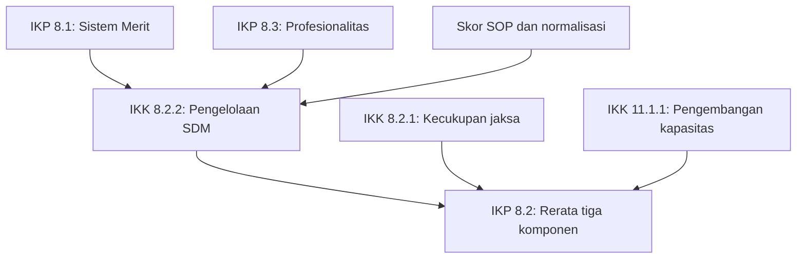

# Pemetaan dan penjenjangan kinerja JAM Pembinaan 2025–2029

Versi analisis: 16 September 2026. Lingkup: Program Dukungan Manajemen, mulai Sasaran Program (SP), Indikator Kinerja Program (IKP), Sasaran Kegiatan (SK), sampai Indikator Kinerja Kegiatan (IKK). Tidak mencakup seluruh program penegakan hukum atau penyusunan SS/IKSS.

**Hasil inventarisasi: 11 SP, 19 IKP, 34 kode SK, dan 95 IKK dalam rumpun SP yang diampu JAM Pembinaan.** Angka 95 mencakup indikator bersama UKE I/daerah dan indikator penghubung yang diampu unit lain. Angka tersebut bukan jumlah indikator yang wajib diinput sendiri oleh JAM Pembinaan. Sebagian pengampu dan target berbeda antar sumber; perbedaannya dicatat.

Pemetaan nama, kode, satuan, target dan formula berasal dari halaman asli KEPJA. Penentuan hubungan kontribusi dan pencocokan operand dengan kode indikator merupakan analisis tersendiri, bukan otomatis ketetapan resmi. **Laporan ini lengkap sebagai inventarisasi dalam lingkup tersebut, tetapi belum merupakan kontrak perhitungan otomatis yang seluruh rumusnya sudah terselesaikan.**

## 1. Register sumber dan cara membaca bukti

| ID | Sumber | Penggunaan | Rujukan |
|---|---|---|---|
| K | KEPJA 1184 Tahun 2025 tentang IKU 2025–2029 | Nama, kode, satuan, definisi, rumus, target, pengampu | Lampiran III: PDF 15–39; Lampiran IV: PDF 81–191; hanya rumpun terkait yang dimasukkan |
| R | A.1.3. Renstra Kejaksaan 2025–2029-Final | Lingkup SP, program, kegiatan, target pembanding dan organisasi pelaksana | Tabel 27: PDF 162–163, tercetak 156–157; matriks kinerja/pendanaan terkait PDF 181–198 |
| T1 | lkjip-kejari-cabjari.docx | Kebutuhan pelaporan daerah; bukan dasar penggantian rumus indikator pusat | BAB III bagian tata kelola; tabel OOXML 99, 101–103 |
| T2 | lkjip-kejati.docx | Kebutuhan rekap lintas satker dan pelaporan daerah | BAB III bagian tata kelola; tabel OOXML 98, 102, 105–106 |

Nomor tabel OOXML berarti urutan tabel di dalam berkas Word, dihitung mulai 1, bukan selalu nomor judul tabel yang tercetak. Rujukan `K:27` berarti halaman PDF 27 KEPJA; pada halaman yang digunakan nomor cetak KEPJA sama dengan nomor PDF. Penomoran cetak Renstra yang terlihat dipakai; lapisan teksnya memuat nomor lama bertumpuk. Seluruh halaman KEPJA yang menjadi dasar 114 indikator diperiksa secara visual, termasuk halaman pindai 15 dan 81.

Empat berkas cocok dengan hash sumber acuan:

| Sumber | SHA-256 |
|---|---|
| K | 69a863d380b70731050952cb831d13d064aad584cfca29d6f4a86a965a5c7a1a |
| R | aad1e8cb781e88a56c32d8184d8221ad76d1a1590f6a2f64c6ad4956c0958e48 |
| T1 | 85170ee589c23fe79146ad23c2b8af66fb7b2c832340f09b0ec07f07797862b4 |
| T2 | 1d21effbb25f8111b30b2acad12637282220a0e7f2a349daf327fc2922bcee73 |

Ketika sumber berbeda, kolom utama mempertahankan KEPJA sebagai keputusan khusus indikator. Versi Renstra tetap dicatat, terutama untuk target dan pengampu. Ini adalah pilihan acuan analisis, bukan pernyataan bahwa dokumen lain otomatis tidak berlaku. PK tahun/unit dan dokumen perubahan yang belum tersedia masih perlu dicocokkan sebelum menetapkan target operasional.

Status yang digunakan:

- `DOCUMENTED`: tertulis dan diperiksa pada halaman asli.
- `DERIVED`: hasil pencocokan nama, definisi, objek, atau formula; bukan rujukan kode eksplisit dalam keputusan.
- `PROPOSED`: rekomendasi penyajian/input atau aturan operasional.
- `UNRESOLVED`: rumus, skala, populasi, kode, atau konflik belum cukup jelas untuk dihitung otomatis.

## 2. Kesimpulan mengenai pengaruh nilai IKK

**SP dan SK adalah sasaran. Dalam sumber yang diperiksa tidak ditemukan aturan universal untuk menghitung “nilai SP” atau “nilai SK” dengan menjumlah/rata-rata seluruh indikator di bawahnya.** Sasaran dinilai melalui indikatornya. Jika aplikasi menampilkan skor ringkasan sasaran, skor itu harus diberi label hasil pengolahan internal dan memiliki kebijakan bobot sendiri.

Hubungan harus dipisahkan menjadi:

| Hubungan | Arti | Dampak saat angka bawah berubah |
|---|---|---|
| Sasaran–indikator (`structure`) | IKP mengukur SP; IKK mengukur SK | Tidak otomatis ada operasi hitung |
| Kontribusi (`contributes_to`) | Hasil kegiatan mendukung hasil program | Nilai atas tidak otomatis berubah |
| Komponen formula (`cascade`, jika terbukti) | Nilai/data tertentu menjadi operand rumus indikator lain | Nilai hasil dapat dihitung ulang setelah input valid |
| Kepemilikan bersama (`shared_ownership`) | Lebih dari satu unit bertanggung jawab atau memasok data | Bukan berarti nilainya dijumlahkan |
| Data pelaporan (`reporting`) | Tabel rinci/bukti mendukung laporan | Tidak otomatis menjadi node IKK baru |

Istilah **mandiri** harus menyatakan bahwa realisasi indikator tidak dihitung dari realisasi indikator anak. Cara memperoleh nilainya masih dapat berupa nilai resmi evaluator, rasio, survei, atau beberapa komponen berbobot. Untuk SAKIP, ketika nilai resmi sudah diberikan evaluator, pengguna cukup memasukkan nilai resmi dan bukti. Formula empat komponen berguna untuk penilaian mandiri/simulasi dan tidak menggantikan LHE.

### 2.1 Hubungan hitung terkuat: SDM lintas SP

KEPJA halaman 27 menyebut tiga komponen IKP 8.2. Pencocokan kode berdasarkan nama komponen menghasilkan:

`IKP 8.2 = (IKK 8.2.1 + IKK 11.1.1 + IKK 8.2.2) / 3`

Status pencocokan kode: **DERIVED**. Formula rerata tiga komponen: **DOCUMENTED**. Pelaksanaan otomatis: **bersyarat**, karena rumus IKK 8.2.1 dan 8.2.2 masih memiliki masalah definisi/skala.

| Komponen IKP 8.2 | Sumber yang cocok | Bukti | Catatan |
|---|---|---|---|
| Kecukupan personil jaksa | IKK 8.2.1 | K:27,131 | Formula personel dan kebutuhan tambahan; bukan sekadar formasi terisi |
| Pengembangan kapasitas personil jaksa | IKK 11.1.1 | K:27,160 | Berasal dari SP 11; pengampu KEPJA Badan Diklat |
| Kesesuaian pengelolaan SDM Jaksa | IKK 8.2.2 | K:27,132 | Menggunakan skor Merit, Profesionalitas, SOP |

IKK 8.2.3 mengukur pegawai yang kompetensinya sesuai jabatan. Indikator ini **tidak boleh menggantikan komponen pengembangan kapasitas** hanya karena sama-sama bernomor 8.2.

IKK 8.2.2 menyebut Sistem Merit dan Profesionalitas institusi. Kandidat sumbernya adalah IKP 8.1 dan IKP 8.3. Dengan demikian, aliran nilai bukan selalu “IKK ke IKP”; pada bagian ini terjadi **IKP → IKK → IKP**. Rerata harus memakai skor yang sudah setara skala. Nilai Merit 0,81, Profesionalitas 3,7 atau 85, dan skor SOP tidak dapat langsung dirata-rata.

Aliran hitung berikut berbeda dari arah panah pohon penjenjangan. Panah berarti “menyediakan operand”, bukan “menjadi sasaran induk”:

Hubungan angka tersebut harus dipisahkan dari graf penjenjangan. Menggabungkan semua panah struktur dan dependensi angka ke satu pohon dapat menimbulkan siklus semu atau perhitungan salah. Lima pasangan antarnode indikator pada bagan ini adalah kandidat dependensi `DERIVED`; normalisasi SOP adalah operand tambahan, bukan IKK rekaan.

### 2.2 Agregat survei layanan internal

IKP 10.1 menggunakan rerata indeks per jenis layanan, K:30. IKK 10.1.1, 10.2.1, 10.3.1, dan 10.4.1 adalah kandidat komponen yang sesuai secara substansi: layanan ASN, keuangan, umum, BMN/pengadaan. Akan tetapi, definisi IKP juga menyebut perencanaan, TI, dan pusat kebijakan/strategi hukum. **Menghitung hanya empat IKK tersebut belum terbukti mencakup seluruh N layanan.**

IKK 10.5.1 sudah merupakan rerata layanan pada UKE I. Nilainya tidak boleh ditambahkan sebagai satu komponen lagi bersama seluruh survei biro bila responden/layanannya beririsan. Daftar layanan, cakupan responden, dan konversi skala harus ditetapkan terlebih dahulu.

IKK SLA pada SK 10.6 dan 10.7 mendukung kualitas layanan, tetapi kecepatan penyelesaian layanan bukan angka kepuasan responden. IKK layanan publik pada SK 10.8 juga berbeda dari layanan internal IKP 10.1; hubungannya disimpan langsung pada SP 10 sampai ada penetapan lintasan IKP yang sesuai.

### 2.3 Kemiripan nama yang tidak berarti kesamaan formula

| Pasangan | Perbedaan yang menentukan | Keputusan pemetaan |
|---|---|---|
| IKK 1.1.1/1.1.2 dan IKP 1.1 | Evaluasi UKE I/satker versus evaluasi lembaga oleh KemenPANRB | Kontribusi; tidak ada rumus rerata nilai unit menjadi SAKIP lembaga |
| IKK 4.2.1/4.2.2 dan IKP 4.1 | Sama-sama NKA, tetapi tingkat entitas berbeda | Jangan rerata satker tanpa metodologi agregasi resmi |
| IKK 8.2.3 dan IKP 11.1 | Proporsi pegawai sesuai kompetensi versus rasio jumlah skor aktual terhadap skor ideal | Dapat berbagi data asesmen, tetapi realisasi berbeda |
| IKK 11.1.2 dan IKP 11.2 | Rasio seluruh SDM bersertifikat versus rata-rata rasio jaksa dan ASN nonjaksa | Berbagi data dasar; tidak menyalin persentase |
| IKK 15.2.1 dan IKP 15.1 | Satker menggunakan CMS versus proses bisnis inti didigitalisasi | Kontribusi; denominator berbeda |
| IKK 16.1.1–16.1.10 dan IKP 16.1 | Realisasi pengadaan/rehabilitasi terhadap rencana versus aset digunakan terhadap seluruh aset | Kontribusi; persentase pengadaan tidak langsung membentuk utilisasi |
| SK 10.9 dan IKP 10.2 | Unit RS, mutu, pemahaman, HSI, jumlah kegiatan versus survei kepuasan kesehatan | Kontribusi; bukan rerata lima IKK |

### 2.4 Penyederhanaan yang aman dan yang mengubah makna

| Kasus | Bentuk yang aman | Batasan |
|---|---|---|
| Nilai resmi evaluator | Input satu nilai, skala, tahun evaluasi, tahun kinerja yang dinilai, dan bukti | Simpan skor simulasi terpisah; jangan menimpa nilai resmi |
| Rasio satu populasi | Dua input S dan T, sistem menghitung 100S/T | Populasi dan periodenya harus sama |
| IKK 5.1.2 | Empat input Ak, Tak, P, Tp; hitung dua rasio lalu rerata | Tidak dapat diganti (Ak+P)/(Tak+Tp) |
| IKP 11.2 | Empat jumlah pegawai menurut kelompok; dua rasio lalu rerata | Tidak dapat diganti rasio seluruh pegawai bersertifikat |
| IKP 8.2 | Ambil tiga realisasi yang tervalidasi; hitung rerata | Jangan pakai capaian terhadap target sebagai operand |
| Indeks berbobot | Input skor komponen yang telah dinormalisasi beserta bobot resmi | Bobot tidak boleh diterapkan dua kali; skala harus cocok |
| Data rasio antar satker | Bila mengukur satu populasi, jumlahkan pembilang dan penyebut lalu hitung | Ini derivasi matematis, bukan izin mengagregasi semua indikator lintas unit |
| Survei beberapa layanan | Pertahankan rerata per layanan apabila rumus memakai N layanan | Menggabungkan seluruh responden mengubah bobot layanan |

Contoh simulasi IKK 5.1.2: LAK = 8/10 = 80%, PBMN = 90/100 = 90%; hasil resmi menurut struktur rumus = 85%. Penggabungan 98/110 menghasilkan 89,09%, sehingga tidak setara.

Contoh simulasi sertifikasi: 80 dari 100 jaksa bersertifikat dan 100 dari 200 ASN nonjaksa bersertifikat. IKP 11.2 = (80% + 50%)/2 = 65%. Rasio gabungan = 180/300 = 60%. Angka gabungan hanya cocok untuk IKK 11.1.2 bila definisi sertifikat dan populasi benar-benar sama.

Contoh simulasi IKP 8.2 setelah ketiga nilai valid: kecukupan 80%, pengembangan 60%, pengelolaan 70% menghasilkan 70%. Ini simulasi, bukan realisasi Kejaksaan.

## 3. Matriks sasaran program

Nama pada matriks utama mempertahankan KEPJA. Tabel 27 Renstra mengonfirmasi rumpun 11 SP berikut sebagai lingkup JAM Pembinaan, termasuk Pusat Kesehatan Yustisial. SP 2, 3, 12, 14 berada pada JAM Pengawasan dan SP 9 pada Badan Diklat; tidak dimasukkan sebagai SP milik JAM Pembinaan. Dukungan lintas unit tetap dapat ada.
| Kode SP | Nama sasaran program (K) | IKP | SK | IKK | Sumber |
|---|---|---|---|---|---|
| SP 1 | Meningkatnya akuntabilitas kinerja Kejaksaan RI | 1.1 | 3 | 9 | K:15; R:162–163 |
| SP 4 | Meningkatnya efisiensi dan efektivitas penggunaan anggaran Kejaksaan RI | 4.1 | 3 | 9 | K:18; R:162–163 |
| SP 5 | Meningkatnya kualitas tata kelola aset dan pengadaan Kejaksaan RI | 5.1, 5.2 | 2 | 6 | K:19,20; R:162–163 |
| SP 6 | Meningkatnya kapasitas kelembagaan dan ketatalaksanaan Kejaksaan RI | 6.1, 6.2 | 2 | 3 | K:21,23; R:162–163 |
| SP 7 | Meningkatnya kualitas kebijakan penegakan hukum | 7.1, 7.2 | 3 | 13 | K:24,25; R:162–163 |
| SP 8 | Meningkatnya kuantitas dan kualitas SDM aparatur Kejaksaan RI | 8.1, 8.2, 8.3 | 3 | 8 | K:26,27,28; R:162–163 |
| SP 10 | Meningkatnya kualitas layanan internal dukungan manajemen dan Kesehatan yustisial | 10.1, 10.2 | 9 | 22 | K:30,31; R:162–163 |
| SP 11 | Meningkatnya kompetensi aparatur Kejaksaan RI | 11.1, 11.2 | 1 | 2 | K:32,33; R:162–163 |
| SP 13 | Meningkatnya kualitas layanan hukum dan hubungan luar negeri | 13.1, 13.2 | 2 | 2 | K:35,36; R:162–163 |
| SP 15 | Meningkatnya efektivitas pelaksanaan tugas dan fungsi Kejaksaan berbasis TI | 15.1 | 5 | 11 | K:38; R:162–163 |
| SP 16 | Meningkatnya kuantitas dan kualitas sarana dan prasarana yang mendukung Kinerja Kejaksaan RI | 16.1 | 1 | 10 | K:39; R:162–163 |

## 4. Matriks seluruh IKP dan hubungan nilainya

Nama, satuan dan rumus: DOCUMENTED sebagai transkripsi; catatan UNRESOLVED berlaku pada interpretasi rumus. Kolom hubungan adalah DERIVED, kecuali formula secara eksplisit menyebut komponen. Rincian input, pengampu dan target setiap indikator ada pada Bagian 8.

| Kode | Nama IKP | Satuan | Rumus ringkas | Hubungan dengan IKK | Rujukan |
|---|---|---|---|---|---|
| 1.1 | Nilai SAKIP Kejaksaan RI | Nilai | S = Σ Xi; Xi = (NXi/Tki) × Wi; W = (30,30,15,25) poin | Tidak langsung. Nilai LHE KemenPANRB; IKK SAKIP dan layanan perencanaan mendukung kualitas implementasi, bukan formula rerata unit. | K:15 |
| 4.1 | Nilai Kinerja Anggaran Kejaksaan RI | Nilai | NKA = X1 + X2; Xi = (NXi/Tki) × Wi; W = (50,50) poin | Tidak ada agregasi IKK yang ditetapkan. Dua komponen anggaran; IKK NKA unit bukan otomatis rerata NKA lembaga. | K:18 |
| 5.1 | Indeks Pengelolaan Aset Kejaksaan RI | Indeks | IPA = Σ(i=1..8) [(NXi/Tki) × Wi]; W = (15%,10%,10%,10%,15%,10%,15%,15%) | Tidak langsung. Delapan parameter penilaian IPA berbeda dari enam IKK pada kedua SK. | K:19 |
| 5.2 | Indeks tata kelola pengadaan Kejaksaan RI | Indeks | ITKP = SP + KSDM + TK | Tidak langsung. Tiga skor aspek pengadaan; SLA pengadaan bukan pengganti skor ITKP. | K:20 |
| 6.1 | Nilai Evaluasi Kelembagaan Kejaksaan RI | Nilai | Cetak: NKA = X1 + X2; Xi = (NXi/Tki) × Bobot. Legenda menyebut NEK. | Kontribusi. Restrukturisasi/RB mendukung dimensi organisasi; bukan operand yang dipersamakan langsung. | K:21–22 |
| 6.2 | Tingkat kepatuhan satuan kerja terhadap standar operasional prosedur | Persentase | Cetak: TK = S/T. Penyajian persen: 100 × S/T (DERIVED). | Kontribusi. Realisasi dihitung dari satker patuh SOP/objek evaluasi, bukan rerata implementasi RB. | K:23 |
| 7.1 | Indeks Kualitas Kebijakan Kejaksaan RI | Indeks | Cetak: IKK = Σ(i=1..5) Xi; Xi = (NXi/Tki) × Wi; W = (10,20,25,30,15) poin | Kontribusi. Kualitas kebijakan terdiri atas lima dimensi; hasil policy brief dapat menjadi bukti, bukan skor dimensi otomatis. | K:24 |
| 7.2 | Indeks reformasi hukum Kejaksaan RI | Persentase | IRH = Σ(i=1..4) [(NXi/Tki) × Wi]; W = (25,25,35,15) poin | Kontribusi lintas SP. Empat variabel IRH. Regulasi ditetapkan tidak otomatis sama dengan skor harmonisasi/re-regulasi. | K:25 |
| 8.1 | Indeks Sistem Merit Kejaksaan RI | Indeks | ISM = Σ(i=1..8) [(NXi/Tki) × Wi]; W = (20%,10%,25%,10%,15%,10%,5%,5%) | Bukan agregasi IKK. Delapan aspek Merit. Nilai Merit justru kandidat operand IKK 8.2.2. | K:26 |
| 8.2 | Persentase kecukupan, kesesuaian, dan pengembangan SDM Kejaksaan RI | Persentase | KKP = rata-rata(kecukupan personel, pengembangan kapasitas SDM, kesesuaian pengelolaan SDM) | Ya, bersyarat; DERIVED. Rerata tiga komponen bernama sesuai K:27; validasi skala/populasi dan rumus penyusun dahulu. | K:27 |
| 8.3 | Indeks Profesionalitas SDM Kejaksaan RI | Indeks | IP = Σ(i=1..4) [(NXi/Tki) × Wi]; W = (20,40,30,10) poin | Bukan agregasi IKK. Empat dimensi Profesionalitas; data disiplin/pelatihan dapat mendukung penilaian tetapi tidak menggantikan rubrik. | K:28 |
| 10.1 | Indeks kepuasan layanan dukungan internal manajemen Kejaksaan RI | Indeks | IK DIM = Σ IKLj / N; IKLj = TSj/(Rj × Pj × Mj) × 100% | Ya, kandidat komponen survei; bersyarat. Daftar N layanan dan skala belum lengkap. SK 10.6–10.7 hanya kontribusi; IKK 10.5.1 jangan dihitung ganda. | K:30 |
| 10.2 | Tingkat kepuasan Stakeholder terhadap Rumah Sakit Adhyaksa, Klinik Adhyaksa, dan Fasilitas Kesehatan Yustisial lainnya | Persentase | TKSRS = [Σ(i=1..5)(Ri × Pi)/(5 × Σ Pi)] × 100% | Tidak langsung. Survei kepuasan kesehatan tersendiri; pembangunan/mutu/HSI bukan formula kepuasan. | K:31 |
| 11.1 | Indeks kesesuaian kompetensi (competency fit index) aparatur Kejaksaan RI | Indeks | CFIj = (Σ SKa / Σ SKi) × 100 | Berbagi data, bukan salin nilai. Menggunakan jumlah skor aktual dan ideal. Hasil lulus kompetensi per pegawai merupakan statistik berbeda. | K:32 |
| 11.2 | Persentase aparatur yang memiliki sertifikasi kompetensi sesuai jabatan | Persentase | ASK = (N1 + N2)/2; N1 = JT/JS ×100%; N2 = ASN-T/J-ASN ×100% | Berbagi data dasar. Harus dipisah jaksa dan nonjaksa; persentase total IKK 11.1.2 tidak cukup sebagai input tunggal. | K:33 |
| 13.1 | Indeks kepuasan satker Kejaksaan atas layanan hukum | Indeks | I = TS/(R × P × M) × 100% | Tidak langsung. Survei satker penerima layanan hukum, bukan persentase regulasi disahkan. | K:35 |
| 13.2 | Indeks kepuasan institusi mitra luar negeri terhadap kualitas kerja sama kelembagaan Kejaksaan RI | Indeks | I = TS/(R × P × M) × 100% | Tidak langsung. Survei mitra luar negeri; jumlah kerja sama berhasil bukan indeks kepuasan. | K:36 |
| 15.1 | Persentase digitalisasi proses bisnis inti Kejaksaan RI | Persentase | DPB = PBT/PBI × 100% | Tidak langsung. Rasio proses bisnis digital; CMS, statistik, keamanan, survei TI mendukung, bukan rerata semua IKK TI. | K:38 |
| 16.1 | Tingkat utilisasi sarana dan prasarana Kejaksaan RI | Persentase | USP = SPu/TSP × 100% | Tidak langsung. Aset digunakan/seluruh aset. Data aset baru dapat memperbarui register aset setelah status penggunaan diketahui. | K:39 |

## 5. Matriks seluruh SK dan arah kontribusi

SP → SK dalam tabel ini merupakan pengelompokan DERIVED dari kode KEPJA, outcome, dan kegiatan Renstra. Hubungan SK → IKK eksplisit pada halaman masing-masing (DOCUMENTED). Relasi kepada IKP di bawah ini adalah analisis kontribusi/kandidat formula, bukan bukti bahwa setiap IKK harus memiliki satu induk IKP. SP dan SK tidak diberi rumus, satuan numerik atau target terpisah yang tidak ditetapkan sumber.

| SP | Kode SK | Nama SK (K) | Kode IKK | IKP terkait / keputusan | Sumber |
|---|---|---|---|---|---|
| SP 1 | SK 1.1 | Meningkatnya Akuntabilitas Kinerja Satker Kejaksaan RI | 1.1.1, 1.1.2 | 1.1. Kontribusi hasil evaluasi UKE I/daerah; tidak dijumlahkan menjadi nilai lembaga. | K:81,82 |
| SP 1 | SK 1.2 | Meningkatnya Kualitas perencanaan Kejaksaan RI | 1.2.1 | 1.1. IPPN mendukung mutu perencanaan, tetapi bukan komponen numerik SAKIP yang diberi koefisien dalam sumber. | K:83 |
| SP 1 | SK 1.3 | Meningkatnya kegiatan perencanaan yang meliputi pengelolaan data, penyusunan rencana anggaran dan program kerja, pemantauan dan evaluasi, pengembangan organisasi dan tata laksana serta fasilitasi pelaksanaan program reformasi birokrasi Kejaksaan RI | 1.3.1, 1.3.2, 1.3.3, 1.3.4, 1.3.5, 1.3.6 | 1.1; lintas 6.1/6.2. Layanan perencanaan/RB mendukung hasil. Pendampingan ZI tidak identik dengan penilaian ZI. | K:84,85,86,87,88,89 |
| SP 4 | SK 4.1 | Meningkatnya kualitas laporan keuangan Kejaksaan RI | 4.1.1 | 4.1; lintas SP 2 di luar lingkup. Kualitas laporan bukan NKA atau opini BPK; simpan hubungan kontribusi. | K:96 |
| SP 4 | SK 4.2 | Meningkatnya efisiensi dan efektivitas Perencanaan dan penggunaan anggaran Kejaksaan UKE I Kejaksaan RI | 4.2.1, 4.2.2 | 4.1. Kesamaan NKA lintas entitas; aturan konsolidasi nilai ke lembaga belum diberikan. | K:97,98 |
| SP 4 | SK 4.3 | Meningkatnya kegiatan pembinaan pengelolaan keuangan Kejaksaan RI | 4.3.1, 4.3.2, 4.3.3, 4.3.4, 4.3.5, 4.3.6 | 4.1. SLA keuangan mendukung kualitas pelaksanaan; bukan komponen NKA langsung. | K:99,100,101,102,103,104 |
| SP 5 | SK 5.1 | Meningkatnya kegiatan analisis kebutuhan dan penatausahaan barang milik negara, pengadaan barang/jasa, dan pengelolaan barang milik negara di lingkungan Kejaksaan RI | 5.1.1, 5.1.2, 5.1.3, 5.1.4, 5.1.5 | 5.1; 5.2. Analisis/inventarisasi/pengelolaan BMN mendukung IPA; SLA pengadaan mendukung ITKP; bukan agregasi semua IKK. | K:105,106,107,108,109 |
| SP 5 | SK 5.2 | Meningkatnya keberhasilan pengelolaan aset UKE I Kejaksaan RI | 5.2.1 | 5.1; lintas 16.1. BMN siap pakai mendukung aset/utilisasi. Siap pakai tidak sama dengan sudah digunakan. | K:110 |
| SP 6 | SK 6.1 | Meningkatnya kualitas Tata Kelola Organisasi Kejaksaan yang tepat fungsi | 6.1.1, 6.1.2 | 6.1; 6.2. Restrukturisasi/RB mendukung organisasi/kepatuhan, bukan skor evaluasi atau jumlah satker patuh. | K:111,112 |
| SP 6 | SK 6.2 | Meningkatnya kualitas Tata Kelola Organisasi UKE I Kejaksaan yang tepat fungsi | 6.2.1 | 6.1; 6.2. RB Tematik berkontribusi; konflik pengampu dan target perlu dicatat. | K:113 |
| SP 7 | SK 7.1 | Meningkatnya pelaksanaan kegiatan pelayanan penyusunan rancangan peraturan perundang-undangan, pertimbangan hukum, kerja sama dan hubungan luar negeri serta perpustakaan dan dokumentasi hukum dan kerja sama hukum | 7.1.1, 7.1.2, 7.1.3, 7.1.4, 7.1.5 | 7.1; 7.2; lintas 13.1/13.2. Mutu/SLA layanan hukum dapat memengaruhi kualitas kebijakan, reformasi hukum, kepuasan; tidak ada koefisien pengaruh numerik. | K:114,115,116,117,118 |
| SP 7 | SK 7.2 | Meningkatnya kegiatan strategi kebijakan penegakan hukum | 7.2.1, 7.2.2, 7.2.3, 7.2.4, 7.2.5, 7.2.6, 7.2.7 | 7.1. Pusat Strategi Kebijakan memasok kegiatan/bukti; tujuh SLA bukan lima dimensi kualitas kebijakan. | K:119,120,121,122,123,124,125 |
| SP 7 | SK 7.3 | Meningkatnya keberhasilan pernyusunan strategi kebijakan penegakan hukum | 7.3.1 | 7.1; 7.2. Implementasi policy brief mendukung kebijakan/harmonisasi; tidak otomatis menjadi skor indeks. | K:126 |
| SP 8 | SK 8.1 | Meningkatnya Kegiatan Pembinaan dan Pengelolaan Kepegawaian di Kejaksaan RI | 8.1.1, 8.1.2, 8.1.3, 8.1.4 | 8.1; 8.3. Layanan kepegawaian mendukung penilaian Merit/Profesionalitas, bukan input persentase langsung. | K:127,128,129,130 |
| SP 8 | SK 8.2 | Meningkatnya kecukupan dan kesesuaian SDM Kejaksaan RI | 8.2.1, 8.2.2, 8.2.3 | 8.2; lintas 11.1. 8.2.1 dan 8.2.2 kandidat komponen 8.2; 8.2.3 hanya dukungan/data asesmen bagi 11.1. | K:131,132,133 |
| SP 8 | SK 8.3 | Berkurangnya pengaduan Masyarakat terhadap SDM Kejaksaan RI | 8.3.1 | 8.3. Data hukuman disiplin dapat menjadi bukti dimensi disiplin; skor disiplin mengikuti rubrik tersendiri. | K:134 |
| SP 10 | SK 10.1 | Meningkatnya kualitas ASN Kejaksaan yang berakhlak | 10.1.1 | 10.1. Indeks survei layanan ASN kandidat komponen IKP 10.1 setelah skala/objek disahkan. | K:138 |
| SP 10 | SK 10.2 | Meningkatnya kualitas layanan keuangan di lingkungan Kejaksaan RI | 10.2.1 | 10.1. Indeks survei keuangan kandidat komponen IKP 10.1 setelah skala/objek disahkan. | K:139 |
| SP 10 | SK 10.3 | Meningkatnya kualitas layanan umum di lingkungan Kejaksaan RI | 10.3.1 | 10.1. Indeks survei umum kandidat komponen IKP 10.1 setelah skala/objek disahkan. | K:140 |
| SP 10 | SK 10.4 | Meningkatnya kualitas layanan manajemen Barang Milik Negara dan pengadaan di Lingkungan Kejaksaan RI | 10.4.1 | 10.1. Indeks survei BMN/pengadaan kandidat komponen IKP 10.1 setelah skala/objek disahkan. | K:141 |
| SP 10 | SK 10.5 | Meningkatnya kualitas layanan dukungan manajemen di lingkungan Kejaksaan RI | 10.5.1 | 10.1, hanya bila cakupan cocok. Agregat survei UKE I; tidak otomatis satu komponen tambahan di atas data biro. | K:142 |
| SP 10 | SK 10.6 | Meningkatnya kegiatan pelayanan ketatausahaan Jaksa Agung, Wakil Jaksa Agung, Staf Ahli, tata usaha pimpinan, Protokol dan Keamanan Pimpinan, Keamanan, tata usaha dan kearsipan, sarana prasarana dan Rumah Tangga | 10.6.1, 10.6.2, 10.6.3, 10.6.4, 10.6.5, 10.6.6 | 10.1. SLA Biro Umum mendukung kepuasan layanan; bukan angka survei. | K:143,144,145,146,147,148 |
| SP 10 | SK 10.7 | Meningkatnya Meningkatnya kegiatan dukungan manajemen dan pelaksanaan tugas teknis lainnya Jaksa Agung Muda Bidang Pembinaan di Kejaksaan Agung, Kejaksaan Tinggi, Kejaksaan Negeri, dan Cabang Kejaksaan Negeri | 10.7.1, 10.7.2, 10.7.3, 10.7.4 | 10.1. Dukungan manajemen mendukung kepuasan; 10.7.1 sendiri komposit SLA yang perlu penegasan notasi. | K:149,150,151,152 |
| SP 10 | SK 10.8 | Meningkatnya kualitas layanan publik Kejaksaan RI | 10.8.1, 10.8.2 | Tidak dipaksakan ke IKP 10.1/10.2. Diletakkan langsung dalam rumpun SP 10; publik berbeda dari internal/kesehatan. Relasi IKP khusus UNRESOLVED. | K:153,154 |
| SP 10 | SK 10.9 | Meningkatnya kualitas penyelenggaraan kegiatan kesehatan yustisial. | 10.9.1, 10.9.2, 10.9.3, 10.9.4, 10.9.5 | 10.2. Lima hasil kegiatan kesehatan mendukung kepuasan kesehatan, tidak dirata-ratakan ke IKP 10.2. | K:155,156,157,158,159 |
| SP 11 | SK 11.1 | Meningkatnya kualitas pengelolaan dan pengembangan SDM Kejaksaan RI yang efektif | 11.1.1, 11.1.2 | 11.1; 11.2; lintas 8.2. 11.1.1 memasok komponen pengembangan pada 8.2. 11.1.2 berbagi data sertifikasi dengan 11.2. | K:160,161 |
| SP 13 | SK 13.1 | Meningkatnya kualitas layanan harmonitasi regulasi dan hubungan luar negeri Kejaksaan RI | 13.1.1 | 13.1; lintas 7.2. Regulasi disahkan mendukung layanan hukum dan IRH; bukan hasil survei. | K:163 |
| SP 13 | SK 13.2 | Meningkatnya kualitas layanan harmonitasi regulasi dan hubungan luar negeri Kejaksaan RI | 132.2 | 13.2. Kerja sama terjalin mendukung kepuasan mitra; identitas kode IKK masih anomali. | K:164 |
| SP 15 | SK 15.1 | Meningkatnya kegiatan pengelolaan data, statistik kriminal serta penerapan dan pengembangan teknologi informasi | 15.1.1, 15.1.2, 15.1.3 | 15.1. Layanan data/TI mendukung digitalisasi, tidak mengukur banyaknya proses bisnis digital. | K:171,172,173 |
| SP 15 | SK 15.2 | Meningkatnya pengembangan dan pemanfaatan Sistem Teknologi Informasi Kejaksaan RI | 15.2.1, 15.2.3 | 15.1. CMS dan IPD mendukung digitalisasi; denominator satker/indeks berbeda dari proses bisnis. | K:174,175 |
| SP 15 | SK 15.3 | Meningkatnya kualitas data Statistik Kriminal Kejaksaan RI | 15.3.1, 15.3.2, 15.3.3, 15.3.4 | 15.1. Statistik, kualitas, pertukaran dan integrasi data mendukung digitalisasi; bukan komponen formula DPB. | K:176,177,178,179 |
| SP 15 | SK 15.4 | Meningkatnya keamanan Sistem Teknologi Informasi Kejaksaan RI | 15.4.1 | 15.1. Keamanan TI mendukung digitalisasi; rubrik domain IPD perlu bukti sebelum menggunakan nilai ini di IPD. | K:180 |
| SP 15 | SK 15.5 | Meningkatnya kualitas tata kelola administrasi penanganan perkara berbasis teknologi informasi | 15.5.1 | 15.1. Survei kepuasan TI adalah outcome pendukung, bukan persentase proses bisnis digital. | K:181 |
| SP 16 | SK 16.1 | Meningkatnya jumlah gedung kantor, rumah negara, kendaraan jabatan, operasional, dan fungsional, perangkat pengolah data dan komunikasi, perlengkapan dan fasilitas perkantoran yang memadai | 16.1.1, 16.1.2, 16.1.3, 16.1.4, 16.1.5, 16.1.6, 16.1.7, 16.1.8, 16.1.9, 16.1.10 | 16.1. Sepuluh rasio pengadaan/rehabilitasi mendukung utilisasi; tidak langsung dijumlah/rata-rata. | K:182,183,184,185,186,187,188,189,190,191 |

## 6. Matriks dependensi dan data bersama

Pada tabel ini panah memakai arah **indikator hasil → indikator sumber**, agar konsisten dengan arah hulu–hilir dalam penjenjangan. Aliran kalkulasi sebenarnya berjalan sebaliknya. Untuk hubungan yang tidak merupakan agregasi, tidak dibuat bobot numerik.

| Indikator hasil | Indikator/data sumber | Jenis | Bobot / operasi | Status | Bukti dan batasan |
|---|---|---|---|---|---|
| IKP 8.2 | IKK 8.2.1 | cascade | 1/3 dari rerata tiga komponen | DERIVED | K:27,131; interpretasi formula personel belum final |
| IKP 8.2 | IKK 8.2.2 | cascade | 1/3 | DERIVED | K:27,132; perlu normalisasi dan skor SOP |
| IKP 8.2 | IKK 11.1.1 | cascade lintas SP | 1/3 | DERIVED | K:27,160; cakupan penerima diklat harus sesuai |
| IKK 8.2.2 | IKP 8.1 | cascade lintas tingkat | Belum operasional | DERIVED / UNRESOLVED | K:132,26; nama skor institusi cocok; normalisasi belum ditetapkan |
| IKK 8.2.2 | IKP 8.3 | cascade lintas tingkat | Belum operasional | DERIVED / UNRESOLVED | K:132,28; konflik skala Profesionalitas |
| IKP 10.1 | IKK 10.1.1; 10.2.1; 10.3.1; 10.4.1 | Kandidat cascade survei | 1/N bila memang masuk daftar layanan | DERIVED / UNRESOLVED | K:30,138–141; daftar layanan belum lengkap, konflik skala |
| IKP 10.1 | IKK 10.5.1 | Kontribusi/kandidat sumber agregat | Tidak ditetapkan | UNRESOLVED | K:30,142; hindari penghitungan ganda layanan |
| IKP 11.2 | Data pegawai yang mendasari IKK 11.1.2 | reporting / data bersama | Dua rasio berkelompok | DERIVED | K:33,161; nilai persentase indikator bukan operand langsung |
| IKP 11.1 | Data asesmen yang mendasari IKK 8.2.3 | reporting / data bersama | Rasio skor aktual/ideal | DERIVED | K:32,133; proporsi pegawai sesuai jabatan tidak menggantikan skor |
| IKP 15.1 | SK 15.1–15.5 | contributes_to | Tidak ada bobot agregasi | DERIVED | K:38,171–181; unit observasi berbeda |
| IKP 16.1 | SK 16.1 dan IKK 5.2.1 | contributes_to | Tidak ada bobot agregasi | DERIVED | K:39,110,182–191; siap pakai/pengadaan belum tentu digunakan |

## 7. Matriks target tahunan 2025–2029

Target utama berikut mengikuti KEPJA dan bukan realisasi. Tidak ada pembagian otomatis target tahunan menjadi empat triwulan. Tahun/target PK unit harus disimpan tersendiri. Tanda kurung pada (90%) dipertahankan sebagaimana cetak.

| Tingkat | Kode | Satuan | 2025 | 2026 | 2027 | 2028 | 2029 | Sumber |
|---|---|---|---|---|---|---|---|---|
| IKP | 1.1 | Nilai | 72 | 73 | 75 | 77 | 80 | K:15 |
| IKP | 4.1 | Nilai | 90 | 90,25 | 90,5 | 90,75 | 91 | K:18 |
| IKP | 5.1 | Indeks | 3,5 | 3,6 | 3,7 | 3,75 | 3,8 | K:19 |
| IKP | 5.2 | Indeks | 89 | 90,5 | 92 | 93,5 | 95 | K:20 |
| IKP | 6.1 | Nilai | 80 | 81 | 82 | 83 | 84 | K:21 |
| IKP | 6.2 | Persentase | 80% | 85% | 90% | 95% | 100% | K:23 |
| IKP | 7.1 | Indeks | 70 | 70 | 75 | 75 | 80 | K:24 |
| IKP | 7.2 | Persentase | 98,1 | 98,2 | 98,3 | 98,4 | 98,5 | K:25 |
| IKP | 8.1 | Indeks | 0,8 | 0,81 | 0,82 | 0,83 | 0,84 | K:26 |
| IKP | 8.2 | Persentase | 60% | 65% | 70% | 75% | 80% | K:27 |
| IKP | 8.3 | Indeks | 3,6 | 3,7 | 3,8 | 3,9 | 4,0 | K:28 |
| IKP | 10.1 | Indeks | 3,6 | 3,7 | 3,8 | 3,9 | 4,0 | K:30 |
| IKP | 10.2 | Persentase | 75% | 85% | 95% | 100% | 100% | K:31 |
| IKP | 11.1 | Indeks | 70 | 75 | 80 | 85 | 90 | K:32 |
| IKP | 11.2 | Persentase | 50% | 65% | 75% | 85% | 95% | K:33 |
| IKP | 13.1 | Indeks | 3,6 | 3,7 | 3,8 | 3,9 | 4,0 | K:35 |
| IKP | 13.2 | Indeks | 3,6 | 3,7 | 3,8 | 3,9 | 4,0 | K:36 |
| IKP | 15.1 | Persentase | 80% | 85% | 90% | 95% | 100% | K:38 |
| IKP | 16.1 | Persentase | 80% | 82% | 84% | 86% | 90% | K:39 |
| IKK | 1.1.1 | Nilai | 72 | 73 | 75 | 77 | 80 | K:81 |
| IKK | 1.1.2 | Nilai | 72 | 73 | 75 | 77 | 80 | K:82 |
| IKK | 1.2.1 | Indeks | 93 | 93,5 | 94 | 94,5 | 95 | K:83 |
| IKK | 1.3.1 | Persentase | 100% | 100% | 100% | 100% | 100% | K:84 |
| IKK | 1.3.2 | Persentase | 100% | 100% | 100% | 100% | 100% | K:85 |
| IKK | 1.3.3 | Persentase | 100% | 100% | 100% | 100% | 100% | K:86 |
| IKK | 1.3.4 | Persentase | 100% | 100% | 100% | 100% | 100% | K:87 |
| IKK | 1.3.5 | Persentase | 100% | 100% | 100% | 100% | 100% | K:88 |
| IKK | 1.3.6 | Persentase | 35% | 40% | 50% | 70% | 80% | K:89 |
| IKK | 4.1.1 | Nilai | 75 | 80 | 85 | 90 | 95 | K:96 |
| IKK | 4.2.1 | Nilai | 90 | 90,25 | 90,5 | 90,75 | 91 | K:97 |
| IKK | 4.2.2 | Nilai | 90 | 90,25 | 90,5 | 90,75 | 91 | K:98 |
| IKK | 4.3.1 | Persentase | 100% | 100% | 100% | 100% | 100% | K:99 |
| IKK | 4.3.2 | Persentase | 100% | 100% | 100% | 100% | 100% | K:100 |
| IKK | 4.3.3 | Persentase | 100% | 100% | 100% | 100% | 100% | K:101 |
| IKK | 4.3.4 | Persentase | 100% | 100% | 100% | 100% | 100% | K:102 |
| IKK | 4.3.5 | Persentase | 100% | 100% | 100% | 100% | 100% | K:103 |
| IKK | 4.3.6 | Persentase | 100% | 100% | 100% | 100% | 100% | K:104 |
| IKK | 5.1.1 | Persentase | 20% | 40% | 60% | 80% | (90%) | K:105 |
| IKK | 5.1.2 | Persentase | 100% | 100% | 100% | 100% | 100% | K:106 |
| IKK | 5.1.3 | Persentase | 100% | 100% | 100% | 100% | 100% | K:107 |
| IKK | 5.1.4 | Persentase | 100% | 100% | 100% | 100% | 100% | K:108 |
| IKK | 5.1.5 | Persentase | 100% | 100% | 100% | 100% | 100% | K:109 |
| IKK | 5.2.1 | Persentase | 70% | 75% | 80% | 85% | 90% | K:110 |
| IKK | 6.1.1 | Persentase | 80% | 85% | 90% | 95% | 100% | K:111 |
| IKK | 6.1.2 | Persentase | 80% | 85% | 90% | 95% | 100% | K:112 |
| IKK | 6.2.1 | Persentase | 80% | 85% | 90% | 95% | 100% | K:113 |
| IKK | 7.1.1 | Persentase | 100% | 100% | 100% | 100% | 100% | K:114 |
| IKK | 7.1.2 | Persentase | 100% | 100% | 100% | 100% | 100% | K:115 |
| IKK | 7.1.3 | Persentase | 100% | 100% | 100% | 100% | 100% | K:116 |
| IKK | 7.1.4 | Persentase | 100% | 100% | 100% | 100% | 100% | K:117 |
| IKK | 7.1.5 | Persentase | 100% | 100% | 100% | 100% | 100% | K:118 |
| IKK | 7.2.1 | Persentase | 100% | 100% | 100% | 100% | 100% | K:119 |
| IKK | 7.2.2 | Persentase | 100% | 100% | 100% | 100% | 100% | K:120 |
| IKK | 7.2.3 | Persentase | 100% | 100% | 100% | 100% | 100% | K:121 |
| IKK | 7.2.4 | Persentase | 100% | 100% | 100% | 100% | 100% | K:122 |
| IKK | 7.2.5 | Persentase | 100% | 100% | 100% | 100% | 100% | K:123 |
| IKK | 7.2.6 | Persentase | 100% | 100% | 100% | 100% | 100% | K:124 |
| IKK | 7.2.7 | Persentase | 100% | 100% | 100% | 100% | 100% | K:125 |
| IKK | 7.3.1 | Persentase | 100% | 100% | 100% | 100% | 100% | K:126 |
| IKK | 8.1.1 | Persentase | 100% | 100% | 100% | 100% | 100% | K:127 |
| IKK | 8.1.2 | Persentase | 100% | 100% | 100% | 100% | 100% | K:128 |
| IKK | 8.1.3 | Persentase | 100% | 100% | 100% | 100% | 100% | K:129 |
| IKK | 8.1.4 | Persentase | 100% | 100% | 100% | 100% | 100% | K:130 |
| IKK | 8.2.1 | Persentase | 80% | 85% | 90% | 95% | 100% | K:131 |
| IKK | 8.2.2 | Persentase | 80% | 85% | 90% | 95% | 100% | K:132 |
| IKK | 8.2.3 | Persentase | 80% | 85% | 90% | 95% | 100% | K:133 |
| IKK | 8.3.1 | Persentase | 5% | 4% | 3% | 2% | 1% | K:134 |
| IKK | 10.1.1 | Indeks | 3,6 | 3,7 | 3,8 | 3,9 | 4,0 | K:138 |
| IKK | 10.2.1 | Indeks | 3,6 | 3,7 | 3,8 | 3,9 | 4,0 | K:139 |
| IKK | 10.3.1 | Indeks | 3,6 | 3,7 | 3,8 | 3,9 | 4,0 | K:140 |
| IKK | 10.4.1 | Indeks | 3,6 | 3,7 | 3,8 | 3,9 | 4,0 | K:141 |
| IKK | 10.5.1 | Indeks | 3,6 | 3,7 | 3,8 | 3,9 | 4,0 | K:142 |
| IKK | 10.6.1 | Persentase | 100% | 100% | 100% | 100% | 100% | K:143 |
| IKK | 10.6.2 | Persentase | 100% | 100% | 100% | 100% | 100% | K:144 |
| IKK | 10.6.3 | Persentase | 100% | 100% | 100% | 100% | 100% | K:145 |
| IKK | 10.6.4 | Persentase | 100% | 100% | 100% | 100% | 100% | K:146 |
| IKK | 10.6.5 | Persentase | 100% | 100% | 100% | 100% | 100% | K:147 |
| IKK | 10.6.6 | Persentase | 100% | 100% | 100% | 100% | 100% | K:148 |
| IKK | 10.7.1 | Persentase | 100% | 100% | 100% | 100% | 100% | K:149 |
| IKK | 10.7.2 | Persentase | 100% | 100% | 100% | 100% | 100% | K:150 |
| IKK | 10.7.3 | Persentase | 100% | 100% | 100% | 100% | 100% | K:151 |
| IKK | 10.7.4 | Persentase | 100% | 100% | 100% | 100% | 100% | K:152 |
| IKK | 10.8.1 | Persentase | 100% | 100% | 100% | 100% | 100% | K:153 |
| IKK | 10.8.2 | Indeks | 3,6 | 3,7 | 3,8 | 3,9 | 4,0 | K:154 |
| IKK | 10.9.1 | Unit | 2 | 2 | 2 | 2 | 2 | K:155 |
| IKK | 10.9.2 | Persentase | 70% | 80% | 90% | 100% | 100% | K:156 |
| IKK | 10.9.3 | Persentase | 70% | 80% | 90% | 95% | 100% | K:157 |
| IKK | 10.9.4 | Persentase | 25% | 35% | 45% | 55% | 65% | K:158 |
| IKK | 10.9.5 | Kegiatan | 100 | 150 | 200 | 250 | 660 | K:159 |
| IKK | 11.1.1 | Persentase | 50% | 70% | 80% | 80% | 90% | K:160 |
| IKK | 11.1.2 | Persentase | 30% | 40% | 50% | 75% | 85% | K:161 |
| IKK | 13.1.1 | Persentase | 50% | 52% | 54% | 56% | 58% | K:163 |
| IKK | 132.2 | Persentase | 80% | 81% | 82% | 83% | 84% | K:164 |
| IKK | 15.1.1 | Persentase | 100% | 100% | 100% | 100% | 100% | K:171 |
| IKK | 15.1.2 | Persentase | 100% | 100% | 100% | 100% | 100% | K:172 |
| IKK | 15.1.3 | Persentase | 100% | 100% | 100% | 100% | 100% | K:173 |
| IKK | 15.2.1 | Persentase | 80% | 85% | 90% | 95% | 100% | K:174 |
| IKK | 15.2.3 | Indeks | 4,15 | 4,17 | 4,19 | 4,21 | 4,23 | K:175 |
| IKK | 15.3.1 | Indeks | 3,2 | 3,4 | 3,6 | 3,8 | 4,0 | K:176 |
| IKK | 15.3.2 | Indeks | 2,6 | 2,8 | 3,0 | 3,2 | 3,4 | K:177 |
| IKK | 15.3.3 | Persentase | 100% | 100% | 100% | 100% | 100% | K:178 |
| IKK | 15.3.4 | Persentase | 75% | 80% | 85% | 90% | 95% | K:179 |
| IKK | 15.4.1 | Indeks | 2,7 | 2,8 | 3,0 | 3,1 | 3,2 | K:180 |
| IKK | 15.5.1 | Indeks | 3,6 | 3,7 | 3,8 | 3,9 | 4,0 | K:181 |
| IKK | 16.1.1 | Persentase | 50% | 60% | 70% | 80% | 90% | K:182 |
| IKK | 16.1.2 | Persentase | 50% | 60% | 70% | 80% | 90% | K:183 |
| IKK | 16.1.3 | Persentase | 20% | 40% | 60% | 80% | 100% | K:184 |
| IKK | 16.1.4 | Persentase | 5% | 10% | 15% | 20% | 25% | K:185 |
| IKK | 16.1.5 | Persentase | 50% | 60% | 70% | 80% | 90% | K:186 |
| IKK | 16.1.6 | Persentase | 50% | 60% | 70% | 80% | 90% | K:187 |
| IKK | 16.1.7 | Persentase | 50% | 60% | 70% | 80% | 90% | K:188 |
| IKK | 16.1.8 | Persentase | 50% | 60% | 70% | 80% | 90% | K:189 |
| IKK | 16.1.9 | Persentase | 70% | 75% | 80% | 85% | 90% | K:190 |
| IKK | 16.1.10 | Persentase | 70% | 75% | 80% | 85% | 90% | K:191 |

## 8. Kamus rinci seluruh indikator: rumus, input, pengampu dan pengaruh

Rumus di bawah ditulis ulang dalam notasi linear agar mudah dibaca. Simbol indikator pada rumus rasio sederhana diseragamkan menjadi R, tanpa mengubah pembilang/penyebut; nama resmi indikator tetap dipertahankan. Rumus cetak yang ambigu disebut secara khusus. Kode formula seperti RASIO dan SURVEI adalah klasifikasi analisis, bukan kode resmi KEPJA. Contoh angka bersifat simulasi, bukan realisasi atau target resmi.

Aturan umum yang belum ditetapkan sumber: penyebut nol, data kosong, pembulatan, batas capaian, nilai di luar rentang, frekuensi pembaruan, serta metode penggabungan antarsatker. Rekomendasi: jangan menghasilkan angka otomatis sampai validasi sesuai; jangan menganggap kosong sebagai nol. Untuk rasio, input berupa jumlah/angka sesuai objek; nilai dan skor memakai desimal; bukti, unit dan periode harus melekat pada input.

### Rumpun SP 1

#### IKP 1.1 — Nilai SAKIP Kejaksaan RI

- **Sasaran:** SP 1 — Meningkatnya akuntabilitas kinerja Kejaksaan RI.
- **Satuan:** Nilai. **Jenis hitung:** NILAI_RESMI / KOMPOSIT. **Arah:** maximize (DERIVED).
- **Rumus:** `S = Σ Xi; Xi = (NXi/Tki) × Wi; W = (30,30,15,25) poin`
- **Input dan definisi operand:** Nilai resmi dan LHE; bila simulasi mandiri: skor perencanaan, pengukuran, pelaporan, evaluasi internal beserta maksimum tiap komponen.
- **Pengampu menurut KEPJA:** Jaksa Agung Muda Bidang Pembinaan (Cq. Biro Perencanaan).
- **Cakupan:** Nasional/lembaga. **Periode:** Evaluasi tahunan; nilai tahun berjalan menilai dokumen tahun sebelumnya.
- **Target 2025 → 2029:** 72; 73; 75; 77; 80.
- **Pengaruh terhadap indikator lain:** Tidak langsung. Nilai LHE KemenPANRB; IKK SAKIP dan layanan perencanaan mendukung kualitas implementasi, bukan formula rerata unit.
- **Catatan:** Nilai resmi tidak diganti hasil simulasi atau rata-rata SAKIP unit di bawahnya. Bobot ditulis sebagai poin maksimum total 100 dalam notasi operasional.
- **Contoh:** Jika skor komponen yang sudah berbobot adalah 24, 24, 12, 20, total simulasi =80; tidak dikalikan bobot lagi.
- **Bukti:** K:15. Status nama/kode/satuan/target: DOCUMENTED; interpretasi yang bermasalah mengikuti catatan UNRESOLVED.

#### IKK 1.1.1 — Nilai SAKIP UKE I Kejaksaan RI

- **Sasaran:** SK 1.1 — Meningkatnya Akuntabilitas Kinerja Satker Kejaksaan RI.
- **Satuan:** Nilai. **Jenis hitung:** NILAI_RESMI / KOMPOSIT. **Arah:** maximize (DERIVED).
- **Rumus:** `S = Σ Xi; Xi = (NXi/Tki) × Wi; W = (30,30,15,25) poin`
- **Input dan definisi operand:** Nilai resmi dan LHE; bila simulasi mandiri: skor perencanaan, pengukuran, pelaporan, evaluasi internal beserta maksimum tiap komponen.
- **Pengampu menurut KEPJA:** JAM Pembinaan, JAM Intelijen, JAM Pidum, JAM Pidsus, JAM Datun, JAM Pidmil, JAM Pengawasan, Badan Pendidikan dan Pelatihan, Badan Pemulihan Aset.
- **Cakupan:** UKE I; termasuk JAM Pembinaan dan unit eselon I lain yang disebut sumber. **Periode:** Evaluasi tahunan; penilaian mandiri dan evaluasi APIP JAMWAS.
- **Target 2025 → 2029:** 72; 73; 75; 77; 80.
- **Pengaruh terhadap indikator lain:** Kontribusi hasil evaluasi UKE I/daerah; tidak dijumlahkan menjadi nilai lembaga.
- **Catatan:** Nilai resmi tidak diganti hasil simulasi atau rata-rata SAKIP unit di bawahnya. Bobot ditulis sebagai poin maksimum total 100 dalam notasi operasional.
- **Contoh:** Jika skor komponen yang sudah berbobot adalah 24, 24, 12, 20, total simulasi =80; tidak dikalikan bobot lagi.
- **Bukti:** K:81. Status nama/kode/satuan/target: DOCUMENTED; interpretasi yang bermasalah mengikuti catatan UNRESOLVED.

#### IKK 1.1.2 — Nilai SAKIP Kejaksaan Tinggi/Kejaksaan Negeri/Cabang Kejaksaan Negeri

- **Sasaran:** SK 1.1 — Meningkatnya Akuntabilitas Kinerja Satker Kejaksaan RI.
- **Satuan:** Nilai. **Jenis hitung:** NILAI_RESMI / KOMPOSIT. **Arah:** maximize (DERIVED dari arah nama/target).
- **Rumus:** `S = Σ Xi; Xi = (NXi/Tki) × Wi; W = (30,30,15,25) poin`
- **Input dan definisi operand:** Nilai resmi dan LHE; bila simulasi mandiri: skor perencanaan, pengukuran, pelaporan, evaluasi internal beserta maksimum tiap komponen.
- **Pengampu menurut KEPJA:** • Kejaksaan Tinggi  • Kejaksaan Negeri • Cabang Kejaksaan Negeri.
- **Cakupan:** Kejati/Kejari/Cabjari; nilai terpisah per satker. **Periode:** Tahunan; aturan triwulan belum ditetapkan pada halaman indikator.
- **Target 2025 → 2029:** 72; 73; 75; 77; 80.
- **Pengaruh terhadap indikator lain:** Kontribusi hasil evaluasi UKE I/daerah; tidak dijumlahkan menjadi nilai lembaga.
- **Catatan:** Nilai resmi tidak diganti hasil simulasi atau rata-rata SAKIP unit di bawahnya. Bobot ditulis sebagai poin maksimum total 100 dalam notasi operasional.
- **Contoh:** Jika skor komponen yang sudah berbobot adalah 24, 24, 12, 20, total simulasi =80; tidak dikalikan bobot lagi.
- **Bukti:** K:82. Status nama/kode/satuan/target: DOCUMENTED; interpretasi yang bermasalah mengikuti catatan UNRESOLVED.

#### IKK 1.2.1 — Indeks Perencanaan Pembangunan Nasional (IPPN)

- **Sasaran:** SK 1.2 — Meningkatnya Kualitas perencanaan Kejaksaan RI.
- **Satuan:** Indeks. **Jenis hitung:** KOMPOSIT / NILAI_RESMI. **Arah:** maximize (DERIVED dari arah nama/target).
- **Rumus:** `IPPN = Σ(i=1..3) [(NXi/Tki) × Wi]; W = (54,36,10) poin`
- **Input dan definisi operand:** Integrasi; sinkronisasi; keterhubungan perencanaan pembangunan dengan perencanaan kinerja.
- **Pengampu menurut KEPJA:** Jaksa Agung Muda Bidang Pembinaan (Cq. Biro Perencanaan).
- **Cakupan:** Pusat/nasional sesuai objek indikator; bukan target otomatis setiap satker daerah. **Periode:** Tahunan; aturan triwulan belum ditetapkan pada halaman indikator.
- **Target 2025 → 2029:** 93; 93,5; 94; 94,5; 95.
- **Pengaruh terhadap indikator lain:** IPPN mendukung mutu perencanaan, tetapi bukan komponen numerik SAKIP yang diberi koefisien dalam sumber.
- **Catatan:** Nilai IPPN tidak dijumlahkan dengan SAKIP untuk membentuk IKP 1.1.
- **Contoh:** Jika seluruh rasio skor/maksimum=0,8 dan bobot maksimum berjumlah 100 poin, nilai komposit=80.
- **Bukti:** K:83. Status nama/kode/satuan/target: DOCUMENTED; interpretasi yang bermasalah mengikuti catatan UNRESOLVED.

#### IKK 1.3.1 — Persentase layanan pengelolaan data sesuai SLA (Service Level Agreement)

- **Sasaran:** SK 1.3 — Meningkatnya kegiatan perencanaan yang meliputi pengelolaan data, penyusunan rencana anggaran dan program kerja, pemantauan dan evaluasi, pengembangan organisasi dan tata laksana serta fasilitasi pelaksanaan program reformasi birokrasi Kejaksaan RI.
- **Satuan:** Persentase. **Jenis hitung:** RASIO. **Arah:** maximize (DERIVED dari arah nama/target).
- **Rumus:** `R = S/T ×100%`
- **Input dan definisi operand:** S: jumlah layanan pengelolaan data selesai sesuai SLA; T: jumlah total layanan pengelolaan data dalam 1 tahun.
- **Pengampu menurut KEPJA:** Jaksa Agung Muda Bidang Pembinaan (Cq. Biro Perencanaan).
- **Cakupan:** Pusat/nasional sesuai objek indikator; bukan target otomatis setiap satker daerah. **Periode:** Tahunan; aturan triwulan belum ditetapkan pada halaman indikator.
- **Target 2025 → 2029:** 100%; 100%; 100%; 100%; 100%.
- **Pengaruh terhadap indikator lain:** Layanan perencanaan/RB mendukung hasil. Pendampingan ZI tidak identik dengan penilaian ZI.
- **Contoh:** Jika S=8 dan T=10 pada objek/periode yang sama, R=80%. Gunakan simbol operand yang tercantum bila berbeda.
- **Bukti:** K:84. Status nama/kode/satuan/target: DOCUMENTED; interpretasi yang bermasalah mengikuti catatan UNRESOLVED.

#### IKK 1.3.2 — Persentase layanan penyusunan rencana anggaran dan program kerja sesuai SLA (Service Level Agreement)

- **Sasaran:** SK 1.3 — Meningkatnya kegiatan perencanaan yang meliputi pengelolaan data, penyusunan rencana anggaran dan program kerja, pemantauan dan evaluasi, pengembangan organisasi dan tata laksana serta fasilitasi pelaksanaan program reformasi birokrasi Kejaksaan RI.
- **Satuan:** Persentase. **Jenis hitung:** RASIO. **Arah:** maximize (DERIVED dari arah nama/target).
- **Rumus:** `R = S/T ×100%`
- **Input dan definisi operand:** S: jumlah dokumen rencana anggaran dan program kerja disusun sesuai SLA; T: jumlah total dokumen yang harus disusun dalam 1 tahun.
- **Pengampu menurut KEPJA:** Jaksa Agung Muda Bidang Pembinaan (Cq. Biro Perencanaan).
- **Cakupan:** Pusat/nasional sesuai objek indikator; bukan target otomatis setiap satker daerah. **Periode:** Tahunan; aturan triwulan belum ditetapkan pada halaman indikator.
- **Target 2025 → 2029:** 100%; 100%; 100%; 100%; 100%.
- **Pengaruh terhadap indikator lain:** Layanan perencanaan/RB mendukung hasil. Pendampingan ZI tidak identik dengan penilaian ZI.
- **Contoh:** Jika S=8 dan T=10 pada objek/periode yang sama, R=80%. Gunakan simbol operand yang tercantum bila berbeda.
- **Bukti:** K:85. Status nama/kode/satuan/target: DOCUMENTED; interpretasi yang bermasalah mengikuti catatan UNRESOLVED.

#### IKK 1.3.3 — Persentase layanan pemantauan dan evaluasi sesuai SLA (Service Level Agreement)

- **Sasaran:** SK 1.3 — Meningkatnya kegiatan perencanaan yang meliputi pengelolaan data, penyusunan rencana anggaran dan program kerja, pemantauan dan evaluasi, pengembangan organisasi dan tata laksana serta fasilitasi pelaksanaan program reformasi birokrasi Kejaksaan RI.
- **Satuan:** Persentase. **Jenis hitung:** RASIO. **Arah:** maximize (DERIVED dari arah nama/target).
- **Rumus:** `R = S/T ×100%`
- **Input dan definisi operand:** S: jumlah layanan monev dilaksanakan sesuai SLA; T: jumlah total layanan monev dalam 1 tahun.
- **Pengampu menurut KEPJA:** Jaksa Agung Muda Bidang Pembinaan (Cq. Biro Perencanaan).
- **Cakupan:** Pusat/nasional sesuai objek indikator; bukan target otomatis setiap satker daerah. **Periode:** Tahunan; aturan triwulan belum ditetapkan pada halaman indikator.
- **Target 2025 → 2029:** 100%; 100%; 100%; 100%; 100%.
- **Pengaruh terhadap indikator lain:** Layanan perencanaan/RB mendukung hasil. Pendampingan ZI tidak identik dengan penilaian ZI.
- **Contoh:** Jika S=8 dan T=10 pada objek/periode yang sama, R=80%. Gunakan simbol operand yang tercantum bila berbeda.
- **Bukti:** K:86. Status nama/kode/satuan/target: DOCUMENTED; interpretasi yang bermasalah mengikuti catatan UNRESOLVED.

#### IKK 1.3.4 — Persentase layanan organisasi dan tata laksana sesuai SLA (Service Level Agreement)

- **Sasaran:** SK 1.3 — Meningkatnya kegiatan perencanaan yang meliputi pengelolaan data, penyusunan rencana anggaran dan program kerja, pemantauan dan evaluasi, pengembangan organisasi dan tata laksana serta fasilitasi pelaksanaan program reformasi birokrasi Kejaksaan RI.
- **Satuan:** Persentase. **Jenis hitung:** RASIO. **Arah:** maximize (DERIVED dari arah nama/target).
- **Rumus:** `R = S/T ×100%`
- **Input dan definisi operand:** S: jumlah layanan organisasi dan tata laksana sesuai SLA; T: jumlah total layanan organisasi dan tata laksana dalam 1 tahun.
- **Pengampu menurut KEPJA:** Jaksa Agung Muda Bidang Pembinaan (Cq. Biro Perencanaan).
- **Cakupan:** Pusat/nasional sesuai objek indikator; bukan target otomatis setiap satker daerah. **Periode:** Tahunan; aturan triwulan belum ditetapkan pada halaman indikator.
- **Target 2025 → 2029:** 100%; 100%; 100%; 100%; 100%.
- **Pengaruh terhadap indikator lain:** Layanan perencanaan/RB mendukung hasil. Pendampingan ZI tidak identik dengan penilaian ZI.
- **Contoh:** Jika S=8 dan T=10 pada objek/periode yang sama, R=80%. Gunakan simbol operand yang tercantum bila berbeda.
- **Bukti:** K:87. Status nama/kode/satuan/target: DOCUMENTED; interpretasi yang bermasalah mengikuti catatan UNRESOLVED.

#### IKK 1.3.5 — Persentase layanan reformasi birokrasi sesuai SLA (Service Level Agreement)

- **Sasaran:** SK 1.3 — Meningkatnya kegiatan perencanaan yang meliputi pengelolaan data, penyusunan rencana anggaran dan program kerja, pemantauan dan evaluasi, pengembangan organisasi dan tata laksana serta fasilitasi pelaksanaan program reformasi birokrasi Kejaksaan RI.
- **Satuan:** Persentase. **Jenis hitung:** RASIO. **Arah:** maximize (DERIVED dari arah nama/target).
- **Rumus:** `R = S/T ×100%`
- **Input dan definisi operand:** S: jumlah layanan reformasi birokrasi selesai sesuai SLA; T: jumlah total layanan reformasi birokrasi dalam 1 tahun.
- **Pengampu menurut KEPJA:** Jaksa Agung Muda Bidang Pembinaan (Cq. Biro Perencanaan).
- **Cakupan:** Pusat/nasional sesuai objek indikator; bukan target otomatis setiap satker daerah. **Periode:** Tahunan; aturan triwulan belum ditetapkan pada halaman indikator.
- **Target 2025 → 2029:** 100%; 100%; 100%; 100%; 100%.
- **Pengaruh terhadap indikator lain:** Layanan perencanaan/RB mendukung hasil. Pendampingan ZI tidak identik dengan penilaian ZI.
- **Contoh:** Jika S=8 dan T=10 pada objek/periode yang sama, R=80%. Gunakan simbol operand yang tercantum bila berbeda.
- **Bukti:** K:88. Status nama/kode/satuan/target: DOCUMENTED; interpretasi yang bermasalah mengikuti catatan UNRESOLVED.

#### IKK 1.3.6 — Persentase satker Kejaksaan RI yang mendapat pendampingan pembangunan zona integritas menuju WBK/WBBM

- **Sasaran:** SK 1.3 — Meningkatnya kegiatan perencanaan yang meliputi pengelolaan data, penyusunan rencana anggaran dan program kerja, pemantauan dan evaluasi, pengembangan organisasi dan tata laksana serta fasilitasi pelaksanaan program reformasi birokrasi Kejaksaan RI.
- **Satuan:** Persentase. **Jenis hitung:** RASIO. **Arah:** maximize (DERIVED dari arah nama/target).
- **Rumus:** `R = S/T ×100%`
- **Input dan definisi operand:** S: jumlah satker memperoleh pendampingan; T: jumlah seluruh satker yang membangun ZI.
- **Pengampu menurut KEPJA:** Jaksa Agung Muda Bidang Pembinaan (cq. Biro Perencanaan).
- **Cakupan:** Pusat/nasional sesuai objek indikator; bukan target otomatis setiap satker daerah. **Periode:** Tahunan; aturan triwulan belum ditetapkan pada halaman indikator.
- **Target 2025 → 2029:** 35%; 40%; 50%; 70%; 80%.
- **Pengaruh terhadap indikator lain:** Layanan perencanaan/RB mendukung hasil. Pendampingan ZI tidak identik dengan penilaian ZI.
- **Contoh:** Jika S=8 dan T=10 pada objek/periode yang sama, R=80%. Gunakan simbol operand yang tercantum bila berbeda.
- **Bukti:** K:89. Status nama/kode/satuan/target: DOCUMENTED; interpretasi yang bermasalah mengikuti catatan UNRESOLVED.

### Rumpun SP 4

#### IKP 4.1 — Nilai Kinerja Anggaran Kejaksaan RI

- **Sasaran:** SP 4 — Meningkatnya efisiensi dan efektivitas penggunaan anggaran Kejaksaan RI.
- **Satuan:** Nilai. **Jenis hitung:** KOMPOSIT / NILAI_RESMI. **Arah:** maximize (DERIVED dari arah nama/target).
- **Rumus:** `NKA = X1 + X2; Xi = (NXi/Tki) × Wi; W = (50,50) poin`
- **Input dan definisi operand:** Nilai kinerja perencanaan anggaran dan pelaksanaan anggaran dari Monev Kemenkeu/OM-SPAN, beserta basis normalisasi.
- **Pengampu menurut KEPJA:** Jaksa Agung Muda Bidang Pembinaan (Cq. Biro Keuangan).
- **Cakupan:** Pusat/nasional sesuai objek indikator; bukan target otomatis setiap satker daerah. **Periode:** Tahunan; aturan triwulan belum ditetapkan pada halaman indikator.
- **Target 2025 → 2029:** 90; 90,25; 90,5; 90,75; 91.
- **Pengaruh terhadap indikator lain:** Tidak ada agregasi IKK yang ditetapkan. Dua komponen anggaran; IKK NKA unit bukan otomatis rerata NKA lembaga.
- **Catatan:** Tidak ada formula rata-rata NKA semua satker pada halaman ini. 0,5A + 0,5B hanya setara bila A dan B sama-sama berskala 0–100.
- **Contoh:** Jika dua komponen telah dinormalisasi ke 0–100, A=90 dan B=80 menghasilkan 0,5×90+0,5×80=85 (contoh bersyarat skala).
- **Bukti:** K:18. Status nama/kode/satuan/target: DOCUMENTED; interpretasi yang bermasalah mengikuti catatan UNRESOLVED.

#### IKK 4.1.1 — Nilai Kualitas Pelaporan Keuangan Unit Akuntansi Pengguna Anggaran (UAPA) Kejaksaan RI

- **Sasaran:** SK 4.1 — Meningkatnya kualitas laporan keuangan Kejaksaan RI.
- **Satuan:** Nilai. **Jenis hitung:** SKOR_DENGAN_PENGURANG. **Arah:** maximize (DERIVED dari arah nama/target).
- **Rumus:** `UAPA = X1 + X2; X1 = (100 − n) × Bobot; X2 = (NX2/Tk × Bobot) − n`
- **Input dan definisi operand:** Temuan yang memengaruhi opini BPK; rata-rata nilai kualitas laporan keuangan UAKPA-EI; NX2 jumlah nilai komponen 2; Tk jumlah satker eselon I; nilai pengurang n.
- **Pengampu menurut KEPJA:** Jaksa Agung Muda Bidang Pembinaan (Cq. Biro Keuangan).
- **Cakupan:** Pusat/nasional sesuai objek indikator; bukan target otomatis setiap satker daerah. **Periode:** Tahunan; aturan triwulan belum ditetapkan pada halaman indikator.
- **Target 2025 → 2029:** 75; 80; 85; 90; 95.
- **Pengaruh terhadap indikator lain:** Kualitas laporan bukan NKA atau opini BPK; simpan hubungan kontribusi.
- **Catatan:** UNRESOLVED: tabel mencetak pengurang 0, −10, −15, −25 tetapi formula mengurangkan n; tanda dan penggunaan bobot perlu ditegaskan. Simpan nilai yang telah ditetapkan. Ini bukan opini BPK dan bukan NKA.
- **Contoh:** Contoh operasional final belum ditetapkan karena membutuhkan kejelasan normalisasi, rubrik, bobot, atau tanda formula. Jangan membuat realisasi dari target.
- **Bukti:** K:96. Status nama/kode/satuan/target: DOCUMENTED; interpretasi yang bermasalah mengikuti catatan UNRESOLVED.

#### IKK 4.2.1 — Nilai Kinerja Anggaran UKE I Kejaksaan RI

- **Sasaran:** SK 4.2 — Meningkatnya efisiensi dan efektivitas Perencanaan dan penggunaan anggaran Kejaksaan UKE I Kejaksaan RI.
- **Satuan:** Nilai. **Jenis hitung:** KOMPOSIT / NILAI_RESMI. **Arah:** maximize (DERIVED dari arah nama/target).
- **Rumus:** `NKA = X1 + X2; Xi = (NXi/Tki) × Wi; W = (50,50) poin`
- **Input dan definisi operand:** Nilai kinerja perencanaan anggaran dan pelaksanaan anggaran dari Monev Kemenkeu/OM-SPAN, beserta basis normalisasi.
- **Pengampu menurut KEPJA:** • Jaksa Agung Muda Bidang Pembinaan  • Jaksa Agung Muda Bidang Intelijen • Jaksa Agung Muda Bidang Tindak Pidana Umum • Jaksa Agung Muda Bidang Tindak Pidana Khusus • Jaksa Agung Muda Bidang Perdata dan Tata Usaha Negara • Jaksa Agung Muda Bidang Pidana Militer • Jaksa Agung Muda Bidang Pengawasan • Badan Pendidikan dan Pelatihan, dan • Badan Pemulihan Aset.
- **Cakupan:** Bersama/lintas unit; lihat pengampu dan objek pada definisi. **Periode:** Tahunan; aturan triwulan belum ditetapkan pada halaman indikator.
- **Target 2025 → 2029:** 90; 90,25; 90,5; 90,75; 91.
- **Pengaruh terhadap indikator lain:** Kesamaan NKA lintas entitas; aturan konsolidasi nilai ke lembaga belum diberikan.
- **Catatan:** Formula sama dengan NKA lembaga, tetapi lingkup UKE I atau satker berbeda. Kesamaan formula bukan bukti rata-rata otomatis ke IKP 4.1.
- **Contoh:** Jika dua komponen telah dinormalisasi ke 0–100, A=90 dan B=80 menghasilkan 0,5×90+0,5×80=85 (contoh bersyarat skala).
- **Bukti:** K:97. Status nama/kode/satuan/target: DOCUMENTED; interpretasi yang bermasalah mengikuti catatan UNRESOLVED.

#### IKK 4.2.2 — Nilai Kinerja Anggaran Kejaksaan Tinggi/Kejaksaan Negeri/Cabang Kejaksaan Negeri RI

- **Sasaran:** SK 4.2 — Meningkatnya efisiensi dan efektivitas Perencanaan dan penggunaan anggaran Kejaksaan UKE I Kejaksaan RI.
- **Satuan:** Nilai. **Jenis hitung:** KOMPOSIT / NILAI_RESMI. **Arah:** maximize (DERIVED dari arah nama/target).
- **Rumus:** `NKA = X1 + X2; Xi = (NXi/Tki) × Wi; W = (50,50) poin`
- **Input dan definisi operand:** Nilai kinerja perencanaan anggaran dan pelaksanaan anggaran dari Monev Kemenkeu/OM-SPAN, beserta basis normalisasi.
- **Pengampu menurut KEPJA:** • Kejaksaan Tinggi,  • Kejaksaan Negeri, • Cabang Kejaksaan Negeri.
- **Cakupan:** Kejati/Kejari/Cabjari; nilai terpisah per satker. **Periode:** Tahunan; aturan triwulan belum ditetapkan pada halaman indikator.
- **Target 2025 → 2029:** 90; 90,25; 90,5; 90,75; 91.
- **Pengaruh terhadap indikator lain:** Kesamaan NKA lintas entitas; aturan konsolidasi nilai ke lembaga belum diberikan.
- **Catatan:** Formula sama dengan NKA lembaga, tetapi lingkup UKE I atau satker berbeda. Kesamaan formula bukan bukti rata-rata otomatis ke IKP 4.1.
- **Contoh:** Jika dua komponen telah dinormalisasi ke 0–100, A=90 dan B=80 menghasilkan 0,5×90+0,5×80=85 (contoh bersyarat skala).
- **Bukti:** K:98. Status nama/kode/satuan/target: DOCUMENTED; interpretasi yang bermasalah mengikuti catatan UNRESOLVED.

#### IKK 4.3.1 — Persentase layanan perbendaharaan sesuai SLA (Service Level Agreement)

- **Sasaran:** SK 4.3 — Meningkatnya kegiatan pembinaan pengelolaan keuangan Kejaksaan RI.
- **Satuan:** Persentase. **Jenis hitung:** RASIO. **Arah:** maximize (DERIVED dari arah nama/target).
- **Rumus:** `R = S/T ×100%`
- **Input dan definisi operand:** S: jumlah layanan pembinaan pengelolaan keuangan sesuai SLA; T: jumlah total layanan pembinaan pengelolaan keuangan dalam 1 tahun.
- **Pengampu menurut KEPJA:** Jaksa Agung Muda Bidang Pembinaan (Cq. Biro Keuangan).
- **Cakupan:** Pusat/nasional sesuai objek indikator; bukan target otomatis setiap satker daerah. **Periode:** Tahunan; aturan triwulan belum ditetapkan pada halaman indikator.
- **Target 2025 → 2029:** 100%; 100%; 100%; 100%; 100%.
- **Pengaruh terhadap indikator lain:** SLA keuangan mendukung kualitas pelaksanaan; bukan komponen NKA langsung.
- **Contoh:** Jika S=8 dan T=10 pada objek/periode yang sama, R=80%. Gunakan simbol operand yang tercantum bila berbeda.
- **Bukti:** K:99. Status nama/kode/satuan/target: DOCUMENTED; interpretasi yang bermasalah mengikuti catatan UNRESOLVED.

#### IKK 4.3.2 — Persentase layanan pendapatan dan piutang negara sesuai SLA (Service Level Agreement)

- **Sasaran:** SK 4.3 — Meningkatnya kegiatan pembinaan pengelolaan keuangan Kejaksaan RI.
- **Satuan:** Persentase. **Jenis hitung:** RASIO. **Arah:** maximize (DERIVED dari arah nama/target).
- **Rumus:** `R = S/T ×100%`
- **Input dan definisi operand:** S: jumlah layanan pendapatan/piutang negara sesuai SLA; T: jumlah total layanan pendapatan/piutang negara dalam 1 tahun.
- **Pengampu menurut KEPJA:** Jaksa Agung Muda Bidang Pembinaan (Cq. Biro Keuangan).
- **Cakupan:** Pusat/nasional sesuai objek indikator; bukan target otomatis setiap satker daerah. **Periode:** Tahunan; aturan triwulan belum ditetapkan pada halaman indikator.
- **Target 2025 → 2029:** 100%; 100%; 100%; 100%; 100%.
- **Pengaruh terhadap indikator lain:** SLA keuangan mendukung kualitas pelaksanaan; bukan komponen NKA langsung.
- **Contoh:** Jika S=8 dan T=10 pada objek/periode yang sama, R=80%. Gunakan simbol operand yang tercantum bila berbeda.
- **Bukti:** K:100. Status nama/kode/satuan/target: DOCUMENTED; interpretasi yang bermasalah mengikuti catatan UNRESOLVED.

#### IKK 4.3.3 — Jumlah laporan pelaksanaan kegiatan penggunaan anggaran PNBP sesuai SLA (Service Level Agreement)

- **Sasaran:** SK 4.3 — Meningkatnya kegiatan pembinaan pengelolaan keuangan Kejaksaan RI.
- **Satuan:** Persentase. **Jenis hitung:** RASIO. **Arah:** maximize (DERIVED dari arah nama/target).
- **Rumus:** `R = S/T ×100%`
- **Input dan definisi operand:** S: jumlah laporan penggunaan anggaran PNBP disampaikan sesuai SLA; T: jumlah total laporan wajib disampaikan dalam 1 tahun.
- **Pengampu menurut KEPJA:** Jaksa Agung Muda Bidang Pembinaan (Cq. Biro Keuangan).
- **Cakupan:** Pusat/nasional sesuai objek indikator; bukan target otomatis setiap satker daerah. **Periode:** Tahunan; aturan triwulan belum ditetapkan pada halaman indikator.
- **Target 2025 → 2029:** 100%; 100%; 100%; 100%; 100%.
- **Pengaruh terhadap indikator lain:** SLA keuangan mendukung kualitas pelaksanaan; bukan komponen NKA langsung.
- **Catatan:** Anomali: nama diawali Jumlah, tetapi satuan, target dan formula adalah persentase. Pertahankan nama resmi, hitung rasio.
- **Contoh:** Jika S=8 dan T=10 pada objek/periode yang sama, R=80%. Gunakan simbol operand yang tercantum bila berbeda.
- **Bukti:** K:101. Status nama/kode/satuan/target: DOCUMENTED; interpretasi yang bermasalah mengikuti catatan UNRESOLVED.

#### IKK 4.3.4 — Persentase layanan akuntansi dan pelaporan keuangan sesuai SLA (Service Level Agreement)

- **Sasaran:** SK 4.3 — Meningkatnya kegiatan pembinaan pengelolaan keuangan Kejaksaan RI.
- **Satuan:** Persentase. **Jenis hitung:** RASIO. **Arah:** maximize (DERIVED dari arah nama/target).
- **Rumus:** `R = S/T ×100%`
- **Input dan definisi operand:** S: jumlah layanan akuntansi/pelaporan keuangan selesai sesuai SLA; T: jumlah total layanan akuntansi/pelaporan keuangan dalam 1 tahun.
- **Pengampu menurut KEPJA:** Jaksa Agung Muda Bidang Pembinaan (Cq. Biro Keuangan).
- **Cakupan:** Pusat/nasional sesuai objek indikator; bukan target otomatis setiap satker daerah. **Periode:** Tahunan; aturan triwulan belum ditetapkan pada halaman indikator.
- **Target 2025 → 2029:** 100%; 100%; 100%; 100%; 100%.
- **Pengaruh terhadap indikator lain:** SLA keuangan mendukung kualitas pelaksanaan; bukan komponen NKA langsung.
- **Contoh:** Jika S=8 dan T=10 pada objek/periode yang sama, R=80%. Gunakan simbol operand yang tercantum bila berbeda.
- **Bukti:** K:102. Status nama/kode/satuan/target: DOCUMENTED; interpretasi yang bermasalah mengikuti catatan UNRESOLVED.

#### IKK 4.3.5 — Persentase layanan umum keuangan sesuai SLA (Service Level Agreement)

- **Sasaran:** SK 4.3 — Meningkatnya kegiatan pembinaan pengelolaan keuangan Kejaksaan RI.
- **Satuan:** Persentase. **Jenis hitung:** RASIO. **Arah:** maximize (DERIVED dari arah nama/target).
- **Rumus:** `R = S/T ×100%`
- **Input dan definisi operand:** S: jumlah layanan umum keuangan selesai sesuai SLA; T: jumlah total layanan umum keuangan dalam 1 tahun.
- **Pengampu menurut KEPJA:** Jaksa Agung Muda Bidang Pembinaan (Cq. Biro Keuangan).
- **Cakupan:** Pusat/nasional sesuai objek indikator; bukan target otomatis setiap satker daerah. **Periode:** Tahunan; aturan triwulan belum ditetapkan pada halaman indikator.
- **Target 2025 → 2029:** 100%; 100%; 100%; 100%; 100%.
- **Pengaruh terhadap indikator lain:** SLA keuangan mendukung kualitas pelaksanaan; bukan komponen NKA langsung.
- **Contoh:** Jika S=8 dan T=10 pada objek/periode yang sama, R=80%. Gunakan simbol operand yang tercantum bila berbeda.
- **Bukti:** K:103. Status nama/kode/satuan/target: DOCUMENTED; interpretasi yang bermasalah mengikuti catatan UNRESOLVED.

#### IKK 4.3.6 — Persentase layanan perkantoran sesuai SLA (Service Level Agreement)

- **Sasaran:** SK 4.3 — Meningkatnya kegiatan pembinaan pengelolaan keuangan Kejaksaan RI.
- **Satuan:** Persentase. **Jenis hitung:** RASIO. **Arah:** maximize (DERIVED dari arah nama/target).
- **Rumus:** `R = S/T ×100%`
- **Input dan definisi operand:** S: jumlah layanan perkantoran selesai sesuai SLA; T: jumlah total layanan perkantoran dalam 1 tahun.
- **Pengampu menurut KEPJA:** Jaksa Agung Muda Bidang Pembinaan (Cq. Biro Keuangan).
- **Cakupan:** Pusat/nasional sesuai objek indikator; bukan target otomatis setiap satker daerah. **Periode:** Tahunan; aturan triwulan belum ditetapkan pada halaman indikator.
- **Target 2025 → 2029:** 100%; 100%; 100%; 100%; 100%.
- **Pengaruh terhadap indikator lain:** SLA keuangan mendukung kualitas pelaksanaan; bukan komponen NKA langsung.
- **Contoh:** Jika S=8 dan T=10 pada objek/periode yang sama, R=80%. Gunakan simbol operand yang tercantum bila berbeda.
- **Bukti:** K:104. Status nama/kode/satuan/target: DOCUMENTED; interpretasi yang bermasalah mengikuti catatan UNRESOLVED.

### Rumpun SP 5

#### IKP 5.1 — Indeks Pengelolaan Aset Kejaksaan RI

- **Sasaran:** SP 5 — Meningkatnya kualitas tata kelola aset dan pengadaan Kejaksaan RI.
- **Satuan:** Indeks. **Jenis hitung:** KOMPOSIT / NILAI_RESMI. **Arah:** maximize (DERIVED dari arah nama/target).
- **Rumus:** `IPA = Σ(i=1..8) [(NXi/Tki) × Wi]; W = (15%,10%,10%,10%,15%,10%,15%,15%)`
- **Input dan definisi operand:** Delapan nilai parameter dan basis penilaiannya: tindak lanjut temuan BMN; PNBP aset; laporan/RKBMN; asuransi; pemanfaatan/pemindahtanganan/penghapusan; BMN rusak berat; dokumen kepemilikan; penggunaan sesuai ketentuan.
- **Pengampu menurut KEPJA:** Jaksa Agung Muda Bidang Pembinaan (Cq. Biro Perlengkapan).
- **Cakupan:** Pusat/nasional sesuai objek indikator; bukan target otomatis setiap satker daerah. **Periode:** Tahunan; aturan triwulan belum ditetapkan pada halaman indikator.
- **Target 2025 → 2029:** 3,5; 3,6; 3,7; 3,75; 3,8.
- **Pengaruh terhadap indikator lain:** Tidak langsung. Delapan parameter penilaian IPA berbeda dari enam IKK pada kedua SK.
- **Catatan:** Normalisasi menuju skala target indeks 3,5–3,8 harus mengikuti instrumen penilai; jangan anggap hasil 0–100 sama dengan indeks 0–4.
- **Contoh:** Contoh operasional final belum ditetapkan karena membutuhkan kejelasan normalisasi, rubrik, bobot, atau tanda formula. Jangan membuat realisasi dari target.
- **Bukti:** K:19. Status nama/kode/satuan/target: DOCUMENTED; interpretasi yang bermasalah mengikuti catatan UNRESOLVED.

#### IKP 5.2 — Indeks tata kelola pengadaan Kejaksaan RI

- **Sasaran:** SP 5 — Meningkatnya kualitas tata kelola aset dan pengadaan Kejaksaan RI.
- **Satuan:** Indeks. **Jenis hitung:** KOMPOSIT / NILAI_RESMI. **Arah:** maximize (DERIVED dari arah nama/target).
- **Rumus:** `ITKP = SP + KSDM + TK`
- **Input dan definisi operand:** Skor pemanfaatan sistem pengadaan; kualifikasi/kompetensi SDM PBJ; kematangan UKPBJ. SP pada formula berarti Sistem Pengadaan, bukan Sasaran Program.
- **Pengampu menurut KEPJA:** Jaksa Agung Muda Bidang Pembinaan (Cq. Biro Perlengkapan).
- **Cakupan:** Pusat/nasional sesuai objek indikator; bukan target otomatis setiap satker daerah. **Periode:** Tahunan; aturan triwulan belum ditetapkan pada halaman indikator.
- **Target 2025 → 2029:** 89; 90,5; 92; 93,5; 95.
- **Pengaruh terhadap indikator lain:** Tidak langsung. Tiga skor aspek pengadaan; SLA pengadaan bukan pengganti skor ITKP.
- **Catatan:** Gunakan skor aspek yang sudah sesuai instrumen, bukan penjumlahan tiga persentase mentah.
- **Contoh:** Skor aspek yang sudah mengikuti instrumen: 30+25+35=90. Contoh tidak menetapkan maksimum tiap aspek.
- **Bukti:** K:20. Status nama/kode/satuan/target: DOCUMENTED; interpretasi yang bermasalah mengikuti catatan UNRESOLVED.

#### IKK 5.1.1 — Persentase jumlah satuan kerja yang telah melaksanakan inventarisasi barang milik negara

- **Sasaran:** SK 5.1 — Meningkatnya kegiatan analisis kebutuhan dan penatausahaan barang milik negara, pengadaan barang/jasa, dan pengelolaan barang milik negara di lingkungan Kejaksaan RI.
- **Satuan:** Persentase. **Jenis hitung:** RASIO. **Arah:** maximize (DERIVED dari arah nama/target).
- **Rumus:** `R = S/T ×100%`
- **Input dan definisi operand:** S: jumlah satker melaksanakan inventarisasi BMN; T: jumlah seluruh satker Kejaksaan RI.
- **Pengampu menurut KEPJA:** Jaksa Agung Muda Bidang Pembinaan (Cq. Biro Perlengkapan).
- **Cakupan:** Pusat/nasional sesuai objek indikator; bukan target otomatis setiap satker daerah. **Periode:** Tahunan; aturan triwulan belum ditetapkan pada halaman indikator.
- **Target 2025 → 2029:** 20%; 40%; 60%; 80%; (90%).
- **Pengaruh terhadap indikator lain:** Analisis/inventarisasi/pengelolaan BMN mendukung IPA; SLA pengadaan mendukung ITKP; bukan agregasi semua IKK.
- **Catatan:** Target 2029 tercetak (90%); tanda kurung dipertahankan pada tabel target.
- **Contoh:** Jika S=8 dan T=10 pada objek/periode yang sama, R=80%. Gunakan simbol operand yang tercantum bila berbeda.
- **Bukti:** K:105. Status nama/kode/satuan/target: DOCUMENTED; interpretasi yang bermasalah mengikuti catatan UNRESOLVED.

#### IKK 5.1.2 — Persentase layanan analisis kebutuhan dan penatausahaan barang milik negara sesuai SLA (Service Level Agreement)

- **Sasaran:** SK 5.1 — Meningkatnya kegiatan analisis kebutuhan dan penatausahaan barang milik negara, pengadaan barang/jasa, dan pengelolaan barang milik negara di lingkungan Kejaksaan RI.
- **Satuan:** Persentase. **Jenis hitung:** RATA_RATA_DUA_RASIO. **Arah:** maximize (DERIVED dari arah nama/target).
- **Rumus:** `AKP = (LAK + PBMN)/2; LAK = Ak/Tak ×100%; PBMN = P/Tp ×100%`
- **Input dan definisi operand:** Ak: usulan kebutuhan dievaluasi sesuai SLA; Tak: seluruh usulan; P: layanan penatausahaan BMN selesai sesuai SLA; Tp: seluruh layanan penatausahaan BMN.
- **Pengampu menurut KEPJA:** Jaksa Agung Muda Bidang Pembinaan (Cq. Biro Perlengkapan).
- **Cakupan:** Pusat/nasional sesuai objek indikator; bukan target otomatis setiap satker daerah. **Periode:** Tahunan; aturan triwulan belum ditetapkan pada halaman indikator.
- **Target 2025 → 2029:** 100%; 100%; 100%; 100%; 100%.
- **Pengaruh terhadap indikator lain:** Analisis/inventarisasi/pengelolaan BMN mendukung IPA; SLA pengadaan mendukung ITKP; bukan agregasi semua IKK.
- **Catatan:** Empat input wajib dipertahankan; jumlah pembilang dibagi jumlah penyebut tidak setara dengan rata-rata dua persentase.
- **Contoh:** 80% dan 50% menghasilkan rerata 65%; bukan rasio gabungan pembilang/penyebut.
- **Bukti:** K:106. Status nama/kode/satuan/target: DOCUMENTED; interpretasi yang bermasalah mengikuti catatan UNRESOLVED.

#### IKK 5.1.3 — Persentase layanan pengadaan sesuai SLA (Service Level Agreement)

- **Sasaran:** SK 5.1 — Meningkatnya kegiatan analisis kebutuhan dan penatausahaan barang milik negara, pengadaan barang/jasa, dan pengelolaan barang milik negara di lingkungan Kejaksaan RI.
- **Satuan:** Persentase. **Jenis hitung:** RASIO. **Arah:** maximize (DERIVED dari arah nama/target).
- **Rumus:** `R = S/T ×100%`
- **Input dan definisi operand:** S: jumlah layanan pengadaan selesai sesuai SLA; T: jumlah total layanan pengadaan dalam 1 tahun.
- **Pengampu menurut KEPJA:** Jaksa Agung Muda Bidang Pembinaan (Cq. Biro Perlengkapan).
- **Cakupan:** Pusat/nasional sesuai objek indikator; bukan target otomatis setiap satker daerah. **Periode:** Tahunan; aturan triwulan belum ditetapkan pada halaman indikator.
- **Target 2025 → 2029:** 100%; 100%; 100%; 100%; 100%.
- **Pengaruh terhadap indikator lain:** Analisis/inventarisasi/pengelolaan BMN mendukung IPA; SLA pengadaan mendukung ITKP; bukan agregasi semua IKK.
- **Contoh:** Jika S=8 dan T=10 pada objek/periode yang sama, R=80%. Gunakan simbol operand yang tercantum bila berbeda.
- **Bukti:** K:107. Status nama/kode/satuan/target: DOCUMENTED; interpretasi yang bermasalah mengikuti catatan UNRESOLVED.

#### IKK 5.1.4 — Persentase layanan pengelolaan barang milik negara sesuai SLA (Service Level Agreement)

- **Sasaran:** SK 5.1 — Meningkatnya kegiatan analisis kebutuhan dan penatausahaan barang milik negara, pengadaan barang/jasa, dan pengelolaan barang milik negara di lingkungan Kejaksaan RI.
- **Satuan:** Persentase. **Jenis hitung:** RASIO. **Arah:** maximize (DERIVED dari arah nama/target).
- **Rumus:** `R = S/T ×100%`
- **Input dan definisi operand:** S: jumlah layanan pengelolaan BMN selesai sesuai SLA; T: jumlah total layanan pengelolaan BMN dalam 1 tahun.
- **Pengampu menurut KEPJA:** Jaksa Agung Muda Bidang Pembinaan (Cq. Biro Perlengkapan).
- **Cakupan:** Pusat/nasional sesuai objek indikator; bukan target otomatis setiap satker daerah. **Periode:** Tahunan; aturan triwulan belum ditetapkan pada halaman indikator.
- **Target 2025 → 2029:** 100%; 100%; 100%; 100%; 100%.
- **Pengaruh terhadap indikator lain:** Analisis/inventarisasi/pengelolaan BMN mendukung IPA; SLA pengadaan mendukung ITKP; bukan agregasi semua IKK.
- **Contoh:** Jika S=8 dan T=10 pada objek/periode yang sama, R=80%. Gunakan simbol operand yang tercantum bila berbeda.
- **Bukti:** K:108. Status nama/kode/satuan/target: DOCUMENTED; interpretasi yang bermasalah mengikuti catatan UNRESOLVED.

#### IKK 5.1.5 — Persentase layanan perkantoran sesuai SLA (Service Level Agreement)

- **Sasaran:** SK 5.1 — Meningkatnya kegiatan analisis kebutuhan dan penatausahaan barang milik negara, pengadaan barang/jasa, dan pengelolaan barang milik negara di lingkungan Kejaksaan RI.
- **Satuan:** Persentase. **Jenis hitung:** RASIO. **Arah:** maximize (DERIVED dari arah nama/target).
- **Rumus:** `R = S/T ×100%`
- **Input dan definisi operand:** S: jumlah layanan perkantoran selesai sesuai SLA; T: jumlah total layanan perkantoran dalam 1 tahun.
- **Pengampu menurut KEPJA:** Jaksa Agung Muda Bidang Pembinaan (Cq. Biro Perlengkapan).
- **Cakupan:** Pusat/nasional sesuai objek indikator; bukan target otomatis setiap satker daerah. **Periode:** Tahunan; aturan triwulan belum ditetapkan pada halaman indikator.
- **Target 2025 → 2029:** 100%; 100%; 100%; 100%; 100%.
- **Pengaruh terhadap indikator lain:** Analisis/inventarisasi/pengelolaan BMN mendukung IPA; SLA pengadaan mendukung ITKP; bukan agregasi semua IKK.
- **Contoh:** Jika S=8 dan T=10 pada objek/periode yang sama, R=80%. Gunakan simbol operand yang tercantum bila berbeda.
- **Bukti:** K:109. Status nama/kode/satuan/target: DOCUMENTED; interpretasi yang bermasalah mengikuti catatan UNRESOLVED.

#### IKK 5.2.1 — Presentase jumlah Barang Milik Negara (BMN) dalam kondisi siap pakai

- **Sasaran:** SK 5.2 — Meningkatnya keberhasilan pengelolaan aset UKE I Kejaksaan RI.
- **Satuan:** Persentase. **Jenis hitung:** RASIO. **Arah:** maximize (DERIVED dari arah nama/target).
- **Rumus:** `R = S/T ×100%`
- **Input dan definisi operand:** S: jumlah BMN kondisi baik dan rusak ringan yang masih operasional; T: jumlah total BMN tersedia/terdaftar.
- **Pengampu menurut KEPJA:** Jaksa Agung Muda Bidang Pembinaan (Cq. Biro Perlengkapan).
- **Cakupan:** Pusat/nasional sesuai objek indikator; bukan target otomatis setiap satker daerah. **Periode:** Tahunan; aturan triwulan belum ditetapkan pada halaman indikator.
- **Target 2025 → 2029:** 70%; 75%; 80%; 85%; 90%.
- **Pengaruh terhadap indikator lain:** BMN siap pakai mendukung aset/utilisasi. Siap pakai tidak sama dengan sudah digunakan.
- **Contoh:** Jika S=8 dan T=10 pada objek/periode yang sama, R=80%. Gunakan simbol operand yang tercantum bila berbeda.
- **Bukti:** K:110. Status nama/kode/satuan/target: DOCUMENTED; interpretasi yang bermasalah mengikuti catatan UNRESOLVED.

### Rumpun SP 6

#### IKP 6.1 — Nilai Evaluasi Kelembagaan Kejaksaan RI

- **Sasaran:** SP 6 — Meningkatnya kapasitas kelembagaan dan ketatalaksanaan Kejaksaan RI.
- **Satuan:** Nilai. **Jenis hitung:** KOMPOSIT / NILAI_RESMI. **Arah:** maximize (DERIVED dari arah nama/target).
- **Rumus:** `Cetak: NKA = X1 + X2; Xi = (NXi/Tki) × Bobot. Legenda menyebut NEK.`
- **Input dan definisi operand:** Nilai dimensi struktur dan proses organisasi, maksimum dan bobot masing-masing.
- **Pengampu menurut KEPJA:** Jaksa Agung Muda Bidang Pembinaan (Cq. Biro Perencanaan).
- **Cakupan:** Pusat/nasional sesuai objek indikator; bukan target otomatis setiap satker daerah. **Periode:** Tahunan; aturan triwulan belum ditetapkan pada halaman indikator.
- **Target 2025 → 2029:** 80; 81; 82; 83; 84.
- **Pengaruh terhadap indikator lain:** Kontribusi. Restrukturisasi/RB mendukung dimensi organisasi; bukan operand yang dipersamakan langsung.
- **Catatan:** UNRESOLVED: bobot dua dimensi tidak dicantumkan pada halaman 21–22; simbol NKA tidak sesuai nama NEK. Jangan mengasumsikan 50:50.
- **Contoh:** Contoh operasional final belum ditetapkan karena membutuhkan kejelasan normalisasi, rubrik, bobot, atau tanda formula. Jangan membuat realisasi dari target.
- **Bukti:** K:21–22. Status nama/kode/satuan/target: DOCUMENTED; interpretasi yang bermasalah mengikuti catatan UNRESOLVED.

#### IKP 6.2 — Tingkat kepatuhan satuan kerja terhadap standar operasional prosedur

- **Sasaran:** SP 6 — Meningkatnya kapasitas kelembagaan dan ketatalaksanaan Kejaksaan RI.
- **Satuan:** Persentase. **Jenis hitung:** RASIO. **Arah:** maximize (DERIVED dari arah nama/target).
- **Rumus:** `Cetak: TK = S/T. Penyajian persen: 100 × S/T (DERIVED).`
- **Input dan definisi operand:** S: jumlah satker dinyatakan patuh SOP; T: jumlah satker objek evaluasi.
- **Pengampu menurut KEPJA:** Jaksa Agung Muda Bidang Pembinaan (Cq. Biro Perencanaan).
- **Cakupan:** Pusat/nasional sesuai objek indikator; bukan target otomatis setiap satker daerah. **Periode:** Tahunan; aturan triwulan belum ditetapkan pada halaman indikator.
- **Target 2025 → 2029:** 80%; 85%; 90%; 95%; 100%.
- **Pengaruh terhadap indikator lain:** Kontribusi. Realisasi dihitung dari satker patuh SOP/objek evaluasi, bukan rerata implementasi RB.
- **Catatan:** Faktor ×100% tidak tercetak, meskipun satuan/target persen. Tetapkan konvensi penyimpanan pecahan 0–1 atau angka persen 0–100.
- **Contoh:** Jika S=8 dan T=10 pada objek/periode yang sama, R=80%. Gunakan simbol operand yang tercantum bila berbeda.
- **Bukti:** K:23. Status nama/kode/satuan/target: DOCUMENTED; interpretasi yang bermasalah mengikuti catatan UNRESOLVED.

#### IKK 6.1.1 — Persentase Penyelesaian Restrukturisasi Organisasi

- **Sasaran:** SK 6.1 — Meningkatnya kualitas Tata Kelola Organisasi Kejaksaan yang tepat fungsi.
- **Satuan:** Persentase. **Jenis hitung:** RASIO. **Arah:** maximize (DERIVED dari arah nama/target).
- **Rumus:** `R = S/T ×100%`
- **Input dan definisi operand:** S: jumlah dokumen restrukturisasi selesai disusun; T: jumlah total rencana/target restrukturisasi ditetapkan dalam 1 tahun.
- **Pengampu menurut KEPJA:** Jaksa Agung Muda Bidang Pembinaan (Cq. Biro Perencanaan).
- **Cakupan:** Pusat/nasional sesuai objek indikator; bukan target otomatis setiap satker daerah. **Periode:** Tahunan; aturan triwulan belum ditetapkan pada halaman indikator.
- **Target 2025 → 2029:** 80%; 85%; 90%; 95%; 100%.
- **Pengaruh terhadap indikator lain:** Restrukturisasi/RB mendukung organisasi/kepatuhan, bukan skor evaluasi atau jumlah satker patuh.
- **Contoh:** Jika S=8 dan T=10 pada objek/periode yang sama, R=80%. Gunakan simbol operand yang tercantum bila berbeda.
- **Bukti:** K:111. Status nama/kode/satuan/target: DOCUMENTED; interpretasi yang bermasalah mengikuti catatan UNRESOLVED.

#### IKK 6.1.2 — Tingkat Realisasi Rencana Aksi RB General Kejaksaan RI

- **Sasaran:** SK 6.1 — Meningkatnya kualitas Tata Kelola Organisasi Kejaksaan yang tepat fungsi.
- **Satuan:** Persentase. **Jenis hitung:** RASIO. **Arah:** maximize (DERIVED dari arah nama/target).
- **Rumus:** `R = S/T ×100%`
- **Input dan definisi operand:** S: jumlah aksi RB telah dilaksanakan; T: jumlah total aksi RB direncanakan dalam 1 tahun.
- **Pengampu menurut KEPJA:** Jaksa Agung Muda Bidang Pembinaan (Cq. Biro Perencanaan).
- **Cakupan:** Pusat/nasional sesuai objek indikator; bukan target otomatis setiap satker daerah. **Periode:** Tahunan; aturan triwulan belum ditetapkan pada halaman indikator.
- **Target 2025 → 2029:** 80%; 85%; 90%; 95%; 100%.
- **Pengaruh terhadap indikator lain:** Restrukturisasi/RB mendukung organisasi/kepatuhan, bukan skor evaluasi atau jumlah satker patuh.
- **Contoh:** Jika S=8 dan T=10 pada objek/periode yang sama, R=80%. Gunakan simbol operand yang tercantum bila berbeda.
- **Bukti:** K:112. Status nama/kode/satuan/target: DOCUMENTED; interpretasi yang bermasalah mengikuti catatan UNRESOLVED.

#### IKK 6.2.1 — Persentase implementasi RB UKE I berdasarkan Rencana Aksi RB Tematik

- **Sasaran:** SK 6.2 — Meningkatnya kualitas Tata Kelola Organisasi UKE I Kejaksaan yang tepat fungsi.
- **Satuan:** Persentase. **Jenis hitung:** RASIO. **Arah:** maximize (DERIVED dari arah nama/target).
- **Rumus:** `R = S/T ×100%`
- **Input dan definisi operand:** S: jumlah aksi RB tematik telah dilaksanakan; T: jumlah total aksi RB tematik direncanakan dalam 1 tahun.
- **Pengampu menurut KEPJA:** Jaksa Agung Muda Bidang Pembinaan (Cq. Biro Perencanaan).
- **Cakupan:** Pusat/nasional sesuai objek indikator; bukan target otomatis setiap satker daerah. **Periode:** Tahunan; aturan triwulan belum ditetapkan pada halaman indikator.
- **Target 2025 → 2029:** 80%; 85%; 90%; 95%; 100%.
- **Pengaruh terhadap indikator lain:** RB Tematik berkontribusi; konflik pengampu dan target perlu dicatat.
- **Contoh:** Jika S=8 dan T=10 pada objek/periode yang sama, R=80%. Gunakan simbol operand yang tercantum bila berbeda.
- **Bukti:** K:113. Status nama/kode/satuan/target: DOCUMENTED; interpretasi yang bermasalah mengikuti catatan UNRESOLVED.

### Rumpun SP 7

#### IKP 7.1 — Indeks Kualitas Kebijakan Kejaksaan RI

- **Sasaran:** SP 7 — Meningkatnya kualitas kebijakan penegakan hukum.
- **Satuan:** Indeks. **Jenis hitung:** KOMPOSIT / NILAI_RESMI. **Arah:** maximize (DERIVED dari arah nama/target).
- **Rumus:** `Cetak: IKK = Σ(i=1..5) Xi; Xi = (NXi/Tki) × Wi; W = (10,20,25,30,15) poin`
- **Input dan definisi operand:** Profil; perencanaan; implementasi; evaluasi/keberlanjutan; transparansi/partisipasi publik.
- **Pengampu menurut KEPJA:** Jaksa Agung Muda Bidang Pembinaan (Cq. Biro Hukum dan  Hubungan Luar Negeri).
- **Cakupan:** Pusat/nasional sesuai objek indikator; bukan target otomatis setiap satker daerah. **Periode:** Tahunan; aturan triwulan belum ditetapkan pada halaman indikator.
- **Target 2025 → 2029:** 70; 70; 75; 75; 80.
- **Pengaruh terhadap indikator lain:** Kontribusi. Kualitas kebijakan terdiri atas lima dimensi; hasil policy brief dapat menjadi bukti, bukan skor dimensi otomatis.
- **Catatan:** IKK pada formula berarti Indeks Kualitas Kebijakan, bukan node Indikator Kinerja Kegiatan; legenda NKA merupakan anomali simbol.
- **Contoh:** Jika seluruh rasio skor/maksimum=0,8 dan bobot maksimum berjumlah 100 poin, nilai komposit=80.
- **Bukti:** K:24. Status nama/kode/satuan/target: DOCUMENTED; interpretasi yang bermasalah mengikuti catatan UNRESOLVED.

#### IKP 7.2 — Indeks reformasi hukum Kejaksaan RI

- **Sasaran:** SP 7 — Meningkatnya kualitas kebijakan penegakan hukum.
- **Satuan:** Persentase. **Jenis hitung:** KOMPOSIT / NILAI_RESMI. **Arah:** maximize (DERIVED dari arah nama/target).
- **Rumus:** `IRH = Σ(i=1..4) [(NXi/Tki) × Wi]; W = (25,25,35,15) poin`
- **Input dan definisi operand:** Koordinasi harmonisasi; kompetensi perancang; kualitas re-regulasi/deregulasi; database regulasi.
- **Pengampu menurut KEPJA:** Jaksa Agung Muda Bidang Pembinaan (Cq. Biro Hukum dan Hubungan  Luar Negeri).
- **Cakupan:** Pusat/nasional sesuai objek indikator; bukan target otomatis setiap satker daerah. **Periode:** Tahunan; aturan triwulan belum ditetapkan pada halaman indikator.
- **Target 2025 → 2029:** 98,1; 98,2; 98,3; 98,4; 98,5.
- **Pengaruh terhadap indikator lain:** Kontribusi lintas SP. Empat variabel IRH. Regulasi ditetapkan tidak otomatis sama dengan skor harmonisasi/re-regulasi.
- **Catatan:** Nama indeks tetapi satuan resmi halaman ini Persentase; dipertahankan dan ditandai.
- **Contoh:** Jika seluruh rasio skor/maksimum=0,8 dan bobot maksimum berjumlah 100 poin, nilai komposit=80.
- **Bukti:** K:25. Status nama/kode/satuan/target: DOCUMENTED; interpretasi yang bermasalah mengikuti catatan UNRESOLVED.

#### IKK 7.1.1 — Persentase layanan penelaahan, perancangan perundang- undangan dan pertimbangan hukum sesuai SLA (Service Level Agreement)

- **Sasaran:** SK 7.1 — Meningkatnya pelaksanaan kegiatan pelayanan penyusunan rancangan peraturan perundang-undangan, pertimbangan hukum, kerja sama dan hubungan luar negeri serta perpustakaan dan dokumentasi hukum dan kerja sama hukum.
- **Satuan:** Persentase. **Jenis hitung:** RASIO. **Arah:** maximize (DERIVED dari arah nama/target).
- **Rumus:** `R = S/T ×100%`
- **Input dan definisi operand:** S: jumlah layanan penelaahan, perancangan perundang-undangan dan pertimbangan hukum sesuai SLA; T: jumlah total permintaan layanan hukum dalam 1 tahun.
- **Pengampu menurut KEPJA:** • Biro Hukum dan Hubungan Luar Negeri; dan  • Perwakilan Kejaksaan RI di luar negeri.
- **Cakupan:** Pusat/nasional sesuai objek indikator; bukan target otomatis setiap satker daerah. **Periode:** Tahunan; aturan triwulan belum ditetapkan pada halaman indikator.
- **Target 2025 → 2029:** 100%; 100%; 100%; 100%; 100%.
- **Pengaruh terhadap indikator lain:** Mutu/SLA layanan hukum dapat memengaruhi kualitas kebijakan, reformasi hukum, kepuasan; tidak ada koefisien pengaruh numerik.
- **Contoh:** Jika S=8 dan T=10 pada objek/periode yang sama, R=80%. Gunakan simbol operand yang tercantum bila berbeda.
- **Bukti:** K:114. Status nama/kode/satuan/target: DOCUMENTED; interpretasi yang bermasalah mengikuti catatan UNRESOLVED.

#### IKK 7.1.2 — Persentase layanan kerja sama hukum dan hubungan luar negeri sesuai SLA (Service Level Agreement)

- **Sasaran:** SK 7.1 — Meningkatnya pelaksanaan kegiatan pelayanan penyusunan rancangan peraturan perundang-undangan, pertimbangan hukum, kerja sama dan hubungan luar negeri serta perpustakaan dan dokumentasi hukum dan kerja sama hukum.
- **Satuan:** Persentase. **Jenis hitung:** RASIO. **Arah:** maximize (DERIVED dari arah nama/target).
- **Rumus:** `R = S/T ×100%`
- **Input dan definisi operand:** S: jumlah layanan kerja sama hukum/hubungan luar negeri sesuai SLA; T: jumlah total permintaan layanan kerja sama hukum/hubungan luar negeri dalam 1 tahun.
- **Pengampu menurut KEPJA:** • Biro Hukum dan Hubungan Luar Negeri; dan  • Perwakilan Kejaksaan RI di luar negeri.
- **Cakupan:** Pusat/nasional sesuai objek indikator; bukan target otomatis setiap satker daerah. **Periode:** Tahunan; aturan triwulan belum ditetapkan pada halaman indikator.
- **Target 2025 → 2029:** 100%; 100%; 100%; 100%; 100%.
- **Pengaruh terhadap indikator lain:** Mutu/SLA layanan hukum dapat memengaruhi kualitas kebijakan, reformasi hukum, kepuasan; tidak ada koefisien pengaruh numerik.
- **Contoh:** Jika S=8 dan T=10 pada objek/periode yang sama, R=80%. Gunakan simbol operand yang tercantum bila berbeda.
- **Bukti:** K:115. Status nama/kode/satuan/target: DOCUMENTED; interpretasi yang bermasalah mengikuti catatan UNRESOLVED.

#### IKK 7.1.3 — Persentase layanan perpustakaan dan dokumentasi hukum sesuai SLA (Service Level Agreement)

- **Sasaran:** SK 7.1 — Meningkatnya pelaksanaan kegiatan pelayanan penyusunan rancangan peraturan perundang-undangan, pertimbangan hukum, kerja sama dan hubungan luar negeri serta perpustakaan dan dokumentasi hukum dan kerja sama hukum.
- **Satuan:** Persentase. **Jenis hitung:** RASIO. **Arah:** maximize (DERIVED dari arah nama/target).
- **Rumus:** `R = S/T ×100%`
- **Input dan definisi operand:** S: jumlah layanan perpustakaan/dokumentasi hukum selesai sesuai SLA; T: jumlah total permintaan layanan perpustakaan/dokumentasi hukum dalam 1 tahun.
- **Pengampu menurut KEPJA:** • Biro Hukum dan Hubungan Luar Negeri; dan  • Perwakilan Kejaksaan RI di luar negeri.
- **Cakupan:** Pusat/nasional sesuai objek indikator; bukan target otomatis setiap satker daerah. **Periode:** Tahunan; aturan triwulan belum ditetapkan pada halaman indikator.
- **Target 2025 → 2029:** 100%; 100%; 100%; 100%; 100%.
- **Pengaruh terhadap indikator lain:** Mutu/SLA layanan hukum dapat memengaruhi kualitas kebijakan, reformasi hukum, kepuasan; tidak ada koefisien pengaruh numerik.
- **Contoh:** Jika S=8 dan T=10 pada objek/periode yang sama, R=80%. Gunakan simbol operand yang tercantum bila berbeda.
- **Bukti:** K:116. Status nama/kode/satuan/target: DOCUMENTED; interpretasi yang bermasalah mengikuti catatan UNRESOLVED.

#### IKK 7.1.4 — Persentase layanan hukum pada perwakilan Kejaksaan RI di luar negeri sesuai SLA (Service Level Agreement)

- **Sasaran:** SK 7.1 — Meningkatnya pelaksanaan kegiatan pelayanan penyusunan rancangan peraturan perundang-undangan, pertimbangan hukum, kerja sama dan hubungan luar negeri serta perpustakaan dan dokumentasi hukum dan kerja sama hukum.
- **Satuan:** Persentase. **Jenis hitung:** RASIO. **Arah:** maximize (DERIVED dari arah nama/target).
- **Rumus:** `R = S/T ×100%`
- **Input dan definisi operand:** S: jumlah layanan hukum perwakilan luar negeri sesuai SLA; T: jumlah total permintaan layanan hukum perwakilan luar negeri dalam 1 tahun.
- **Pengampu menurut KEPJA:** • Biro Hukum dan Hubungan Luar Negeri; dan  • Perwakilan Kejaksaan RI di luar negeri.
- **Cakupan:** Pusat/nasional sesuai objek indikator; bukan target otomatis setiap satker daerah. **Periode:** Tahunan; aturan triwulan belum ditetapkan pada halaman indikator.
- **Target 2025 → 2029:** 100%; 100%; 100%; 100%; 100%.
- **Pengaruh terhadap indikator lain:** Mutu/SLA layanan hukum dapat memengaruhi kualitas kebijakan, reformasi hukum, kepuasan; tidak ada koefisien pengaruh numerik.
- **Contoh:** Jika S=8 dan T=10 pada objek/periode yang sama, R=80%. Gunakan simbol operand yang tercantum bila berbeda.
- **Bukti:** K:117. Status nama/kode/satuan/target: DOCUMENTED; interpretasi yang bermasalah mengikuti catatan UNRESOLVED.

#### IKK 7.1.5 — Persentase layanan perkantoran perwakilan Kejaksaan RI di luar negeri sesuai SLA (Service Level Agreement)

- **Sasaran:** SK 7.1 — Meningkatnya pelaksanaan kegiatan pelayanan penyusunan rancangan peraturan perundang-undangan, pertimbangan hukum, kerja sama dan hubungan luar negeri serta perpustakaan dan dokumentasi hukum dan kerja sama hukum.
- **Satuan:** Persentase. **Jenis hitung:** RASIO. **Arah:** maximize (DERIVED dari arah nama/target).
- **Rumus:** `R = S/T ×100%`
- **Input dan definisi operand:** S: jumlah layanan perkantoran perwakilan luar negeri selesai sesuai SLA; T: jumlah total layanan perkantoran perwakilan luar negeri dalam 1 tahun.
- **Pengampu menurut KEPJA:** • Biro Hukum dan Hubungan Luar Negeri; dan  • Perwakilan Kejaksaan RI di luar negeri.
- **Cakupan:** Pusat/nasional sesuai objek indikator; bukan target otomatis setiap satker daerah. **Periode:** Tahunan; aturan triwulan belum ditetapkan pada halaman indikator.
- **Target 2025 → 2029:** 100%; 100%; 100%; 100%; 100%.
- **Pengaruh terhadap indikator lain:** Mutu/SLA layanan hukum dapat memengaruhi kualitas kebijakan, reformasi hukum, kepuasan; tidak ada koefisien pengaruh numerik.
- **Contoh:** Jika S=8 dan T=10 pada objek/periode yang sama, R=80%. Gunakan simbol operand yang tercantum bila berbeda.
- **Bukti:** K:118. Status nama/kode/satuan/target: DOCUMENTED; interpretasi yang bermasalah mengikuti catatan UNRESOLVED.

#### IKK 7.2.1 — Persentase layanan program dan evaluasi sesuai SLA (Service Level Agreement)

- **Sasaran:** SK 7.2 — Meningkatnya kegiatan strategi kebijakan penegakan hukum.
- **Satuan:** Persentase. **Jenis hitung:** RASIO. **Arah:** maximize (DERIVED dari arah nama/target).
- **Rumus:** `R = S/T ×100%`
- **Input dan definisi operand:** S: jumlah layanan program/evaluasi sesuai SLA; T: jumlah total layanan program/evaluasi dalam 1 tahun.
- **Pengampu menurut KEPJA:** Pusat Strategi Kebijakan Penegakan Hukum.
- **Cakupan:** Pusat/nasional sesuai objek indikator; bukan target otomatis setiap satker daerah. **Periode:** Tahunan; aturan triwulan belum ditetapkan pada halaman indikator.
- **Target 2025 → 2029:** 100%; 100%; 100%; 100%; 100%.
- **Pengaruh terhadap indikator lain:** Pusat Strategi Kebijakan memasok kegiatan/bukti; tujuh SLA bukan lima dimensi kualitas kebijakan.
- **Contoh:** Jika S=8 dan T=10 pada objek/periode yang sama, R=80%. Gunakan simbol operand yang tercantum bila berbeda.
- **Bukti:** K:119. Status nama/kode/satuan/target: DOCUMENTED; interpretasi yang bermasalah mengikuti catatan UNRESOLVED.

#### IKK 7.2.2 — Tingkat ketepatan waktu penyampaian laporan penyusunan dan pemberian rekomendasi kebijakan terkait strategi kebijakan penegakan hukum, intelijen pidana, perdata, tata usaha negara, serta politik hukum, pemerintahan dan pembangunan SDM dalam bentuk policy brief atau policy paper

- **Sasaran:** SK 7.2 — Meningkatnya kegiatan strategi kebijakan penegakan hukum.
- **Satuan:** Persentase. **Jenis hitung:** RASIO. **Arah:** maximize (DERIVED dari arah nama/target).
- **Rumus:** `R = S/T ×100%`
- **Input dan definisi operand:** S: jumlah laporan rekomendasi kebijakan disusun dan disampaikan tepat waktu; T: jumlah total permintaan rekomendasi kebijakan dalam 1 tahun.
- **Pengampu menurut KEPJA:** Pusat Strategi Kebijakan Penegakan Hukum.
- **Cakupan:** Pusat/nasional sesuai objek indikator; bukan target otomatis setiap satker daerah. **Periode:** Tahunan; aturan triwulan belum ditetapkan pada halaman indikator.
- **Target 2025 → 2029:** 100%; 100%; 100%; 100%; 100%.
- **Pengaruh terhadap indikator lain:** Pusat Strategi Kebijakan memasok kegiatan/bukti; tujuh SLA bukan lima dimensi kualitas kebijakan.
- **Contoh:** Jika S=8 dan T=10 pada objek/periode yang sama, R=80%. Gunakan simbol operand yang tercantum bila berbeda.
- **Bukti:** K:120. Status nama/kode/satuan/target: DOCUMENTED; interpretasi yang bermasalah mengikuti catatan UNRESOLVED.

#### IKK 7.2.3 — Persentase layanan pengelolaan jurnal ilmiah Kejaksaan (The Prosecutor Law Review) sesuai SLA (Service Level Agreement)

- **Sasaran:** SK 7.2 — Meningkatnya kegiatan strategi kebijakan penegakan hukum.
- **Satuan:** Persentase. **Jenis hitung:** RASIO. **Arah:** maximize (DERIVED dari arah nama/target).
- **Rumus:** `R = S/T ×100%`
- **Input dan definisi operand:** S: jumlah layanan pengelolaan jurnal ilmiah terbit tepat waktu; T: jumlah total layanan pengelolaan jurnal ilmiah dalam 1 tahun.
- **Pengampu menurut KEPJA:** Pusat Strategi Kebijakan Penegakan Hukum.
- **Cakupan:** Pusat/nasional sesuai objek indikator; bukan target otomatis setiap satker daerah. **Periode:** Tahunan; aturan triwulan belum ditetapkan pada halaman indikator.
- **Target 2025 → 2029:** 100%; 100%; 100%; 100%; 100%.
- **Pengaruh terhadap indikator lain:** Pusat Strategi Kebijakan memasok kegiatan/bukti; tujuh SLA bukan lima dimensi kualitas kebijakan.
- **Contoh:** Jika S=8 dan T=10 pada objek/periode yang sama, R=80%. Gunakan simbol operand yang tercantum bila berbeda.
- **Bukti:** K:121. Status nama/kode/satuan/target: DOCUMENTED; interpretasi yang bermasalah mengikuti catatan UNRESOLVED.

#### IKK 7.2.4 — Persentase layanan pembinaan karya tulis ilmiah (makalah) di lingkungan Kejaksaan Agung sesuai SLA (Service Level Agreement)

- **Sasaran:** SK 7.2 — Meningkatnya kegiatan strategi kebijakan penegakan hukum.
- **Satuan:** Persentase. **Jenis hitung:** RASIO. **Arah:** maximize (DERIVED dari arah nama/target).
- **Rumus:** `R = S/T ×100%`
- **Input dan definisi operand:** S: jumlah layanan pembinaan karya tulis ilmiah sesuai SLA; T: jumlah total layanan pembinaan karya tulis ilmiah dalam 1 tahun.
- **Pengampu menurut KEPJA:** Pusat Strategi Kebijakan Penegakan Hukum.
- **Cakupan:** Pusat/nasional sesuai objek indikator; bukan target otomatis setiap satker daerah. **Periode:** Tahunan; aturan triwulan belum ditetapkan pada halaman indikator.
- **Target 2025 → 2029:** 100%; 100%; 100%; 100%; 100%.
- **Pengaruh terhadap indikator lain:** Pusat Strategi Kebijakan memasok kegiatan/bukti; tujuh SLA bukan lima dimensi kualitas kebijakan.
- **Contoh:** Jika S=8 dan T=10 pada objek/periode yang sama, R=80%. Gunakan simbol operand yang tercantum bila berbeda.
- **Bukti:** K:122. Status nama/kode/satuan/target: DOCUMENTED; interpretasi yang bermasalah mengikuti catatan UNRESOLVED.

#### IKK 7.2.5 — Persentase layanan penilaian karya tulis ilmiah (makalah) di lingkungan Kejaksaan Agung sesuai SLA (Service Level Agreement)

- **Sasaran:** SK 7.2 — Meningkatnya kegiatan strategi kebijakan penegakan hukum.
- **Satuan:** Persentase. **Jenis hitung:** RASIO. **Arah:** maximize (DERIVED dari arah nama/target).
- **Rumus:** `R = S/T ×100%`
- **Input dan definisi operand:** S: jumlah penilaian karya tulis ilmiah selesai sesuai SLA; T: jumlah total layanan penilaian karya tulis ilmiah dalam 1 tahun.
- **Pengampu menurut KEPJA:** Pusat Strategi Kebijakan Penegakan Hukum.
- **Cakupan:** Pusat/nasional sesuai objek indikator; bukan target otomatis setiap satker daerah. **Periode:** Tahunan; aturan triwulan belum ditetapkan pada halaman indikator.
- **Target 2025 → 2029:** 100%; 100%; 100%; 100%; 100%.
- **Pengaruh terhadap indikator lain:** Pusat Strategi Kebijakan memasok kegiatan/bukti; tujuh SLA bukan lima dimensi kualitas kebijakan.
- **Contoh:** Jika S=8 dan T=10 pada objek/periode yang sama, R=80%. Gunakan simbol operand yang tercantum bila berbeda.
- **Bukti:** K:123. Status nama/kode/satuan/target: DOCUMENTED; interpretasi yang bermasalah mengikuti catatan UNRESOLVED.

#### IKK 7.2.6 — Persentase layanan pemantauan dan evaluasi kebijakan strategis di bidang penegakan hukum dalam bentuk perjalanan dinas sesuai SLA (Service Level Agreement)

- **Sasaran:** SK 7.2 — Meningkatnya kegiatan strategi kebijakan penegakan hukum.
- **Satuan:** Persentase. **Jenis hitung:** RASIO. **Arah:** maximize (DERIVED dari arah nama/target).
- **Rumus:** `R = S/T ×100%`
- **Input dan definisi operand:** S: jumlah layanan monev dilaksanakan sesuai SLA; T: jumlah total layanan monev dalam 1 tahun.
- **Pengampu menurut KEPJA:** Pusat Strategi Kebijakan Penegakan Hukum.
- **Cakupan:** Pusat/nasional sesuai objek indikator; bukan target otomatis setiap satker daerah. **Periode:** Tahunan; aturan triwulan belum ditetapkan pada halaman indikator.
- **Target 2025 → 2029:** 100%; 100%; 100%; 100%; 100%.
- **Pengaruh terhadap indikator lain:** Pusat Strategi Kebijakan memasok kegiatan/bukti; tujuh SLA bukan lima dimensi kualitas kebijakan.
- **Contoh:** Jika S=8 dan T=10 pada objek/periode yang sama, R=80%. Gunakan simbol operand yang tercantum bila berbeda.
- **Bukti:** K:124. Status nama/kode/satuan/target: DOCUMENTED; interpretasi yang bermasalah mengikuti catatan UNRESOLVED.

#### IKK 7.2.7 — Persentase layanan survei kepuasan masyarakat terhadap pelayanan publik Kejaksaan RI sesuai SLA (Service Level Agreement)

- **Sasaran:** SK 7.2 — Meningkatnya kegiatan strategi kebijakan penegakan hukum.
- **Satuan:** Persentase. **Jenis hitung:** RASIO. **Arah:** maximize (DERIVED dari arah nama/target).
- **Rumus:** `R = S/T ×100%`
- **Input dan definisi operand:** S: jumlah pelaksanaan survei selesai sesuai SLA; T: jumlah total pelaksanaan survei dalam 1 tahun.
- **Pengampu menurut KEPJA:** Pusat Strategi Kebijakan Penegakan Hukum.
- **Cakupan:** Pusat/nasional sesuai objek indikator; bukan target otomatis setiap satker daerah. **Periode:** Tahunan; aturan triwulan belum ditetapkan pada halaman indikator.
- **Target 2025 → 2029:** 100%; 100%; 100%; 100%; 100%.
- **Pengaruh terhadap indikator lain:** Pusat Strategi Kebijakan memasok kegiatan/bukti; tujuh SLA bukan lima dimensi kualitas kebijakan.
- **Contoh:** Jika S=8 dan T=10 pada objek/periode yang sama, R=80%. Gunakan simbol operand yang tercantum bila berbeda.
- **Bukti:** K:125. Status nama/kode/satuan/target: DOCUMENTED; interpretasi yang bermasalah mengikuti catatan UNRESOLVED.

#### IKK 7.3.1 — Persentase Capaian Implementasi Policy Brief untuk Harmonisasi Kebijakan

- **Sasaran:** SK 7.3 — Meningkatnya keberhasilan pernyusunan strategi kebijakan penegakan hukum.
- **Satuan:** Persentase. **Jenis hitung:** RASIO. **Arah:** maximize (DERIVED dari arah nama/target).
- **Rumus:** `R = S/T ×100%`
- **Input dan definisi operand:** S: jumlah policy brief ditindaklanjuti melalui regulasi, pedoman atau keputusan strategis; T: jumlah total policy brief diterbitkan.
- **Pengampu menurut KEPJA:** Pusat Strategi Kebijakan Penegakan Hukum.
- **Cakupan:** Pusat/nasional sesuai objek indikator; bukan target otomatis setiap satker daerah. **Periode:** Tahunan; aturan triwulan belum ditetapkan pada halaman indikator.
- **Target 2025 → 2029:** 100%; 100%; 100%; 100%; 100%.
- **Pengaruh terhadap indikator lain:** Implementasi policy brief mendukung kebijakan/harmonisasi; tidak otomatis menjadi skor indeks.
- **Contoh:** Jika S=8 dan T=10 pada objek/periode yang sama, R=80%. Gunakan simbol operand yang tercantum bila berbeda.
- **Bukti:** K:126. Status nama/kode/satuan/target: DOCUMENTED; interpretasi yang bermasalah mengikuti catatan UNRESOLVED.

### Rumpun SP 8

#### IKP 8.1 — Indeks Sistem Merit Kejaksaan RI

- **Sasaran:** SP 8 — Meningkatnya kuantitas dan kualitas SDM aparatur Kejaksaan RI.
- **Satuan:** Indeks. **Jenis hitung:** KOMPOSIT / NILAI_RESMI. **Arah:** maximize (DERIVED dari arah nama/target).
- **Rumus:** `ISM = Σ(i=1..8) [(NXi/Tki) × Wi]; W = (20%,10%,25%,10%,15%,10%,5%,5%)`
- **Input dan definisi operand:** Perencanaan kebutuhan; pengadaan; pengembangan karier; promosi/mutasi; manajemen kinerja; penggajian/penghargaan/disiplin; perlindungan/pelayanan; sistem informasi.
- **Pengampu menurut KEPJA:** Jaksa Agung Muda Bidang Pembinaan (Cq. Biro Kepegawaian).
- **Cakupan:** Pusat/nasional sesuai objek indikator; bukan target otomatis setiap satker daerah. **Periode:** Tahunan; aturan triwulan belum ditetapkan pada halaman indikator.
- **Target 2025 → 2029:** 0,8; 0,81; 0,82; 0,83; 0,84.
- **Pengaruh terhadap indikator lain:** Bukan agregasi IKK. Delapan aspek Merit. Nilai Merit justru kandidat operand IKK 8.2.2.
- **Catatan:** Target ISM berskala indeks 0–1. Gunakan nilai indeks resmi; jangan mencampur skor mentah 100–400 dengan indeks.
- **Contoh:** Jika setiap rasio skor/maksimum=0,8 dan bobot berupa pecahan dengan total 1, indeks=0,8.
- **Bukti:** K:26. Status nama/kode/satuan/target: DOCUMENTED; interpretasi yang bermasalah mengikuti catatan UNRESOLVED.

#### IKP 8.2 — Persentase kecukupan, kesesuaian, dan pengembangan SDM Kejaksaan RI

- **Sasaran:** SP 8 — Meningkatnya kuantitas dan kualitas SDM aparatur Kejaksaan RI.
- **Satuan:** Persentase. **Jenis hitung:** AGREGAT_LINTAS_INDIKATOR. **Arah:** maximize (DERIVED dari arah nama/target).
- **Rumus:** `KKP = rata-rata(kecukupan personel, pengembangan kapasitas SDM, kesesuaian pengelolaan SDM)`
- **Input dan definisi operand:** Kandidat sumber: IKK 8.2.1, IKK 11.1.1, IKK 8.2.2; ketiganya angka persen dengan populasi/periode yang konsisten.
- **Pengampu menurut KEPJA:** Jaksa Agung Muda Bidang Pembinaan (Cq. Biro Kepegawaian, Biro  Perencanaan), Badan Pendidikan dan Pelatihan.
- **Cakupan:** Pusat/nasional sesuai objek indikator; bukan target otomatis setiap satker daerah. **Periode:** Tahunan; aturan triwulan belum ditetapkan pada halaman indikator.
- **Target 2025 → 2029:** 60%; 65%; 70%; 75%; 80%.
- **Pengaruh terhadap indikator lain:** Ya, bersyarat; DERIVED. Rerata tiga komponen bernama sesuai K:27; validasi skala/populasi dan rumus penyusun dahulu.
- **Catatan:** DERIVED: pencocokan kode IKK dari nama komponen; KEPJA menyebut nama komponen, bukan referensi kode. IKK 8.2.3 bukan pengganti IKK 11.1.1.
- **Contoh:** 80%, 60%, 70% menghasilkan (80+60+70)/3=70% setelah validasi semua komponen.
- **Bukti:** K:27. Status nama/kode/satuan/target: DOCUMENTED; interpretasi yang bermasalah mengikuti catatan UNRESOLVED.

#### IKP 8.3 — Indeks Profesionalitas SDM Kejaksaan RI

- **Sasaran:** SP 8 — Meningkatnya kuantitas dan kualitas SDM aparatur Kejaksaan RI.
- **Satuan:** Indeks. **Jenis hitung:** KOMPOSIT / NILAI_RESMI. **Arah:** maximize (DERIVED dari arah nama/target).
- **Rumus:** `IP = Σ(i=1..4) [(NXi/Tki) × Wi]; W = (20,40,30,10) poin`
- **Input dan definisi operand:** Kualifikasi; kompetensi; kinerja; disiplin.
- **Pengampu menurut KEPJA:** Jaksa Agung Muda Bidang Pembinaan (Cq. Biro Kepegawaian).
- **Cakupan:** Pusat/nasional sesuai objek indikator; bukan target otomatis setiap satker daerah. **Periode:** Tahunan; aturan triwulan belum ditetapkan pada halaman indikator.
- **Target 2025 → 2029:** 3,6; 3,7; 3,8; 3,9; 4,0.
- **Pengaruh terhadap indikator lain:** Bukan agregasi IKK. Empat dimensi Profesionalitas; data disiplin/pelatihan dapat mendukung penilaian tetapi tidak menggantikan rubrik.
- **Catatan:** UNRESOLVED: tabel predikat memakai 0–100, target memakai 3,6–4,0. Konversi tidak diberikan; jangan membagi 25 secara otomatis.
- **Contoh:** Contoh operasional final belum ditetapkan karena membutuhkan kejelasan normalisasi, rubrik, bobot, atau tanda formula. Jangan membuat realisasi dari target.
- **Bukti:** K:28. Status nama/kode/satuan/target: DOCUMENTED; interpretasi yang bermasalah mengikuti catatan UNRESOLVED.

#### IKK 8.1.1 — Persentase layanan umum kepegawaian sesuai SLA (Service Level Agreement)

- **Sasaran:** SK 8.1 — Meningkatnya Kegiatan Pembinaan dan Pengelolaan Kepegawaian di Kejaksaan RI.
- **Satuan:** Persentase. **Jenis hitung:** RASIO. **Arah:** maximize (DERIVED dari arah nama/target).
- **Rumus:** `R = S/T ×100%`
- **Input dan definisi operand:** S: jumlah layanan umum kepegawaian selesai sesuai SLA; T: jumlah total layanan umum kepegawaian dalam 1 tahun.
- **Pengampu menurut KEPJA:** Jaksa Agung Muda Bidang Pembinaan (Cq. Biro Kepegawaian).
- **Cakupan:** Pusat/nasional sesuai objek indikator; bukan target otomatis setiap satker daerah. **Periode:** Tahunan; aturan triwulan belum ditetapkan pada halaman indikator.
- **Target 2025 → 2029:** 100%; 100%; 100%; 100%; 100%.
- **Pengaruh terhadap indikator lain:** Layanan kepegawaian mendukung penilaian Merit/Profesionalitas, bukan input persentase langsung.
- **Contoh:** Jika S=8 dan T=10 pada objek/periode yang sama, R=80%. Gunakan simbol operand yang tercantum bila berbeda.
- **Bukti:** K:127. Status nama/kode/satuan/target: DOCUMENTED; interpretasi yang bermasalah mengikuti catatan UNRESOLVED.

#### IKK 8.1.2 — Persentase layanan pengembangan kepegawaian sesuai SLA (Service Level Agreement)

- **Sasaran:** SK 8.1 — Meningkatnya Kegiatan Pembinaan dan Pengelolaan Kepegawaian di Kejaksaan RI.
- **Satuan:** Persentase. **Jenis hitung:** RASIO. **Arah:** maximize (DERIVED dari arah nama/target).
- **Rumus:** `R = S/T ×100%`
- **Input dan definisi operand:** S: jumlah layanan pengembangan kepegawaian selesai sesuai SLA; T: jumlah total layanan pengembangan kepegawaian dalam 1 tahun.
- **Pengampu menurut KEPJA:** Jaksa Agung Muda Bidang Pembinaan (Cq. Biro Kepegawaian).
- **Cakupan:** Pusat/nasional sesuai objek indikator; bukan target otomatis setiap satker daerah. **Periode:** Tahunan; aturan triwulan belum ditetapkan pada halaman indikator.
- **Target 2025 → 2029:** 100%; 100%; 100%; 100%; 100%.
- **Pengaruh terhadap indikator lain:** Layanan kepegawaian mendukung penilaian Merit/Profesionalitas, bukan input persentase langsung.
- **Contoh:** Jika S=8 dan T=10 pada objek/periode yang sama, R=80%. Gunakan simbol operand yang tercantum bila berbeda.
- **Bukti:** K:128. Status nama/kode/satuan/target: DOCUMENTED; interpretasi yang bermasalah mengikuti catatan UNRESOLVED.

#### IKK 8.1.3 — Persentase layanan kepangkatan dan mutasi kepegawaian sesuai SLA (Service Level Agreement)

- **Sasaran:** SK 8.1 — Meningkatnya Kegiatan Pembinaan dan Pengelolaan Kepegawaian di Kejaksaan RI.
- **Satuan:** Persentase. **Jenis hitung:** RASIO. **Arah:** maximize (DERIVED dari arah nama/target).
- **Rumus:** `R = S/T ×100%`
- **Input dan definisi operand:** S: jumlah layanan kepangkatan/mutasi selesai sesuai SLA; T: jumlah total layanan kepangkatan/mutasi dalam 1 tahun.
- **Pengampu menurut KEPJA:** Jaksa Agung Muda Bidang Pembinaan (Cq. Biro Kepegawaian).
- **Cakupan:** Pusat/nasional sesuai objek indikator; bukan target otomatis setiap satker daerah. **Periode:** Tahunan; aturan triwulan belum ditetapkan pada halaman indikator.
- **Target 2025 → 2029:** 100%; 100%; 100%; 100%; 100%.
- **Pengaruh terhadap indikator lain:** Layanan kepegawaian mendukung penilaian Merit/Profesionalitas, bukan input persentase langsung.
- **Contoh:** Jika S=8 dan T=10 pada objek/periode yang sama, R=80%. Gunakan simbol operand yang tercantum bila berbeda.
- **Bukti:** K:129. Status nama/kode/satuan/target: DOCUMENTED; interpretasi yang bermasalah mengikuti catatan UNRESOLVED.

#### IKK 8.1.4 — Persentase layanan pemberhentian dan pensiun sesuai SLA (Service Level Agreement)

- **Sasaran:** SK 8.1 — Meningkatnya Kegiatan Pembinaan dan Pengelolaan Kepegawaian di Kejaksaan RI.
- **Satuan:** Persentase. **Jenis hitung:** RASIO. **Arah:** maximize (DERIVED dari arah nama/target).
- **Rumus:** `R = S/T ×100%`
- **Input dan definisi operand:** S: jumlah layanan pemberhentian/pensiun selesai sesuai SLA; T: jumlah total layanan pemberhentian/pensiun dalam 1 tahun.
- **Pengampu menurut KEPJA:** Jaksa Agung Muda Bidang Pembinaan (Cq. Biro Kepegawaian).
- **Cakupan:** Pusat/nasional sesuai objek indikator; bukan target otomatis setiap satker daerah. **Periode:** Tahunan; aturan triwulan belum ditetapkan pada halaman indikator.
- **Target 2025 → 2029:** 100%; 100%; 100%; 100%; 100%.
- **Pengaruh terhadap indikator lain:** Layanan kepegawaian mendukung penilaian Merit/Profesionalitas, bukan input persentase langsung.
- **Contoh:** Jika S=8 dan T=10 pada objek/periode yang sama, R=80%. Gunakan simbol operand yang tercantum bila berbeda.
- **Bukti:** K:130. Status nama/kode/satuan/target: DOCUMENTED; interpretasi yang bermasalah mengikuti catatan UNRESOLVED.

#### IKK 8.2.1 — Tingkat Kecukupan Personel Jaksa

- **Sasaran:** SK 8.2 — Meningkatnya kecukupan dan kesesuaian SDM Kejaksaan RI.
- **Satuan:** Persentase. **Jenis hitung:** RASIO_BERTINGKAT. **Arah:** maximize (DERIVED dari arah nama/target).
- **Rumus:** `KJ = ΣP/(ΣS + ΣKPT) ×100%; ΣKPT = (ΣPM − PS)/13`
- **Input dan definisi operand:** P dan S sama-sama didefinisikan jumlah personil jaksa dalam sumber; PM perkara masuk; PS perkara selesai; KPT kebutuhan personil tambahan; rasio ideal 13.
- **Pengampu menurut KEPJA:** Jaksa Agung Muda Bidang Pembinaan (Cq. Biro Kepegawaian), Jaksa  Agung Muda Bidang Tindak Pidana Umum, Jaksa Agung Muda Bidang Tindak Pidana Khusus.
- **Cakupan:** Pusat/nasional sesuai objek indikator; bukan target otomatis setiap satker daerah. **Periode:** Tahunan; aturan triwulan belum ditetapkan pada halaman indikator.
- **Target 2025 → 2029:** 80%; 85%; 90%; 95%; 100%.
- **Pengaruh terhadap indikator lain:** Menjadi kandidat komponen kecukupan dalam IKP 8.2, bobot 1/3; DERIVED, setelah formula dan populasi diselesaikan.
- **Catatan:** UNRESOLVED: pembedaan P/S, lingkup Σ pada PM−PS, kondisi selisih negatif dan periode perkara. Jangan mengganti formula dengan personel/formasi tanpa keputusan.
- **Contoh:** Contoh operasional final belum ditetapkan karena membutuhkan kejelasan normalisasi, rubrik, bobot, atau tanda formula. Jangan membuat realisasi dari target.
- **Bukti:** K:131. Status nama/kode/satuan/target: DOCUMENTED; interpretasi yang bermasalah mengikuti catatan UNRESOLVED.

#### IKK 8.2.2 — Tingkat kesesuaian pengelolaan SDM Jaksa

- **Sasaran:** SK 8.2 — Meningkatnya kecukupan dan kesesuaian SDM Kejaksaan RI.
- **Satuan:** Persentase. **Jenis hitung:** KOMPOSIT_LINTAS_INDIKATOR. **Arah:** maximize (DERIVED dari arah nama/target).
- **Rumus:** `Cetak: KPSDM = %rata-rata skor indeks sistem merit + skor indeks profesionalitas + skor ketersediaan SOP`
- **Input dan definisi operand:** Skor Sistem Merit institusi; Profesionalitas institusi; SOP promosi dan mutasi. Kandidat sumber dua skor pertama: IKP 8.1 dan IKP 8.3.
- **Pengampu menurut KEPJA:** Jaksa Agung Muda Bidang Pembinaan (Cq. Biro Kepegawaian, Biro  Perencanaan).
- **Cakupan:** Pusat/nasional sesuai objek indikator; bukan target otomatis setiap satker daerah. **Periode:** Tahunan; aturan triwulan belum ditetapkan pada halaman indikator.
- **Target 2025 → 2029:** 80%; 85%; 90%; 95%; 100%.
- **Pengaruh terhadap indikator lain:** Kandidat komponen pengelolaan SDM dalam IKP 8.2. Memerlukan skor Merit dan Profesionalitas; hubungan ke IKP 8.1/8.3 DERIVED.
- **Catatan:** UNRESOLVED: kurung rata-rata tidak tegas, skala berbeda, rubrik skor SOP tidak dicantumkan. (M_norm+P_norm+SOP_norm)/3 hanya usulan setelah instrumen disahkan.
- **Contoh:** Contoh operasional final belum ditetapkan karena membutuhkan kejelasan normalisasi, rubrik, bobot, atau tanda formula. Jangan membuat realisasi dari target.
- **Bukti:** K:132. Status nama/kode/satuan/target: DOCUMENTED; interpretasi yang bermasalah mengikuti catatan UNRESOLVED.

#### IKK 8.2.3 — Tingkat kesesuaian kompetensi pegawai terhadap persyaratan kompetensi jabatan

- **Sasaran:** SK 8.2 — Meningkatnya kecukupan dan kesesuaian SDM Kejaksaan RI.
- **Satuan:** Persentase. **Jenis hitung:** RASIO. **Arah:** maximize (DERIVED dari arah nama/target).
- **Rumus:** `R = S/T ×100%`
- **Input dan definisi operand:** S: jumlah pegawai kompetensinya sesuai jabatan; T: jumlah total pegawai Kejaksaan RI menurut legenda formula.
- **Pengampu menurut KEPJA:** Jaksa Agung Muda Bidang Pembinaan (Cq. Biro Kepegawaian).
- **Cakupan:** Pusat/nasional sesuai objek indikator; bukan target otomatis setiap satker daerah. **Periode:** Tahunan; aturan triwulan belum ditetapkan pada halaman indikator.
- **Target 2025 → 2029:** 80%; 85%; 90%; 95%; 100%.
- **Pengaruh terhadap indikator lain:** Bukan salah satu tiga komponen bernama IKP 8.2. Mendukung analisis kesesuaian kompetensi; data asesmen dapat dipakai untuk IKP 11.1.
- **Catatan:** UNRESOLVED: narasi memakai total pegawai yang diukur, legenda memakai total pegawai Kejaksaan RI. Definisikan denominator; bukan CFI IKP 11.1.
- **Contoh:** Jika S=8 dan T=10 pada objek/periode yang sama, R=80%. Gunakan simbol operand yang tercantum bila berbeda.
- **Bukti:** K:133. Status nama/kode/satuan/target: DOCUMENTED; interpretasi yang bermasalah mengikuti catatan UNRESOLVED.

#### IKK 8.3.1 — Persentase SDM Kejaksaan yang dijatuhi hukuman disiplin

- **Sasaran:** SK 8.3 — Berkurangnya pengaduan Masyarakat terhadap SDM Kejaksaan RI.
- **Satuan:** Persentase. **Jenis hitung:** RASIO. **Arah:** minimize (DERIVED).
- **Rumus:** `R = S/T ×100%`
- **Input dan definisi operand:** S: jumlah aparatur diberi SK hukuman disiplin dalam 1 tahun; T: jumlah total aparatur Kejaksaan RI.
- **Pengampu menurut KEPJA:** Jaksa Agung Muda Bidang Pembinaan (Cq. Biro Kepegawaian).
- **Cakupan:** Pusat/nasional sesuai objek indikator; bukan target otomatis setiap satker daerah. **Periode:** Tahunan; aturan triwulan belum ditetapkan pada halaman indikator.
- **Target 2025 → 2029:** 5%; 4%; 3%; 2%; 1%.
- **Pengaruh terhadap indikator lain:** Data hukuman disiplin dapat menjadi bukti dimensi disiplin; skor disiplin mengikuti rubrik tersendiri.
- **Catatan:** Arah minimize; hukuman disiplin tidak identik dengan jumlah pengaduan masyarakat pada nama sasaran SK 8.3.
- **Contoh:** Jika S=8 dan T=10 pada objek/periode yang sama, R=80%. Gunakan simbol operand yang tercantum bila berbeda.
- **Bukti:** K:134. Status nama/kode/satuan/target: DOCUMENTED; interpretasi yang bermasalah mengikuti catatan UNRESOLVED.

### Rumpun SP 10

#### IKP 10.1 — Indeks kepuasan layanan dukungan internal manajemen Kejaksaan RI

- **Sasaran:** SP 10 — Meningkatnya kualitas layanan internal dukungan manajemen dan Kesehatan yustisial.
- **Satuan:** Indeks. **Jenis hitung:** AGREGAT_SURVEI. **Arah:** maximize (DERIVED dari arah nama/target).
- **Rumus:** `IK DIM = Σ IKLj / N; IKLj = TSj/(Rj × Pj × Mj) × 100%`
- **Input dan definisi operand:** Per layanan: total skor TS, responden R, pertanyaan P, skala maksimum M; N jumlah jenis layanan.
- **Pengampu menurut KEPJA:** Jaksa Agung Muda Bidang Pembinaan (Cq. Biro Perencanaan).
- **Cakupan:** Pusat/nasional sesuai objek indikator; bukan target otomatis setiap satker daerah. **Periode:** Tahunan; aturan triwulan belum ditetapkan pada halaman indikator.
- **Target 2025 → 2029:** 3,6; 3,7; 3,8; 3,9; 4,0.
- **Pengaruh terhadap indikator lain:** Ya, kandidat komponen survei; bersyarat. Daftar N layanan dan skala belum lengkap. SK 10.6–10.7 hanya kontribusi; IKK 10.5.1 jangan dihitung ganda.
- **Catatan:** Rata-rata per layanan, bukan seluruh IKK SLA. Target indeks 3,6–4,0 tidak sejalan dengan keluaran persen; daftar layanan dan konversi perlu disahkan.
- **Contoh:** Dua indeks layanan pada skala sama 80% dan 90% menghasilkan rerata 85%; belum boleh dibandingkan langsung dengan target 3,7.
- **Bukti:** K:30. Status nama/kode/satuan/target: DOCUMENTED; interpretasi yang bermasalah mengikuti catatan UNRESOLVED.

#### IKP 10.2 — Tingkat kepuasan Stakeholder terhadap Rumah Sakit Adhyaksa, Klinik Adhyaksa, dan Fasilitas Kesehatan Yustisial lainnya

- **Sasaran:** SP 10 — Meningkatnya kualitas layanan internal dukungan manajemen dan Kesehatan yustisial.
- **Satuan:** Persentase. **Jenis hitung:** SURVEI. **Arah:** maximize (DERIVED dari arah nama/target).
- **Rumus:** `TKSRS = [Σ(i=1..5)(Ri × Pi)/(5 × Σ Pi)] × 100%`
- **Input dan definisi operand:** Ri rating 1–5; Pi frekuensi jawaban/pernyataan pada rating i, sesuai instrumen survei kesehatan.
- **Pengampu menurut KEPJA:** Pusat Kesehatan Yustisial.
- **Cakupan:** Pusat/nasional sesuai objek indikator; bukan target otomatis setiap satker daerah. **Periode:** Tahunan; aturan triwulan belum ditetapkan pada halaman indikator.
- **Target 2025 → 2029:** 75%; 85%; 95%; 100%; 100%.
- **Pengaruh terhadap indikator lain:** Tidak langsung. Survei kepuasan kesehatan tersendiri; pembangunan/mutu/HSI bukan formula kepuasan.
- **Catatan:** Bukan rata-rata pembangunan RS, mutu, HSI dan jumlah layanan pada SK 10.9.
- **Contoh:** Seluruh 10 jawaban memiliki rating 4: (4×10)/(5×10)×100%=80%.
- **Bukti:** K:31. Status nama/kode/satuan/target: DOCUMENTED; interpretasi yang bermasalah mengikuti catatan UNRESOLVED.

#### IKK 10.1.1 — Indeks Kepuasan Pegawai terhadap Layanan Manajemen ASN

- **Sasaran:** SK 10.1 — Meningkatnya kualitas ASN Kejaksaan yang berakhlak.
- **Satuan:** Indeks. **Jenis hitung:** SURVEI. **Arah:** maximize (DERIVED dari arah nama/target).
- **Rumus:** `I = TS/(R × P × M) × 100%`
- **Input dan definisi operand:** TS jumlah skor seluruh jawaban; R responden; P pertanyaan; M nilai maksimum skala pada survei layanan terkait.
- **Pengampu menurut KEPJA:** Jaksa Agung Muda Bidang Pembinaan (Cq. Biro Kepegawaian).
- **Cakupan:** Pusat/nasional sesuai objek indikator; bukan target otomatis setiap satker daerah. **Periode:** Tahunan; aturan triwulan belum ditetapkan pada halaman indikator.
- **Target 2025 → 2029:** 3,6; 3,7; 3,8; 3,9; 4,0.
- **Pengaruh terhadap indikator lain:** Indeks survei layanan ASN kandidat komponen IKP 10.1 setelah skala/objek disahkan.
- **Catatan:** UNRESOLVED: rumus menghasilkan persen, target berupa indeks 3,6–4,0. Jangan menetapkan M=4 hanya dari target 4,0.
- **Contoh:** TS=160, R=10, P=4, M=5 menghasilkan 80% menurut rumus cetak. Konversi ke skala target indeks belum ditetapkan.
- **Bukti:** K:138. Status nama/kode/satuan/target: DOCUMENTED; interpretasi yang bermasalah mengikuti catatan UNRESOLVED.

#### IKK 10.2.1 — Indeks Kepuasan Pegawai terhadap Layanan keuangan

- **Sasaran:** SK 10.2 — Meningkatnya kualitas layanan keuangan di lingkungan Kejaksaan RI.
- **Satuan:** Indeks. **Jenis hitung:** SURVEI. **Arah:** maximize (DERIVED dari arah nama/target).
- **Rumus:** `I = TS/(R × P × M) × 100%`
- **Input dan definisi operand:** TS jumlah skor seluruh jawaban; R responden; P pertanyaan; M nilai maksimum skala pada survei layanan terkait.
- **Pengampu menurut KEPJA:** Jaksa Agung Muda Bidang Pembinaan (Cq. Biro Keuangan).
- **Cakupan:** Pusat/nasional sesuai objek indikator; bukan target otomatis setiap satker daerah. **Periode:** Tahunan; aturan triwulan belum ditetapkan pada halaman indikator.
- **Target 2025 → 2029:** 3,6; 3,7; 3,8; 3,9; 4,0.
- **Pengaruh terhadap indikator lain:** Indeks survei keuangan kandidat komponen IKP 10.1 setelah skala/objek disahkan.
- **Catatan:** UNRESOLVED: rumus menghasilkan persen, target berupa indeks 3,6–4,0. Jangan menetapkan M=4 hanya dari target 4,0.
- **Contoh:** TS=160, R=10, P=4, M=5 menghasilkan 80% menurut rumus cetak. Konversi ke skala target indeks belum ditetapkan.
- **Bukti:** K:139. Status nama/kode/satuan/target: DOCUMENTED; interpretasi yang bermasalah mengikuti catatan UNRESOLVED.

#### IKK 10.3.1 — Indeks Kepuasan Pegawai terhadap Layanan Biro umum

- **Sasaran:** SK 10.3 — Meningkatnya kualitas layanan umum di lingkungan Kejaksaan RI.
- **Satuan:** Indeks. **Jenis hitung:** SURVEI. **Arah:** maximize (DERIVED dari arah nama/target).
- **Rumus:** `I = TS/(R × P × M) × 100%`
- **Input dan definisi operand:** TS jumlah skor seluruh jawaban; R responden; P pertanyaan; M nilai maksimum skala pada survei layanan terkait.
- **Pengampu menurut KEPJA:** Jaksa Agung Muda Bidang Pembinaan (Cq. Biro Umum).
- **Cakupan:** Pusat/nasional sesuai objek indikator; bukan target otomatis setiap satker daerah. **Periode:** Tahunan; aturan triwulan belum ditetapkan pada halaman indikator.
- **Target 2025 → 2029:** 3,6; 3,7; 3,8; 3,9; 4,0.
- **Pengaruh terhadap indikator lain:** Indeks survei umum kandidat komponen IKP 10.1 setelah skala/objek disahkan.
- **Catatan:** UNRESOLVED: rumus menghasilkan persen, target berupa indeks 3,6–4,0. Jangan menetapkan M=4 hanya dari target 4,0.
- **Contoh:** TS=160, R=10, P=4, M=5 menghasilkan 80% menurut rumus cetak. Konversi ke skala target indeks belum ditetapkan.
- **Bukti:** K:140. Status nama/kode/satuan/target: DOCUMENTED; interpretasi yang bermasalah mengikuti catatan UNRESOLVED.

#### IKK 10.4.1 — Indeks Kepuasan Pegawai terhadap layanan manajemen Barang Milik Negara dan Pengadaan

- **Sasaran:** SK 10.4 — Meningkatnya kualitas layanan manajemen Barang Milik Negara dan pengadaan di Lingkungan Kejaksaan RI.
- **Satuan:** Indeks. **Jenis hitung:** SURVEI. **Arah:** maximize (DERIVED dari arah nama/target).
- **Rumus:** `I = TS/(R × P × M) × 100%`
- **Input dan definisi operand:** TS jumlah skor seluruh jawaban; R responden; P pertanyaan; M nilai maksimum skala pada survei layanan terkait.
- **Pengampu menurut KEPJA:** Jaksa Agung Muda Bidang Pembinaan (Cq. Biro Perlengkapan).
- **Cakupan:** Pusat/nasional sesuai objek indikator; bukan target otomatis setiap satker daerah. **Periode:** Tahunan; aturan triwulan belum ditetapkan pada halaman indikator.
- **Target 2025 → 2029:** 3,6; 3,7; 3,8; 3,9; 4,0.
- **Pengaruh terhadap indikator lain:** Indeks survei BMN/pengadaan kandidat komponen IKP 10.1 setelah skala/objek disahkan.
- **Catatan:** UNRESOLVED: rumus menghasilkan persen, target berupa indeks 3,6–4,0. Jangan menetapkan M=4 hanya dari target 4,0.
- **Contoh:** TS=160, R=10, P=4, M=5 menghasilkan 80% menurut rumus cetak. Konversi ke skala target indeks belum ditetapkan.
- **Bukti:** K:141. Status nama/kode/satuan/target: DOCUMENTED; interpretasi yang bermasalah mengikuti catatan UNRESOLVED.

#### IKK 10.5.1 — Indeks Kepuasan Pegawai terhadap Layanan dukungan manajemen Satker UKE I

- **Sasaran:** SK 10.5 — Meningkatnya kualitas layanan dukungan manajemen di lingkungan Kejaksaan RI.
- **Satuan:** Indeks. **Jenis hitung:** AGREGAT_SURVEI. **Arah:** maximize (DERIVED dari arah nama/target).
- **Rumus:** `IK UKE I = Σ IKLj/N; IKLj = TSj/(Rj × Pj × Mj) ×100%`
- **Input dan definisi operand:** Per jenis layanan UKE I: TS, R, P, M; jumlah jenis layanan N.
- **Pengampu menurut KEPJA:** Jaksa Agung Muda Bidang Pembinaan, Jaksa Agung Muda Bidang  Intelijen, Jaksa Agung Muda Bidang Tindak Pidana Umum, Jaksa Agung Muda Bidang Tindak Pidana Khusus, Jaksa Agung Muda Bidang Perdata Tata Usaha Negara, Jaksa Agung Muda Bidang Pidana Militer, Jaksa Agung Muda Bidang Pengawasan, dan Badan Pendidikan dan Pelatihan.
- **Cakupan:** Bersama/lintas unit; lihat pengampu dan objek pada definisi. **Periode:** Tahunan; aturan triwulan belum ditetapkan pada halaman indikator.
- **Target 2025 → 2029:** 3,6; 3,7; 3,8; 3,9; 4,0.
- **Pengaruh terhadap indikator lain:** Agregat survei UKE I; tidak otomatis satu komponen tambahan di atas data biro.
- **Catatan:** Target 3,6–4,0 versus rumus persen; jangan gabung hasil UKE I dengan hasil biro bila populasi layanannya beririsan.
- **Contoh:** Dua indeks layanan pada skala sama 80% dan 90% menghasilkan rerata 85%; belum boleh dibandingkan langsung dengan target 3,7.
- **Bukti:** K:142. Status nama/kode/satuan/target: DOCUMENTED; interpretasi yang bermasalah mengikuti catatan UNRESOLVED.

#### IKK 10.6.1 — Persentase layanan tata usaha pimpinan sesuai SLA (Service Level Agreement)

- **Sasaran:** SK 10.6 — Meningkatnya kegiatan pelayanan ketatausahaan Jaksa Agung, Wakil Jaksa Agung, Staf Ahli, tata usaha pimpinan, Protokol dan Keamanan Pimpinan, Keamanan, tata usaha dan kearsipan, sarana prasarana dan Rumah Tangga.
- **Satuan:** Persentase. **Jenis hitung:** RASIO. **Arah:** maximize (DERIVED dari arah nama/target).
- **Rumus:** `R = S/T ×100%`
- **Input dan definisi operand:** S: jumlah layanan tata usaha pimpinan selesai sesuai SLA; T: jumlah total layanan tata usaha pimpinan dalam 1 tahun.
- **Pengampu menurut KEPJA:** Jaksa Agung Muda Bidang Pembinaan (Cq. Biro Umum).
- **Cakupan:** Pusat/nasional sesuai objek indikator; bukan target otomatis setiap satker daerah. **Periode:** Tahunan; aturan triwulan belum ditetapkan pada halaman indikator.
- **Target 2025 → 2029:** 100%; 100%; 100%; 100%; 100%.
- **Pengaruh terhadap indikator lain:** SLA Biro Umum mendukung kepuasan layanan; bukan angka survei.
- **Contoh:** Jika S=8 dan T=10 pada objek/periode yang sama, R=80%. Gunakan simbol operand yang tercantum bila berbeda.
- **Bukti:** K:143. Status nama/kode/satuan/target: DOCUMENTED; interpretasi yang bermasalah mengikuti catatan UNRESOLVED.

#### IKK 10.6.2 — Persentase layanan protokol dan pengamanan pimpinan sesuai SLA (Service Level Agreement)

- **Sasaran:** SK 10.6 — Meningkatnya kegiatan pelayanan ketatausahaan Jaksa Agung, Wakil Jaksa Agung, Staf Ahli, tata usaha pimpinan, Protokol dan Keamanan Pimpinan, Keamanan, tata usaha dan kearsipan, sarana prasarana dan Rumah Tangga.
- **Satuan:** Persentase. **Jenis hitung:** RASIO. **Arah:** maximize (DERIVED dari arah nama/target).
- **Rumus:** `R = S/T ×100%`
- **Input dan definisi operand:** S: jumlah layanan protokol/pengamanan pimpinan selesai sesuai SLA; T: jumlah total layanan protokol/pengamanan pimpinan dalam 1 tahun.
- **Pengampu menurut KEPJA:** Jaksa Agung Muda Bidang Pembinaan (Cq. Biro Umum).
- **Cakupan:** Pusat/nasional sesuai objek indikator; bukan target otomatis setiap satker daerah. **Periode:** Tahunan; aturan triwulan belum ditetapkan pada halaman indikator.
- **Target 2025 → 2029:** 100%; 100%; 100%; 100%; 100%.
- **Pengaruh terhadap indikator lain:** SLA Biro Umum mendukung kepuasan layanan; bukan angka survei.
- **Contoh:** Jika S=8 dan T=10 pada objek/periode yang sama, R=80%. Gunakan simbol operand yang tercantum bila berbeda.
- **Bukti:** K:144. Status nama/kode/satuan/target: DOCUMENTED; interpretasi yang bermasalah mengikuti catatan UNRESOLVED.

#### IKK 10.6.3 — Persentase layanan keamanan dalam sesuai SLA (Service Level Agreement)

- **Sasaran:** SK 10.6 — Meningkatnya kegiatan pelayanan ketatausahaan Jaksa Agung, Wakil Jaksa Agung, Staf Ahli, tata usaha pimpinan, Protokol dan Keamanan Pimpinan, Keamanan, tata usaha dan kearsipan, sarana prasarana dan Rumah Tangga.
- **Satuan:** Persentase. **Jenis hitung:** RASIO. **Arah:** maximize (DERIVED dari arah nama/target).
- **Rumus:** `R = S/T ×100%`
- **Input dan definisi operand:** S: jumlah layanan keamanan dalam selesai sesuai SLA; T: jumlah total layanan keamanan dalam dalam 1 tahun.
- **Pengampu menurut KEPJA:** Jaksa Agung Muda Bidang Pembinaan (Cq. Biro Umum).
- **Cakupan:** Pusat/nasional sesuai objek indikator; bukan target otomatis setiap satker daerah. **Periode:** Tahunan; aturan triwulan belum ditetapkan pada halaman indikator.
- **Target 2025 → 2029:** 100%; 100%; 100%; 100%; 100%.
- **Pengaruh terhadap indikator lain:** SLA Biro Umum mendukung kepuasan layanan; bukan angka survei.
- **Contoh:** Jika S=8 dan T=10 pada objek/periode yang sama, R=80%. Gunakan simbol operand yang tercantum bila berbeda.
- **Bukti:** K:145. Status nama/kode/satuan/target: DOCUMENTED; interpretasi yang bermasalah mengikuti catatan UNRESOLVED.

#### IKK 10.6.4 — Persentase layanan tata usaha dan kearsipan sesuai SLA (Service Level Agreement)

- **Sasaran:** SK 10.6 — Meningkatnya kegiatan pelayanan ketatausahaan Jaksa Agung, Wakil Jaksa Agung, Staf Ahli, tata usaha pimpinan, Protokol dan Keamanan Pimpinan, Keamanan, tata usaha dan kearsipan, sarana prasarana dan Rumah Tangga.
- **Satuan:** Persentase. **Jenis hitung:** RASIO. **Arah:** maximize (DERIVED dari arah nama/target).
- **Rumus:** `R = S/T ×100%`
- **Input dan definisi operand:** S: jumlah layanan tata usaha/kearsipan selesai sesuai SLA; T: jumlah total layanan tata usaha/kearsipan dalam 1 tahun.
- **Pengampu menurut KEPJA:** Jaksa Agung Muda Bidang Pembinaan (Cq. Biro Umum).
- **Cakupan:** Pusat/nasional sesuai objek indikator; bukan target otomatis setiap satker daerah. **Periode:** Tahunan; aturan triwulan belum ditetapkan pada halaman indikator.
- **Target 2025 → 2029:** 100%; 100%; 100%; 100%; 100%.
- **Pengaruh terhadap indikator lain:** SLA Biro Umum mendukung kepuasan layanan; bukan angka survei.
- **Contoh:** Jika S=8 dan T=10 pada objek/periode yang sama, R=80%. Gunakan simbol operand yang tercantum bila berbeda.
- **Bukti:** K:146. Status nama/kode/satuan/target: DOCUMENTED; interpretasi yang bermasalah mengikuti catatan UNRESOLVED.

#### IKK 10.6.5 — Persentase layanan prasarana sarana dan rumah tangga sesuai SLA (Service Level Agreement)

- **Sasaran:** SK 10.6 — Meningkatnya kegiatan pelayanan ketatausahaan Jaksa Agung, Wakil Jaksa Agung, Staf Ahli, tata usaha pimpinan, Protokol dan Keamanan Pimpinan, Keamanan, tata usaha dan kearsipan, sarana prasarana dan Rumah Tangga.
- **Satuan:** Persentase. **Jenis hitung:** RASIO. **Arah:** maximize (DERIVED dari arah nama/target).
- **Rumus:** `R = S/T ×100%`
- **Input dan definisi operand:** S: jumlah layanan sarana/prasarana dan rumah tangga selesai sesuai SLA; T: jumlah total layanan sarana/prasarana dan rumah tangga dalam 1 tahun.
- **Pengampu menurut KEPJA:** Jaksa Agung Muda Bidang Pembinaan (Cq. Biro Umum).
- **Cakupan:** Pusat/nasional sesuai objek indikator; bukan target otomatis setiap satker daerah. **Periode:** Tahunan; aturan triwulan belum ditetapkan pada halaman indikator.
- **Target 2025 → 2029:** 100%; 100%; 100%; 100%; 100%.
- **Pengaruh terhadap indikator lain:** SLA Biro Umum mendukung kepuasan layanan; bukan angka survei.
- **Contoh:** Jika S=8 dan T=10 pada objek/periode yang sama, R=80%. Gunakan simbol operand yang tercantum bila berbeda.
- **Bukti:** K:147. Status nama/kode/satuan/target: DOCUMENTED; interpretasi yang bermasalah mengikuti catatan UNRESOLVED.

#### IKK 10.6.6 — Persentase layanan perkantoran sesuai SLA (Service Level Agreement)

- **Sasaran:** SK 10.6 — Meningkatnya kegiatan pelayanan ketatausahaan Jaksa Agung, Wakil Jaksa Agung, Staf Ahli, tata usaha pimpinan, Protokol dan Keamanan Pimpinan, Keamanan, tata usaha dan kearsipan, sarana prasarana dan Rumah Tangga.
- **Satuan:** Persentase. **Jenis hitung:** RASIO. **Arah:** maximize (DERIVED dari arah nama/target).
- **Rumus:** `R = S/T ×100%`
- **Input dan definisi operand:** S: jumlah layanan perkantoran selesai sesuai SLA; T: jumlah total layanan perkantoran dalam 1 tahun.
- **Pengampu menurut KEPJA:** Jaksa Agung Muda Bidang Pembinaan (Cq. Biro Umum).
- **Cakupan:** Pusat/nasional sesuai objek indikator; bukan target otomatis setiap satker daerah. **Periode:** Tahunan; aturan triwulan belum ditetapkan pada halaman indikator.
- **Target 2025 → 2029:** 100%; 100%; 100%; 100%; 100%.
- **Pengaruh terhadap indikator lain:** SLA Biro Umum mendukung kepuasan layanan; bukan angka survei.
- **Contoh:** Jika S=8 dan T=10 pada objek/periode yang sama, R=80%. Gunakan simbol operand yang tercantum bila berbeda.
- **Bukti:** K:148. Status nama/kode/satuan/target: DOCUMENTED; interpretasi yang bermasalah mengikuti catatan UNRESOLVED.

#### IKK 10.7.1 — Persentase layanan dukungan manajemen Eselon I sesuai SLA (Service Level Agreement)

- **Sasaran:** SK 10.7 — Meningkatnya Meningkatnya kegiatan dukungan manajemen dan pelaksanaan tugas teknis lainnya Jaksa Agung Muda Bidang Pembinaan di Kejaksaan Agung, Kejaksaan Tinggi, Kejaksaan Negeri, dan Cabang Kejaksaan Negeri.
- **Satuan:** Persentase. **Jenis hitung:** RATA_RATA_BANYAK_RASIO. **Arah:** maximize (DERIVED dari arah nama/target).
- **Rumus:** `LDME = (L1 + L2 + … + Ln)/N; cetak juga Xj = Sj/Tj ×100%`
- **Input dan definisi operand:** Sj layanan jenis j selesai sesuai SLA; Tj total layanan jenis j; N ditetapkan sesuai banyak jenis layanan.
- **Pengampu menurut KEPJA:** Jaksa Agung Muda Pembinaan, Kejaksaan Tinggi, Kejaksaan Negeri,  dan Cabang Kejaksaan Negeri.
- **Cakupan:** Bersama/lintas unit; lihat pengampu dan objek pada definisi. **Periode:** Tahunan; aturan triwulan belum ditetapkan pada halaman indikator.
- **Target 2025 → 2029:** 100%; 100%; 100%; 100%; 100%.
- **Pengaruh terhadap indikator lain:** Dukungan manajemen mendukung kepuasan; 10.7.1 sendiri komposit SLA yang perlu penegasan notasi.
- **Catatan:** UNRESOLVED: formula memakai L tetapi rumus komponen memakai X; legenda L dan N menyebut jumlah layanan. Pemaknaan sebagai rata-rata rasio perlu dikonfirmasi, bukan langsung diganti rasio total.
- **Contoh:** Contoh operasional final belum ditetapkan karena membutuhkan kejelasan normalisasi, rubrik, bobot, atau tanda formula. Jangan membuat realisasi dari target.
- **Bukti:** K:149. Status nama/kode/satuan/target: DOCUMENTED; interpretasi yang bermasalah mengikuti catatan UNRESOLVED.

#### IKK 10.7.2 — Persentase layanan dukungan satker

- **Sasaran:** SK 10.7 — Meningkatnya Meningkatnya kegiatan dukungan manajemen dan pelaksanaan tugas teknis lainnya Jaksa Agung Muda Bidang Pembinaan di Kejaksaan Agung, Kejaksaan Tinggi, Kejaksaan Negeri, dan Cabang Kejaksaan Negeri.
- **Satuan:** Persentase. **Jenis hitung:** RASIO. **Arah:** maximize (DERIVED dari arah nama/target).
- **Rumus:** `R = S/T ×100%`
- **Input dan definisi operand:** S: jumlah layanan dukungan satker selesai sesuai SLA; T: jumlah total layanan dukungan satker dalam 1 tahun.
- **Pengampu menurut KEPJA:** Jaksa Agung Muda Pembinaan, Kejaksaan Tinggi, Kejaksaan Negeri,  dan Cabang Kejaksaan Negeri.
- **Cakupan:** Bersama/lintas unit; lihat pengampu dan objek pada definisi. **Periode:** Tahunan; aturan triwulan belum ditetapkan pada halaman indikator.
- **Target 2025 → 2029:** 100%; 100%; 100%; 100%; 100%.
- **Pengaruh terhadap indikator lain:** Dukungan manajemen mendukung kepuasan; 10.7.1 sendiri komposit SLA yang perlu penegasan notasi.
- **Contoh:** Jika S=8 dan T=10 pada objek/periode yang sama, R=80%. Gunakan simbol operand yang tercantum bila berbeda.
- **Bukti:** K:150. Status nama/kode/satuan/target: DOCUMENTED; interpretasi yang bermasalah mengikuti catatan UNRESOLVED.

#### IKK 10.7.3 — Persentase layanan pemeliharaan dan implementasi sistem informasi pada seluruh satker Kejaksaan RI sesuai SLA (Service Level Agreement)

- **Sasaran:** SK 10.7 — Meningkatnya Meningkatnya kegiatan dukungan manajemen dan pelaksanaan tugas teknis lainnya Jaksa Agung Muda Bidang Pembinaan di Kejaksaan Agung, Kejaksaan Tinggi, Kejaksaan Negeri, dan Cabang Kejaksaan Negeri.
- **Satuan:** Persentase. **Jenis hitung:** RASIO. **Arah:** maximize (DERIVED dari arah nama/target).
- **Rumus:** `R = S/T ×100%`
- **Input dan definisi operand:** S: jumlah layanan pemeliharaan/implementasi sistem informasi selesai sesuai SLA; T: jumlah total layanan pemeliharaan/implementasi sistem informasi dalam 1 tahun.
- **Pengampu menurut KEPJA:** Jaksa Agung Muda Pembinaan, Kejaksaan Tinggi, Kejaksaan Negeri,  dan Cabang Kejaksaan Negeri.
- **Cakupan:** Bersama/lintas unit; lihat pengampu dan objek pada definisi. **Periode:** Tahunan; aturan triwulan belum ditetapkan pada halaman indikator.
- **Target 2025 → 2029:** 100%; 100%; 100%; 100%; 100%.
- **Pengaruh terhadap indikator lain:** Dukungan manajemen mendukung kepuasan; 10.7.1 sendiri komposit SLA yang perlu penegasan notasi.
- **Contoh:** Jika S=8 dan T=10 pada objek/periode yang sama, R=80%. Gunakan simbol operand yang tercantum bila berbeda.
- **Bukti:** K:151. Status nama/kode/satuan/target: DOCUMENTED; interpretasi yang bermasalah mengikuti catatan UNRESOLVED.

#### IKK 10.7.4 — Persentase layanan perkantoran sesuai SLA (Service Level Agreement)

- **Sasaran:** SK 10.7 — Meningkatnya Meningkatnya kegiatan dukungan manajemen dan pelaksanaan tugas teknis lainnya Jaksa Agung Muda Bidang Pembinaan di Kejaksaan Agung, Kejaksaan Tinggi, Kejaksaan Negeri, dan Cabang Kejaksaan Negeri.
- **Satuan:** Persentase. **Jenis hitung:** RASIO. **Arah:** maximize (DERIVED dari arah nama/target).
- **Rumus:** `R = S/T ×100%`
- **Input dan definisi operand:** S: jumlah layanan perkantoran selesai sesuai SLA; T: jumlah total layanan perkantoran dalam 1 tahun.
- **Pengampu menurut KEPJA:** Jaksa Agung Muda Pembinaan, Kejaksaan Tinggi, Kejaksaan Negeri,  dan Cabang Kejaksaan Negeri.
- **Cakupan:** Bersama/lintas unit; lihat pengampu dan objek pada definisi. **Periode:** Tahunan; aturan triwulan belum ditetapkan pada halaman indikator.
- **Target 2025 → 2029:** 100%; 100%; 100%; 100%; 100%.
- **Pengaruh terhadap indikator lain:** Dukungan manajemen mendukung kepuasan; 10.7.1 sendiri komposit SLA yang perlu penegasan notasi.
- **Contoh:** Jika S=8 dan T=10 pada objek/periode yang sama, R=80%. Gunakan simbol operand yang tercantum bila berbeda.
- **Bukti:** K:152. Status nama/kode/satuan/target: DOCUMENTED; interpretasi yang bermasalah mengikuti catatan UNRESOLVED.

#### IKK 10.8.1 — Persentase Satker yang melaksanakan Survey kepuasan layanan

- **Sasaran:** SK 10.8 — Meningkatnya kualitas layanan publik Kejaksaan RI.
- **Satuan:** Persentase. **Jenis hitung:** RASIO. **Arah:** maximize (DERIVED dari arah nama/target).
- **Rumus:** `R = S/T ×100%`
- **Input dan definisi operand:** S: jumlah satker melaksanakan survei kepuasan layanan publik; T: jumlah total satker penyelenggara layanan publik.
- **Pengampu menurut KEPJA:** Jaksa Agung Muda Bidang Pembinaan (Cq. Biro Perencanaan).
- **Cakupan:** Pusat/nasional sesuai objek indikator; bukan target otomatis setiap satker daerah. **Periode:** Tahunan; aturan triwulan belum ditetapkan pada halaman indikator.
- **Target 2025 → 2029:** 100%; 100%; 100%; 100%; 100%.
- **Pengaruh terhadap indikator lain:** Diletakkan langsung dalam rumpun SP 10; publik berbeda dari internal/kesehatan. Relasi IKP khusus UNRESOLVED.
- **Contoh:** Jika S=8 dan T=10 pada objek/periode yang sama, R=80%. Gunakan simbol operand yang tercantum bila berbeda.
- **Bukti:** K:153. Status nama/kode/satuan/target: DOCUMENTED; interpretasi yang bermasalah mengikuti catatan UNRESOLVED.

#### IKK 10.8.2 — Indeks kepuasan layanan publik Kejaksaan RI

- **Sasaran:** SK 10.8 — Meningkatnya kualitas layanan publik Kejaksaan RI.
- **Satuan:** Indeks. **Jenis hitung:** SURVEI. **Arah:** maximize (DERIVED dari arah nama/target).
- **Rumus:** `I = Σ(i=1..5)(Ri × Ni)/Σ Ni`
- **Input dan definisi operand:** Rating Ri 1–5 dan frekuensi Ni pada setiap rating; pada halaman 181 frekuensi ditulis Pi.
- **Pengampu menurut KEPJA:** Jaksa Agung Muda Bidang Pembinaan (Cq. Biro Perencanaan).
- **Cakupan:** Pusat/nasional sesuai objek indikator; bukan target otomatis setiap satker daerah. **Periode:** Tahunan; aturan triwulan belum ditetapkan pada halaman indikator.
- **Target 2025 → 2029:** 3,6; 3,7; 3,8; 3,9; 4,0.
- **Pengaruh terhadap indikator lain:** Diletakkan langsung dalam rumpun SP 10; publik berbeda dari internal/kesehatan. Relasi IKP khusus UNRESOLVED.
- **Catatan:** Keluaran rata-rata skala 1–5. Berbeda dari survei yang dinormalisasi ×100%; jangan pakai satu rumus untuk semua indeks.
- **Contoh:** Delapan jawaban rating 4 dan dua jawaban rating 5: (8×4+2×5)/10=4,2.
- **Bukti:** K:154. Status nama/kode/satuan/target: DOCUMENTED; interpretasi yang bermasalah mengikuti catatan UNRESOLVED.

#### IKK 10.9.1 — Jumlah Rumah Sakit Adhyaksa yang selesai pembangunan baru atau pengembangan sarana prasarana Rumah Sakit Adhyaksa eksisting

- **Sasaran:** SK 10.9 — Meningkatnya kualitas penyelenggaraan kegiatan kesehatan yustisial..
- **Satuan:** Unit. **Jenis hitung:** JUMLAH. **Arah:** maximize (DERIVED dari arah nama/target).
- **Rumus:** `RSA = RSAt`
- **Input dan definisi operand:** Jumlah RS Adhyaksa selesai dibangun baru atau dikembangkan pada tahun berjalan.
- **Pengampu menurut KEPJA:** Pusat Kesehatan Yustisial.
- **Cakupan:** Pusat/nasional sesuai objek indikator; bukan target otomatis setiap satker daerah. **Periode:** Tahunan; aturan triwulan belum ditetapkan pada halaman indikator.
- **Target 2025 → 2029:** 2; 2; 2; 2; 2.
- **Pengaruh terhadap indikator lain:** Lima hasil kegiatan kesehatan mendukung kepuasan kesehatan, tidak dirata-ratakan ke IKP 10.2.
- **Catatan:** Hitung unit selesai; bukan persentase realisasi fisik proyek.
- **Contoh:** Dua unit RS yang memenuhi definisi selesai pada tahun berjalan menghasilkan 2 unit.
- **Bukti:** K:155. Status nama/kode/satuan/target: DOCUMENTED; interpretasi yang bermasalah mengikuti catatan UNRESOLVED.

#### IKK 10.9.2 — Persentase pemenuhan target Indikator Nasional Mutu Pelayanan Kesehatan di Rumah Sakit Adhyaksa

- **Sasaran:** SK 10.9 — Meningkatnya kualitas penyelenggaraan kegiatan kesehatan yustisial..
- **Satuan:** Persentase. **Jenis hitung:** RASIO. **Arah:** maximize (DERIVED dari arah nama/target).
- **Rumus:** `MPK = R/KI ×100%`
- **Input dan definisi operand:** R: indikator nasional mutu yang terealisasi; KI: total indikator nasional mutu pelayanan kesehatan; cakupan RS Adhyaksa terakreditasi.
- **Pengampu menurut KEPJA:** Pusat Kesehatan Yustisial.
- **Cakupan:** Pusat/nasional sesuai objek indikator; bukan target otomatis setiap satker daerah. **Periode:** Tahunan; aturan triwulan belum ditetapkan pada halaman indikator.
- **Target 2025 → 2029:** 70%; 80%; 90%; 100%; 100%.
- **Pengaruh terhadap indikator lain:** Lima hasil kegiatan kesehatan mendukung kepuasan kesehatan, tidak dirata-ratakan ke IKP 10.2.
- **Contoh:** Jika S=8 dan T=10 pada objek/periode yang sama, R=80%. Gunakan simbol operand yang tercantum bila berbeda.
- **Bukti:** K:156. Status nama/kode/satuan/target: DOCUMENTED; interpretasi yang bermasalah mengikuti catatan UNRESOLVED.

#### IKK 10.9.3 — Tingkat pemahaman para stakeholder terhadap tugas dan fungsi Pusat Kesehatan Yustisial

- **Sasaran:** SK 10.9 — Meningkatnya kualitas penyelenggaraan kegiatan kesehatan yustisial..
- **Satuan:** Persentase. **Jenis hitung:** SURVEI. **Arah:** maximize (DERIVED dari arah nama/target).
- **Rumus:** `TPS = [Σ(i=1..5)(Ri × Pi)/(5 × Σ Pi)] × 100%`
- **Input dan definisi operand:** Ri rating 1–5; Pi frekuensi jawaban/pernyataan pada rating i, sesuai instrumen survei kesehatan.
- **Pengampu menurut KEPJA:** Pusat Kesehatan Yustisial.
- **Cakupan:** Pusat/nasional sesuai objek indikator; bukan target otomatis setiap satker daerah. **Periode:** Tahunan; aturan triwulan belum ditetapkan pada halaman indikator.
- **Target 2025 → 2029:** 70%; 80%; 90%; 95%; 100%.
- **Pengaruh terhadap indikator lain:** Lima hasil kegiatan kesehatan mendukung kepuasan kesehatan, tidak dirata-ratakan ke IKP 10.2.
- **Catatan:** Survei pemahaman tugas/fungsi Pusat Kesehatan Yustisial; objek berbeda dari survei kepuasan IKP 10.2.
- **Contoh:** Seluruh 10 jawaban memiliki rating 4: (4×10)/(5×10)×100%=80%.
- **Bukti:** K:157. Status nama/kode/satuan/target: DOCUMENTED; interpretasi yang bermasalah mengikuti catatan UNRESOLVED.

#### IKK 10.9.4 — Persentase pemenuhan Hospital Safety Index di Rumah Sakit Adhyaksa

- **Sasaran:** SK 10.9 — Meningkatnya kualitas penyelenggaraan kegiatan kesehatan yustisial..
- **Satuan:** Persentase. **Jenis hitung:** RASIO. **Arah:** maximize (DERIVED dari arah nama/target).
- **Rumus:** `Cetak HIS = A/SK ×100%`
- **Input dan definisi operand:** A: jumlah RS Adhyaksa kategori A Hospital Safety Index; SK: total RS Adhyaksa.
- **Pengampu menurut KEPJA:** Pusat Kesehatan Yustisial.
- **Cakupan:** Pusat/nasional sesuai objek indikator; bukan target otomatis setiap satker daerah. **Periode:** Tahunan; aturan triwulan belum ditetapkan pada halaman indikator.
- **Target 2025 → 2029:** 25%; 35%; 45%; 55%; 65%.
- **Pengaruh terhadap indikator lain:** Lima hasil kegiatan kesehatan mendukung kepuasan kesehatan, tidak dirata-ratakan ke IKP 10.2.
- **Catatan:** HIS pada formula merupakan anomali simbol terhadap HSI pada nama; bukan rata-rata nilai HSI seluruh RS.
- **Contoh:** Jika S=8 dan T=10 pada objek/periode yang sama, R=80%. Gunakan simbol operand yang tercantum bila berbeda.
- **Bukti:** K:158. Status nama/kode/satuan/target: DOCUMENTED; interpretasi yang bermasalah mengikuti catatan UNRESOLVED.

#### IKK 10.9.5 — Jumlah kegiatan pelayanan kesehatan yustisial pada Rumah Sakit Adhyaksa, Klinik Adhyaksa, dan Fasilitas Kesehatan Yustisial lainnya

- **Sasaran:** SK 10.9 — Meningkatnya kualitas penyelenggaraan kegiatan kesehatan yustisial..
- **Satuan:** Kegiatan. **Jenis hitung:** PENJUMLAHAN. **Arah:** maximize (DERIVED dari arah nama/target).
- **Rumus:** `KLK = Σ(j=1..n) LKj`
- **Input dan definisi operand:** Jumlah kegiatan layanan kesehatan yustisial tahun berjalan di masing-masing tempat layanan j.
- **Pengampu menurut KEPJA:** Pusat Kesehatan Yustisial.
- **Cakupan:** Pusat/nasional sesuai objek indikator; bukan target otomatis setiap satker daerah. **Periode:** Tahunan; aturan triwulan belum ditetapkan pada halaman indikator.
- **Target 2025 → 2029:** 100; 150; 200; 250; 660.
- **Pengaruh terhadap indikator lain:** Lima hasil kegiatan kesehatan mendukung kepuasan kesehatan, tidak dirata-ratakan ke IKP 10.2.
- **Catatan:** Aturan deduplikasi kegiatan lintas fasilitas perlu ditetapkan.
- **Contoh:** Tiga fasilitas dengan 10, 20, 30 kegiatan berbeda menghasilkan total 60 kegiatan.
- **Bukti:** K:159. Status nama/kode/satuan/target: DOCUMENTED; interpretasi yang bermasalah mengikuti catatan UNRESOLVED.

### Rumpun SP 11

#### IKP 11.1 — Indeks kesesuaian kompetensi (competency fit index) aparatur Kejaksaan RI

- **Sasaran:** SP 11 — Meningkatnya kompetensi aparatur Kejaksaan RI.
- **Satuan:** Indeks. **Jenis hitung:** RASIO_SKOR. **Arah:** maximize (DERIVED dari arah nama/target).
- **Rumus:** `CFIj = (Σ SKa / Σ SKi) × 100`
- **Input dan definisi operand:** Skor kompetensi aktual setiap aparatur dan skor ideal berdasarkan standar jabatan.
- **Pengampu menurut KEPJA:** Jaksa Agung Muda Bidang Pembinaan (Cq. Biro Kepegawaian).
- **Cakupan:** Pusat/nasional sesuai objek indikator; bukan target otomatis setiap satker daerah. **Periode:** Tahunan; aturan triwulan belum ditetapkan pada halaman indikator.
- **Target 2025 → 2029:** 70; 75; 80; 85; 90.
- **Pengaruh terhadap indikator lain:** Berbagi data, bukan salin nilai. Menggunakan jumlah skor aktual dan ideal. Hasil lulus kompetensi per pegawai merupakan statistik berbeda.
- **Catatan:** Tidak identik dengan persentase pegawai yang lulus ambang kompetensi pada IKK 8.2.3.
- **Contoh:** ΣSKa=850 dan ΣSKi=1000 menghasilkan CFI=85.
- **Bukti:** K:32. Status nama/kode/satuan/target: DOCUMENTED; interpretasi yang bermasalah mengikuti catatan UNRESOLVED.

#### IKP 11.2 — Persentase aparatur yang memiliki sertifikasi kompetensi sesuai jabatan

- **Sasaran:** SP 11 — Meningkatnya kompetensi aparatur Kejaksaan RI.
- **Satuan:** Persentase. **Jenis hitung:** RATA_RATA_DUA_RASIO. **Arah:** maximize (DERIVED dari arah nama/target).
- **Rumus:** `ASK = (N1 + N2)/2; N1 = JT/JS ×100%; N2 = ASN-T/J-ASN ×100%`
- **Input dan definisi operand:** JT/JS: jaksa bersertifikat/seluruh jaksa; ASN-T/J-ASN: ASN nonjaksa bersertifikat/seluruh ASN nonjaksa.
- **Pengampu menurut KEPJA:** Jaksa Agung Muda Bidang Pembinaan (Cq. Biro Kepegawaian).
- **Cakupan:** Pusat/nasional sesuai objek indikator; bukan target otomatis setiap satker daerah. **Periode:** Tahunan; aturan triwulan belum ditetapkan pada halaman indikator.
- **Target 2025 → 2029:** 50%; 65%; 75%; 85%; 95%.
- **Pengaruh terhadap indikator lain:** Berbagi data dasar. Harus dipisah jaksa dan nonjaksa; persentase total IKK 11.1.2 tidak cukup sebagai input tunggal.
- **Catatan:** Tidak sama dengan rasio gabungan seluruh pegawai pada IKK 11.1.2. Data individu dapat dipakai bersama setelah syarat sertifikat cocok.
- **Contoh:** 80% dan 50% menghasilkan rerata 65%; bukan rasio gabungan pembilang/penyebut.
- **Bukti:** K:33. Status nama/kode/satuan/target: DOCUMENTED; interpretasi yang bermasalah mengikuti catatan UNRESOLVED.

#### IKK 11.1.1 — Tingkat Pengembangan Kapasitas personil Jaksa

- **Sasaran:** SK 11.1 — Meningkatnya kualitas pengelolaan dan pengembangan SDM Kejaksaan RI yang efektif.
- **Satuan:** Persentase. **Jenis hitung:** RASIO. **Arah:** maximize (DERIVED dari arah nama/target).
- **Rumus:** `PKJ = ΣJPK/ΣTPK ×100%`
- **Input dan definisi operand:** JPK: personil jaksa menerima diklat dasar + lanjutan; TPK: personil jaksa yang membutuhkan dan memenuhi persyaratan sesuai pangkat.
- **Pengampu menurut KEPJA:** Badan Pendidikan dan Pelatihan.
- **Cakupan:** Pusat/nasional sesuai objek indikator; bukan target otomatis setiap satker daerah. **Periode:** Tahunan; aturan triwulan belum ditetapkan pada halaman indikator.
- **Target 2025 → 2029:** 50%; 70%; 80%; 80%; 90%.
- **Pengaruh terhadap indikator lain:** Kandidat komponen pengembangan kapasitas IKP 8.2 lintas SP, bobot 1/3; juga berkontribusi pada kompetensi SP 11.
- **Catatan:** Pengampu KEPJA: Badan Pendidikan dan Pelatihan. Definisi naratif menyebut seluruh personel, legenda formula memakai yang membutuhkan/memenuhi syarat; perlu sinkronisasi cakupan dan deduplikasi penerima dua diklat.
- **Contoh:** Jika S=8 dan T=10 pada objek/periode yang sama, R=80%. Gunakan simbol operand yang tercantum bila berbeda.
- **Bukti:** K:160. Status nama/kode/satuan/target: DOCUMENTED; interpretasi yang bermasalah mengikuti catatan UNRESOLVED.

#### IKK 11.1.2 — Persentase SDM Kejaksaan RI yang telah memiliki sertifikat sesuai standar kompetensi

- **Sasaran:** SK 11.1 — Meningkatnya kualitas pengelolaan dan pengembangan SDM Kejaksaan RI yang efektif.
- **Satuan:** Persentase. **Jenis hitung:** RASIO. **Arah:** maximize (DERIVED dari arah nama/target).
- **Rumus:** `SJSK = JSK/TJK ×100%`
- **Input dan definisi operand:** JSK: SDM bersertifikat sesuai standar kompetensi; TJK: seluruh SDM Kejaksaan RI.
- **Pengampu menurut KEPJA:** Jaksa Agung Muda Bidang Pembinaan (Cq. Biro Kepegawaian).
- **Cakupan:** Pusat/nasional sesuai objek indikator; bukan target otomatis setiap satker daerah. **Periode:** Tahunan; aturan triwulan belum ditetapkan pada halaman indikator.
- **Target 2025 → 2029:** 30%; 40%; 50%; 75%; 85%.
- **Pengaruh terhadap indikator lain:** Berbagi data sertifikasi dengan IKP 11.2, tetapi realisasi tidak identik karena formula kelompok berbeda.
- **Catatan:** Tidak boleh langsung dijadikan realisasi IKP 11.2 yang memakai rerata rasio dua kelompok.
- **Contoh:** Jika S=8 dan T=10 pada objek/periode yang sama, R=80%. Gunakan simbol operand yang tercantum bila berbeda.
- **Bukti:** K:161. Status nama/kode/satuan/target: DOCUMENTED; interpretasi yang bermasalah mengikuti catatan UNRESOLVED.

### Rumpun SP 13

#### IKP 13.1 — Indeks kepuasan satker Kejaksaan atas layanan hukum

- **Sasaran:** SP 13 — Meningkatnya kualitas layanan hukum dan hubungan luar negeri.
- **Satuan:** Indeks. **Jenis hitung:** SURVEI. **Arah:** maximize (DERIVED dari arah nama/target).
- **Rumus:** `I = TS/(R × P × M) × 100%`
- **Input dan definisi operand:** TS jumlah skor seluruh jawaban; R responden; P pertanyaan; M nilai maksimum skala pada survei layanan terkait.
- **Pengampu menurut KEPJA:** Jaksa Agung Muda Bidang Pembinaan (Cq. Biro Hukum dan Hubungan  Luar Negeri).
- **Cakupan:** Pusat/nasional sesuai objek indikator; bukan target otomatis setiap satker daerah. **Periode:** Tahunan; aturan triwulan belum ditetapkan pada halaman indikator.
- **Target 2025 → 2029:** 3,6; 3,7; 3,8; 3,9; 4,0.
- **Pengaruh terhadap indikator lain:** Tidak langsung. Survei satker penerima layanan hukum, bukan persentase regulasi disahkan.
- **Catatan:** UNRESOLVED: rumus menghasilkan persen, target berupa indeks 3,6–4,0. Jangan menetapkan M=4 hanya dari target 4,0.
- **Contoh:** TS=160, R=10, P=4, M=5 menghasilkan 80% menurut rumus cetak. Konversi ke skala target indeks belum ditetapkan.
- **Bukti:** K:35. Status nama/kode/satuan/target: DOCUMENTED; interpretasi yang bermasalah mengikuti catatan UNRESOLVED.

#### IKP 13.2 — Indeks kepuasan institusi mitra luar negeri terhadap kualitas kerja sama kelembagaan Kejaksaan RI

- **Sasaran:** SP 13 — Meningkatnya kualitas layanan hukum dan hubungan luar negeri.
- **Satuan:** Indeks. **Jenis hitung:** SURVEI. **Arah:** maximize (DERIVED dari arah nama/target).
- **Rumus:** `I = TS/(R × P × M) × 100%`
- **Input dan definisi operand:** TS jumlah skor seluruh jawaban; R responden; P pertanyaan; M nilai maksimum skala pada survei layanan terkait.
- **Pengampu menurut KEPJA:** Jaksa Agung Muda Bidang Pembinaan (Cq. Biro Hukum dan Hubungan  Luar Negeri).
- **Cakupan:** Pusat/nasional sesuai objek indikator; bukan target otomatis setiap satker daerah. **Periode:** Tahunan; aturan triwulan belum ditetapkan pada halaman indikator.
- **Target 2025 → 2029:** 3,6; 3,7; 3,8; 3,9; 4,0.
- **Pengaruh terhadap indikator lain:** Tidak langsung. Survei mitra luar negeri; jumlah kerja sama berhasil bukan indeks kepuasan.
- **Catatan:** UNRESOLVED: rumus menghasilkan persen, target berupa indeks 3,6–4,0. Jangan menetapkan M=4 hanya dari target 4,0.
- **Contoh:** TS=160, R=10, P=4, M=5 menghasilkan 80% menurut rumus cetak. Konversi ke skala target indeks belum ditetapkan.
- **Bukti:** K:36. Status nama/kode/satuan/target: DOCUMENTED; interpretasi yang bermasalah mengikuti catatan UNRESOLVED.

#### IKK 13.1.1 — Persentase regulasi yang berhasil ditetapkan/ disahkan

- **Sasaran:** SK 13.1 — Meningkatnya kualitas layanan harmonitasi regulasi dan hubungan luar negeri Kejaksaan RI.
- **Satuan:** Persentase. **Jenis hitung:** RASIO. **Arah:** maximize (DERIVED dari arah nama/target).
- **Rumus:** `R = S/T ×100%`
- **Input dan definisi operand:** S: jumlah regulasi berhasil ditetapkan/disahkan; T: jumlah total regulasi diusulkan/direncanakan dalam 1 tahun.
- **Pengampu menurut KEPJA:** Jaksa Agung Muda Bidang Pembinaan (Cq. Biro hukum dan Hubungan  Luar Negeri).
- **Cakupan:** Pusat/nasional sesuai objek indikator; bukan target otomatis setiap satker daerah. **Periode:** Tahunan; aturan triwulan belum ditetapkan pada halaman indikator.
- **Target 2025 → 2029:** 50%; 52%; 54%; 56%; 58%.
- **Pengaruh terhadap indikator lain:** Regulasi disahkan mendukung layanan hukum dan IRH; bukan hasil survei.
- **Contoh:** Jika S=8 dan T=10 pada objek/periode yang sama, R=80%. Gunakan simbol operand yang tercantum bila berbeda.
- **Bukti:** K:163. Status nama/kode/satuan/target: DOCUMENTED; interpretasi yang bermasalah mengikuti catatan UNRESOLVED.

#### IKK 132.2 — Persentase keberhasilan terjalinnya kerjasama internasional dan antar lembaga

- **Sasaran:** SK 13.2 — Meningkatnya kualitas layanan harmonitasi regulasi dan hubungan luar negeri Kejaksaan RI.
- **Satuan:** Persentase. **Jenis hitung:** RASIO. **Arah:** maximize (DERIVED dari arah nama/target).
- **Rumus:** `R = S/T ×100%`
- **Input dan definisi operand:** S: jumlah kerja sama berhasil terjalin; T: jumlah total kerja sama direncanakan/diusulkan dalam 1 tahun.
- **Pengampu menurut KEPJA:** Jaksa Agung Muda Bidang Pembinaan (Cq. Biro hukum dan Hubungan  Luar Negeri).
- **Cakupan:** Pusat/nasional sesuai objek indikator; bukan target otomatis setiap satker daerah. **Periode:** Tahunan; aturan triwulan belum ditetapkan pada halaman indikator.
- **Target 2025 → 2029:** 80%; 81%; 82%; 83%; 84%.
- **Pengaruh terhadap indikator lain:** Kerja sama terjalin mendukung kepuasan mitra; identitas kode IKK masih anomali.
- **Catatan:** Kode cetak IKK 132.2, sasaran SK 13.2. Kode belum dikoreksi resmi; jangan diam-diam mengganti 13.1.2 atau 13.2.2.
- **Contoh:** Jika S=8 dan T=10 pada objek/periode yang sama, R=80%. Gunakan simbol operand yang tercantum bila berbeda.
- **Bukti:** K:164. Status nama/kode/satuan/target: DOCUMENTED; interpretasi yang bermasalah mengikuti catatan UNRESOLVED.

### Rumpun SP 15

#### IKP 15.1 — Persentase digitalisasi proses bisnis inti Kejaksaan RI

- **Sasaran:** SP 15 — Meningkatnya efektivitas pelaksanaan tugas dan fungsi Kejaksaan berbasis TI.
- **Satuan:** Persentase. **Jenis hitung:** RASIO. **Arah:** maximize (DERIVED dari arah nama/target).
- **Rumus:** `DPB = PBT/PBI × 100%`
- **Input dan definisi operand:** PBT: proses bisnis inti yang sudah didigitalisasi; PBI: seluruh proses bisnis inti.
- **Pengampu menurut KEPJA:** Jaksa Agung Muda Bidang Pembinaan (Pusdaskrimti).
- **Cakupan:** Pusat/nasional sesuai objek indikator; bukan target otomatis setiap satker daerah. **Periode:** Tahunan; aturan triwulan belum ditetapkan pada halaman indikator.
- **Target 2025 → 2029:** 80%; 85%; 90%; 95%; 100%.
- **Pengaruh terhadap indikator lain:** Tidak langsung. Rasio proses bisnis digital; CMS, statistik, keamanan, survei TI mendukung, bukan rerata semua IKK TI.
- **Catatan:** Satuan hitung proses bisnis, bukan jumlah aplikasi atau jumlah satker pengguna CMS.
- **Contoh:** Jika S=8 dan T=10 pada objek/periode yang sama, R=80%. Gunakan simbol operand yang tercantum bila berbeda.
- **Bukti:** K:38. Status nama/kode/satuan/target: DOCUMENTED; interpretasi yang bermasalah mengikuti catatan UNRESOLVED.

#### IKK 15.1.1 — Persentase layanan pengelolaan data dan statistik kriminal

- **Sasaran:** SK 15.1 — Meningkatnya kegiatan pengelolaan data, statistik kriminal serta penerapan dan pengembangan teknologi informasi.
- **Satuan:** Persentase. **Jenis hitung:** RASIO. **Arah:** maximize (DERIVED dari arah nama/target).
- **Rumus:** `R = S/T ×100%`
- **Input dan definisi operand:** S: jumlah layanan pengolahan data/statistik kriminal selesai atau ditindaklanjuti; T: jumlah total permintaan layanan pengolahan data/statistik kriminal dalam 1 tahun.
- **Pengampu menurut KEPJA:** Pusat Data Statistik Kriminal dan Teknologi Informasi.
- **Cakupan:** Pusat/nasional sesuai objek indikator; bukan target otomatis setiap satker daerah. **Periode:** Tahunan; aturan triwulan belum ditetapkan pada halaman indikator.
- **Target 2025 → 2029:** 100%; 100%; 100%; 100%; 100%.
- **Pengaruh terhadap indikator lain:** Layanan data/TI mendukung digitalisasi, tidak mengukur banyaknya proses bisnis digital.
- **Contoh:** Jika S=8 dan T=10 pada objek/periode yang sama, R=80%. Gunakan simbol operand yang tercantum bila berbeda.
- **Bukti:** K:171. Status nama/kode/satuan/target: DOCUMENTED; interpretasi yang bermasalah mengikuti catatan UNRESOLVED.

#### IKK 15.1.2 — Persentase layanan penerapan dan pengembangan teknologi informasi sesuai SLA (Service Level Agreement)

- **Sasaran:** SK 15.1 — Meningkatnya kegiatan pengelolaan data, statistik kriminal serta penerapan dan pengembangan teknologi informasi.
- **Satuan:** Persentase. **Jenis hitung:** RASIO. **Arah:** maximize (DERIVED dari arah nama/target).
- **Rumus:** `R = S/T ×100%`
- **Input dan definisi operand:** S: jumlah layanan penerapan/pengembangan TI selesai sesuai SLA; T: jumlah total permintaan layanan penerapan/pengembangan TI dalam 1 tahun.
- **Pengampu menurut KEPJA:** Pusat Data Statistik Kriminal dan Teknologi Informasi.
- **Cakupan:** Pusat/nasional sesuai objek indikator; bukan target otomatis setiap satker daerah. **Periode:** Tahunan; aturan triwulan belum ditetapkan pada halaman indikator.
- **Target 2025 → 2029:** 100%; 100%; 100%; 100%; 100%.
- **Pengaruh terhadap indikator lain:** Layanan data/TI mendukung digitalisasi, tidak mengukur banyaknya proses bisnis digital.
- **Contoh:** Jika S=8 dan T=10 pada objek/periode yang sama, R=80%. Gunakan simbol operand yang tercantum bila berbeda.
- **Bukti:** K:172. Status nama/kode/satuan/target: DOCUMENTED; interpretasi yang bermasalah mengikuti catatan UNRESOLVED.

#### IKK 15.1.3 — Persentase layanan perkantoran sesuai SLA (Service Level Agreement)

- **Sasaran:** SK 15.1 — Meningkatnya kegiatan pengelolaan data, statistik kriminal serta penerapan dan pengembangan teknologi informasi.
- **Satuan:** Persentase. **Jenis hitung:** RASIO. **Arah:** maximize (DERIVED dari arah nama/target).
- **Rumus:** `R = S/T ×100%`
- **Input dan definisi operand:** S: jumlah layanan perkantoran selesai sesuai SLA; T: jumlah total layanan perkantoran dalam 1 tahun.
- **Pengampu menurut KEPJA:** Pusat Data Statistik Kriminal dan Teknologi Informasi.
- **Cakupan:** Pusat/nasional sesuai objek indikator; bukan target otomatis setiap satker daerah. **Periode:** Tahunan; aturan triwulan belum ditetapkan pada halaman indikator.
- **Target 2025 → 2029:** 100%; 100%; 100%; 100%; 100%.
- **Pengaruh terhadap indikator lain:** Layanan data/TI mendukung digitalisasi, tidak mengukur banyaknya proses bisnis digital.
- **Contoh:** Jika S=8 dan T=10 pada objek/periode yang sama, R=80%. Gunakan simbol operand yang tercantum bila berbeda.
- **Bukti:** K:173. Status nama/kode/satuan/target: DOCUMENTED; interpretasi yang bermasalah mengikuti catatan UNRESOLVED.

#### IKK 15.2.1 — Persentase Satuan Kerja yang Menggunakan CMS dalam rangka Impementasi SPPT-TI

- **Sasaran:** SK 15.2 — Meningkatnya pengembangan dan pemanfaatan Sistem Teknologi Informasi Kejaksaan RI.
- **Satuan:** Persentase. **Jenis hitung:** RASIO. **Arah:** maximize (DERIVED dari arah nama/target).
- **Rumus:** `P-CMS = CMS/N ×100%`
- **Input dan definisi operand:** CMS: satker sudah mengimplementasikan CMS; N menurut legenda: seluruh satker Kejaksaan RI yang menangani perkara.
- **Pengampu menurut KEPJA:** Pusat Data Statistik Kriminal dan Teknologi Informasi.
- **Cakupan:** Pusat/nasional sesuai objek indikator; bukan target otomatis setiap satker daerah. **Periode:** Tahunan; aturan triwulan belum ditetapkan pada halaman indikator.
- **Target 2025 → 2029:** 80%; 85%; 90%; 95%; 100%.
- **Pengaruh terhadap indikator lain:** CMS dan IPD mendukung digitalisasi; denominator satker/indeks berbeda dari proses bisnis.
- **Catatan:** Definisi menyebut seluruh satker, legenda membatasi satker penangan perkara. Tetapkan populasi sebelum hitung.
- **Contoh:** Jika S=8 dan T=10 pada objek/periode yang sama, R=80%. Gunakan simbol operand yang tercantum bila berbeda.
- **Bukti:** K:174. Status nama/kode/satuan/target: DOCUMENTED; interpretasi yang bermasalah mengikuti catatan UNRESOLVED.

#### IKK 15.2.3 — Indeks Pemerintah Digital

- **Sasaran:** SK 15.2 — Meningkatnya pengembangan dan pemanfaatan Sistem Teknologi Informasi Kejaksaan RI.
- **Satuan:** Indeks. **Jenis hitung:** KOMPOSIT / NILAI_RESMI. **Arah:** maximize (DERIVED dari arah nama/target).
- **Rumus:** `IPD = Σ(i=1..9) [(NXi/Tki) × Wi]; W = (5%,5%,20%,6%,9%,10%,10%,15%,20%)`
- **Input dan definisi operand:** Strategi/rencana; tata kelola/manajemen; teknologi digital; audit digital; keamanan siber; kapabilitas/budaya digital; pengelolaan/pemanfaatan data; keterpaduan layanan; kepuasan pengguna.
- **Pengampu menurut KEPJA:** Pusat Data Statistik Kriminal dan Teknologi Informasi.
- **Cakupan:** Pusat/nasional sesuai objek indikator; bukan target otomatis setiap satker daerah. **Periode:** Tahunan; aturan triwulan belum ditetapkan pada halaman indikator.
- **Target 2025 → 2029:** 4,15; 4,17; 4,19; 4,21; 4,23.
- **Pengaruh terhadap indikator lain:** CMS dan IPD mendukung digitalisasi; denominator satker/indeks berbeda dari proses bisnis.
- **Catatan:** UNRESOLVED: bobot cetak berjumlah 100%; dasar normalisasi tiap aspek perlu mengikuti instrumen. Tidak otomatis mengambil IKK 15.4.1 sebagai skor keamanan siber.
- **Contoh:** Contoh operasional final belum ditetapkan karena membutuhkan kejelasan normalisasi, rubrik, bobot, atau tanda formula. Jangan membuat realisasi dari target.
- **Bukti:** K:175. Status nama/kode/satuan/target: DOCUMENTED; interpretasi yang bermasalah mengikuti catatan UNRESOLVED.

#### IKK 15.3.1 — Indeks kualitas data Kejaksaan RI

- **Sasaran:** SK 15.3 — Meningkatnya kualitas data Statistik Kriminal Kejaksaan RI.
- **Satuan:** Indeks. **Jenis hitung:** INDEKS_TERTIMBANG. **Arah:** maximize (DERIVED dari arah nama/target).
- **Rumus:** `IKD = Σ(k=1..K) Wk × Nk`
- **Input dan definisi operand:** Indeks aspek dan bobot: relevansi; akurasi; aktualitas/ketepatan waktu; aksesibilitas; keterbandingan/konsistensi.
- **Pengampu menurut KEPJA:** Pusat Data Statistik Kriminal dan Teknologi Informasi.
- **Cakupan:** Pusat/nasional sesuai objek indikator; bukan target otomatis setiap satker daerah. **Periode:** Tahunan; aturan triwulan belum ditetapkan pada halaman indikator.
- **Target 2025 → 2029:** 3,2; 3,4; 3,6; 3,8; 4,0.
- **Pengaruh terhadap indikator lain:** Statistik, kualitas, pertukaran dan integrasi data mendukung digitalisasi; bukan komponen formula DPB.
- **Catatan:** UNRESOLVED: nilai bobot numerik tidak dicantumkan; narasi menyebut rerata tetapi formula tertimbang. Jangan mengisi bobot 20% tanpa instrumen.
- **Contoh:** Contoh operasional final belum ditetapkan karena membutuhkan kejelasan normalisasi, rubrik, bobot, atau tanda formula. Jangan membuat realisasi dari target.
- **Bukti:** K:176. Status nama/kode/satuan/target: DOCUMENTED; interpretasi yang bermasalah mengikuti catatan UNRESOLVED.

#### IKK 15.3.2 — Indeks penyelenggaraan statistik sektoral

- **Sasaran:** SK 15.3 — Meningkatnya kualitas data Statistik Kriminal Kejaksaan RI.
- **Satuan:** Indeks. **Jenis hitung:** INDEKS_TERTIMBANG. **Arah:** maximize (DERIVED dari arah nama/target).
- **Rumus:** `IPSS = Σ(k=1..5) Wk × Nk; W = (28%,24%,19%,17%,12%)`
- **Input dan definisi operand:** Nilai domain: Prinsip Satu Data Indonesia; Kualitas Data; Proses Bisnis Statistik; Kelembagaan; Statistik Nasional.
- **Pengampu menurut KEPJA:** Pusat Data Statistik Kriminal dan Teknologi Informasi.
- **Cakupan:** Pusat/nasional sesuai objek indikator; bukan target otomatis setiap satker daerah. **Periode:** Tahunan; aturan triwulan belum ditetapkan pada halaman indikator.
- **Target 2025 → 2029:** 2,6; 2,8; 3,0; 3,2; 3,4.
- **Pengaruh terhadap indikator lain:** Statistik, kualitas, pertukaran dan integrasi data mendukung digitalisasi; bukan komponen formula DPB.
- **Catatan:** Kualitas Data sebagai domain tidak otomatis identik dengan nilai final IKK 15.3.1; cocokkan instrumen dan cakupan.
- **Contoh:** Jika kelima nilai domain semuanya 3, hasil =3×(0,28+0,24+0,19+0,17+0,12)=3.
- **Bukti:** K:177. Status nama/kode/satuan/target: DOCUMENTED; interpretasi yang bermasalah mengikuti catatan UNRESOLVED.

#### IKK 15.3.3 — Persentase satuan kerja yang telah menerapkan SPPT- TI dengan dengan kualitas data yang berhasil dipertukarkan dengan Lembaga Penegak Hukum (LPH) lainnya terhadap data shahih sebesar minimal 70%

- **Sasaran:** SK 15.3 — Meningkatnya kualitas data Statistik Kriminal Kejaksaan RI.
- **Satuan:** Persentase. **Jenis hitung:** RASIO_DENGAN_AMBANG. **Arah:** maximize (DERIVED dari arah nama/target).
- **Rumus:** `SPPTI = XS/N ×100%`
- **Input dan definisi operand:** XS: satker menerapkan SPPT-TI dan rasio data berhasil dipertukarkan terhadap data shahih minimal 70%; N: seluruh satker Kejaksaan RI.
- **Pengampu menurut KEPJA:** Pusat Data Statistik Kriminal dan Teknologi Informasi.
- **Cakupan:** Pusat/nasional sesuai objek indikator; bukan target otomatis setiap satker daerah. **Periode:** Tahunan; aturan triwulan belum ditetapkan pada halaman indikator.
- **Target 2025 → 2029:** 100%; 100%; 100%; 100%; 100%.
- **Pengaruh terhadap indikator lain:** Statistik, kualitas, pertukaran dan integrasi data mendukung digitalisasi; bukan komponen formula DPB.
- **Catatan:** Dua lapis: uji rasio data per satker ≥70%, kemudian hitung persentase satker lolos. Ambang 70% bukan target indikator; targetnya 100%.
- **Contoh:** Satker A 80/100 data berhasil dipertukarkan; B 60/100. Satu dari dua satker memenuhi ambang 70%, sehingga indikator =50%.
- **Bukti:** K:178. Status nama/kode/satuan/target: DOCUMENTED; interpretasi yang bermasalah mengikuti catatan UNRESOLVED.

#### IKK 15.3.4 — Tingkat keberhasilan penyelenggaraan tata kelola sistem Satu Data Kejaksaan

- **Sasaran:** SK 15.3 — Meningkatnya kualitas data Statistik Kriminal Kejaksaan RI.
- **Satuan:** Persentase. **Jenis hitung:** RASIO. **Arah:** maximize (DERIVED dari arah nama/target).
- **Rumus:** `TSD = SI/TSI ×100%`
- **Input dan definisi operand:** SI: sistem TI terintegrasi dan dikelola Pusdaskrimti; TSI menurut legenda: seluruh sistem TI Kejaksaan RI yang terintegrasi.
- **Pengampu menurut KEPJA:** Pusat Data Statistik Kriminal dan Teknologi Informasi.
- **Cakupan:** Pusat/nasional sesuai objek indikator; bukan target otomatis setiap satker daerah. **Periode:** Tahunan; aturan triwulan belum ditetapkan pada halaman indikator.
- **Target 2025 → 2029:** 75%; 80%; 85%; 90%; 95%.
- **Pengaruh terhadap indikator lain:** Statistik, kualitas, pertukaran dan integrasi data mendukung digitalisasi; bukan komponen formula DPB.
- **Catatan:** Definisi denominator juga menyebut yang terintegrasi. Jangan mengganti diam-diam menjadi seluruh sistem tanpa syarat integrasi.
- **Contoh:** Jika S=8 dan T=10 pada objek/periode yang sama, R=80%. Gunakan simbol operand yang tercantum bila berbeda.
- **Bukti:** K:179. Status nama/kode/satuan/target: DOCUMENTED; interpretasi yang bermasalah mengikuti catatan UNRESOLVED.

#### IKK 15.4.1 — Indeks Kematangan Keamanan Siber Kejaksaan RI

- **Sasaran:** SK 15.4 — Meningkatnya keamanan Sistem Teknologi Informasi Kejaksaan RI.
- **Satuan:** Indeks. **Jenis hitung:** INDEKS_TERTIMBANG. **Arah:** maximize (DERIVED dari arah nama/target).
- **Rumus:** `IKKS = Σ(k=1..K) Wk × Nk`
- **Input dan definisi operand:** Nilai dan bobot domain identifikasi, proteksi, deteksi, penanggulangan/pemulihan mengikuti instrumen BSSN yang dirujuk sumber.
- **Pengampu menurut KEPJA:** Pusat Data Statistik Kriminal dan Teknologi Informasi.
- **Cakupan:** Pusat/nasional sesuai objek indikator; bukan target otomatis setiap satker daerah. **Periode:** Tahunan; aturan triwulan belum ditetapkan pada halaman indikator.
- **Target 2025 → 2029:** 2,7; 2,8; 3,0; 3,1; 3,2.
- **Pengaruh terhadap indikator lain:** Keamanan TI mendukung digitalisasi; rubrik domain IPD perlu bukti sebelum menggunakan nilai ini di IPD.
- **Catatan:** UNRESOLVED: bobot numerik tidak tercantum pada halaman indikator; gunakan nilai resmi atau lengkapi instrumen.
- **Contoh:** Contoh operasional final belum ditetapkan karena membutuhkan kejelasan normalisasi, rubrik, bobot, atau tanda formula. Jangan membuat realisasi dari target.
- **Bukti:** K:180. Status nama/kode/satuan/target: DOCUMENTED; interpretasi yang bermasalah mengikuti catatan UNRESOLVED.

#### IKK 15.5.1 — Indeks kepuasan pengguna internal terhadap sistem administrasi perkara berbasis TI

- **Sasaran:** SK 15.5 — Meningkatnya kualitas tata kelola administrasi penanganan perkara berbasis teknologi informasi.
- **Satuan:** Indeks. **Jenis hitung:** SURVEI. **Arah:** maximize (DERIVED dari arah nama/target).
- **Rumus:** `I = Σ(i=1..5)(Ri × Ni)/Σ Ni`
- **Input dan definisi operand:** Rating Ri 1–5 dan frekuensi Ni pada setiap rating; pada halaman 181 frekuensi ditulis Pi.
- **Pengampu menurut KEPJA:** Pusat Data Statistik Kriminal dan Teknologi Informasi.
- **Cakupan:** Pusat/nasional sesuai objek indikator; bukan target otomatis setiap satker daerah. **Periode:** Tahunan; aturan triwulan belum ditetapkan pada halaman indikator.
- **Target 2025 → 2029:** 3,6; 3,7; 3,8; 3,9; 4,0.
- **Pengaruh terhadap indikator lain:** Survei kepuasan TI adalah outcome pendukung, bukan persentase proses bisnis digital.
- **Catatan:** Keluaran rata-rata skala 1–5. Berbeda dari survei yang dinormalisasi ×100%; jangan pakai satu rumus untuk semua indeks.
- **Contoh:** Delapan jawaban rating 4 dan dua jawaban rating 5: (8×4+2×5)/10=4,2.
- **Bukti:** K:181. Status nama/kode/satuan/target: DOCUMENTED; interpretasi yang bermasalah mengikuti catatan UNRESOLVED.

### Rumpun SP 16

#### IKP 16.1 — Tingkat utilisasi sarana dan prasarana Kejaksaan RI

- **Sasaran:** SP 16 — Meningkatnya kuantitas dan kualitas sarana dan prasarana yang mendukung Kinerja Kejaksaan RI.
- **Satuan:** Persentase. **Jenis hitung:** RASIO. **Arah:** maximize (DERIVED dari arah nama/target).
- **Rumus:** `USP = SPu/TSP × 100%`
- **Input dan definisi operand:** SPu: sarana/prasarana yang digunakan; TSP: seluruh sarana/prasarana pada tahun berjalan.
- **Pengampu menurut KEPJA:** Jaksa Agung Muda Bidang Pembinaan (C.q Biro Perlengkapan).
- **Cakupan:** Pusat/nasional sesuai objek indikator; bukan target otomatis setiap satker daerah. **Periode:** Tahunan; aturan triwulan belum ditetapkan pada halaman indikator.
- **Target 2025 → 2029:** 80%; 82%; 84%; 86%; 90%.
- **Pengaruh terhadap indikator lain:** Tidak langsung. Aset digunakan/seluruh aset. Data aset baru dapat memperbarui register aset setelah status penggunaan diketahui.
- **Catatan:** Pengadaan dan rehabilitasi mendukung utilisasi, tetapi persentase pengadaan bukan operand langsung.
- **Contoh:** Jika S=8 dan T=10 pada objek/periode yang sama, R=80%. Gunakan simbol operand yang tercantum bila berbeda.
- **Bukti:** K:39. Status nama/kode/satuan/target: DOCUMENTED; interpretasi yang bermasalah mengikuti catatan UNRESOLVED.

#### IKK 16.1.1 — Persentase gedung kantor yang direhabilitasi

- **Sasaran:** SK 16.1 — Meningkatnya jumlah gedung kantor, rumah negara, kendaraan jabatan, operasional, dan fungsional, perangkat pengolah data dan komunikasi, perlengkapan dan fasilitas perkantoran yang memadai.
- **Satuan:** Persentase. **Jenis hitung:** RASIO_AKUMULATIF. **Arah:** maximize (DERIVED dari arah nama/target).
- **Rumus:** `R = S/T ×100%`
- **Input dan definisi operand:** S: jumlah realisasi gedung kantor direhabilitasi secara akumulatif; T: jumlah rencana objek yang sama setiap tahun secara akumulatif.
- **Pengampu menurut KEPJA:** Jaksa Agung Muda Bidang Pembinaan (Cq. Biro Perlengkapan).
- **Cakupan:** Pusat/nasional sesuai objek indikator; bukan target otomatis setiap satker daerah. **Periode:** Akumulatif menurut formula; batas awal akumulasi dan perlakuan revisi rencana perlu ditetapkan.
- **Target 2025 → 2029:** 50%; 60%; 70%; 80%; 90%.
- **Pengaruh terhadap indikator lain:** Sepuluh rasio pengadaan/rehabilitasi mendukung utilisasi; tidak langsung dijumlah/rata-rata.
- **Catatan:** Batas awal akumulasi perlu ditetapkan; nilai snapshot kumulatif antartiwulan tidak dijumlah ulang.
- **Contoh:** Jika S=8 dan T=10 pada objek/periode yang sama, R=80%. Gunakan simbol operand yang tercantum bila berbeda.
- **Bukti:** K:182. Status nama/kode/satuan/target: DOCUMENTED; interpretasi yang bermasalah mengikuti catatan UNRESOLVED.

#### IKK 16.1.2 — Persentase rumah negara yang direhabilitasi

- **Sasaran:** SK 16.1 — Meningkatnya jumlah gedung kantor, rumah negara, kendaraan jabatan, operasional, dan fungsional, perangkat pengolah data dan komunikasi, perlengkapan dan fasilitas perkantoran yang memadai.
- **Satuan:** Persentase. **Jenis hitung:** RASIO_AKUMULATIF. **Arah:** maximize (DERIVED dari arah nama/target).
- **Rumus:** `R = S/T ×100%`
- **Input dan definisi operand:** S: jumlah realisasi rumah negara direhabilitasi secara akumulatif; T: jumlah rencana objek yang sama setiap tahun secara akumulatif.
- **Pengampu menurut KEPJA:** Jaksa Agung Muda Bidang Pembinaan (Cq. Biro Perlengkapan).
- **Cakupan:** Pusat/nasional sesuai objek indikator; bukan target otomatis setiap satker daerah. **Periode:** Akumulatif menurut formula; batas awal akumulasi dan perlakuan revisi rencana perlu ditetapkan.
- **Target 2025 → 2029:** 50%; 60%; 70%; 80%; 90%.
- **Pengaruh terhadap indikator lain:** Sepuluh rasio pengadaan/rehabilitasi mendukung utilisasi; tidak langsung dijumlah/rata-rata.
- **Catatan:** Batas awal akumulasi perlu ditetapkan; nilai snapshot kumulatif antartiwulan tidak dijumlah ulang.
- **Contoh:** Jika S=8 dan T=10 pada objek/periode yang sama, R=80%. Gunakan simbol operand yang tercantum bila berbeda.
- **Bukti:** K:183. Status nama/kode/satuan/target: DOCUMENTED; interpretasi yang bermasalah mengikuti catatan UNRESOLVED.

#### IKK 16.1.3 — Persentase pembangunan gedung kantor satuan kerja yang baru

- **Sasaran:** SK 16.1 — Meningkatnya jumlah gedung kantor, rumah negara, kendaraan jabatan, operasional, dan fungsional, perangkat pengolah data dan komunikasi, perlengkapan dan fasilitas perkantoran yang memadai.
- **Satuan:** Persentase. **Jenis hitung:** RASIO_AKUMULATIF. **Arah:** maximize (DERIVED dari arah nama/target).
- **Rumus:** `R = S/T ×100%`
- **Input dan definisi operand:** S: jumlah realisasi gedung kantor baru selesai dibangun secara akumulatif; T: jumlah rencana objek yang sama setiap tahun secara akumulatif.
- **Pengampu menurut KEPJA:** Jaksa Agung Muda Bidang Pembinaan (Cq. Biro Perlengkapan).
- **Cakupan:** Pusat/nasional sesuai objek indikator; bukan target otomatis setiap satker daerah. **Periode:** Akumulatif menurut formula; batas awal akumulasi dan perlakuan revisi rencana perlu ditetapkan.
- **Target 2025 → 2029:** 20%; 40%; 60%; 80%; 100%.
- **Pengaruh terhadap indikator lain:** Sepuluh rasio pengadaan/rehabilitasi mendukung utilisasi; tidak langsung dijumlah/rata-rata.
- **Catatan:** Batas awal akumulasi perlu ditetapkan; nilai snapshot kumulatif antartiwulan tidak dijumlah ulang.
- **Contoh:** Jika S=8 dan T=10 pada objek/periode yang sama, R=80%. Gunakan simbol operand yang tercantum bila berbeda.
- **Bukti:** K:184. Status nama/kode/satuan/target: DOCUMENTED; interpretasi yang bermasalah mengikuti catatan UNRESOLVED.

#### IKK 16.1.4 — Persentase pembangunan rumah negara baru

- **Sasaran:** SK 16.1 — Meningkatnya jumlah gedung kantor, rumah negara, kendaraan jabatan, operasional, dan fungsional, perangkat pengolah data dan komunikasi, perlengkapan dan fasilitas perkantoran yang memadai.
- **Satuan:** Persentase. **Jenis hitung:** RASIO_AKUMULATIF. **Arah:** maximize (DERIVED dari arah nama/target).
- **Rumus:** `R = S/T ×100%`
- **Input dan definisi operand:** S: jumlah realisasi rumah negara baru selesai dibangun secara akumulatif; T: jumlah rencana objek yang sama setiap tahun secara akumulatif.
- **Pengampu menurut KEPJA:** Jaksa Agung Muda Bidang Pembinaan (Cq. Biro Perlengkapan).
- **Cakupan:** Pusat/nasional sesuai objek indikator; bukan target otomatis setiap satker daerah. **Periode:** Akumulatif menurut formula; batas awal akumulasi dan perlakuan revisi rencana perlu ditetapkan.
- **Target 2025 → 2029:** 5%; 10%; 15%; 20%; 25%.
- **Pengaruh terhadap indikator lain:** Sepuluh rasio pengadaan/rehabilitasi mendukung utilisasi; tidak langsung dijumlah/rata-rata.
- **Catatan:** Batas awal akumulasi perlu ditetapkan; nilai snapshot kumulatif antartiwulan tidak dijumlah ulang.
- **Contoh:** Jika S=8 dan T=10 pada objek/periode yang sama, R=80%. Gunakan simbol operand yang tercantum bila berbeda.
- **Bukti:** K:185. Status nama/kode/satuan/target: DOCUMENTED; interpretasi yang bermasalah mengikuti catatan UNRESOLVED.

#### IKK 16.1.5 — Persentase pengadaan mobil jabatan dan operasional

- **Sasaran:** SK 16.1 — Meningkatnya jumlah gedung kantor, rumah negara, kendaraan jabatan, operasional, dan fungsional, perangkat pengolah data dan komunikasi, perlengkapan dan fasilitas perkantoran yang memadai.
- **Satuan:** Persentase. **Jenis hitung:** RASIO_AKUMULATIF. **Arah:** maximize (DERIVED dari arah nama/target).
- **Rumus:** `R = S/T ×100%`
- **Input dan definisi operand:** S: jumlah realisasi mobil jabatan dan operasional secara akumulatif; T: jumlah rencana objek yang sama setiap tahun secara akumulatif.
- **Pengampu menurut KEPJA:** Jaksa Agung Muda Bidang Pembinaan (Cq. Biro Perlengkapan).
- **Cakupan:** Pusat/nasional sesuai objek indikator; bukan target otomatis setiap satker daerah. **Periode:** Akumulatif menurut formula; batas awal akumulasi dan perlakuan revisi rencana perlu ditetapkan.
- **Target 2025 → 2029:** 50%; 60%; 70%; 80%; 90%.
- **Pengaruh terhadap indikator lain:** Sepuluh rasio pengadaan/rehabilitasi mendukung utilisasi; tidak langsung dijumlah/rata-rata.
- **Catatan:** Batas awal akumulasi perlu ditetapkan; nilai snapshot kumulatif antartiwulan tidak dijumlah ulang.
- **Contoh:** Jika S=8 dan T=10 pada objek/periode yang sama, R=80%. Gunakan simbol operand yang tercantum bila berbeda.
- **Bukti:** K:186. Status nama/kode/satuan/target: DOCUMENTED; interpretasi yang bermasalah mengikuti catatan UNRESOLVED.

#### IKK 16.1.6 — Persentase pengadaan mobil tahanan dan mobil fungsional lainnya

- **Sasaran:** SK 16.1 — Meningkatnya jumlah gedung kantor, rumah negara, kendaraan jabatan, operasional, dan fungsional, perangkat pengolah data dan komunikasi, perlengkapan dan fasilitas perkantoran yang memadai.
- **Satuan:** Persentase. **Jenis hitung:** RASIO_AKUMULATIF. **Arah:** maximize (DERIVED dari arah nama/target).
- **Rumus:** `R = S/T ×100%`
- **Input dan definisi operand:** S: jumlah realisasi mobil tahanan dan mobil fungsional lain secara akumulatif; T: jumlah rencana objek yang sama setiap tahun secara akumulatif.
- **Pengampu menurut KEPJA:** Jaksa Agung Muda Bidang Pembinaan (Cq. Biro Perlengkapan).
- **Cakupan:** Pusat/nasional sesuai objek indikator; bukan target otomatis setiap satker daerah. **Periode:** Akumulatif menurut formula; batas awal akumulasi dan perlakuan revisi rencana perlu ditetapkan.
- **Target 2025 → 2029:** 50%; 60%; 70%; 80%; 90%.
- **Pengaruh terhadap indikator lain:** Sepuluh rasio pengadaan/rehabilitasi mendukung utilisasi; tidak langsung dijumlah/rata-rata.
- **Catatan:** Batas awal akumulasi perlu ditetapkan; nilai snapshot kumulatif antartiwulan tidak dijumlah ulang.
- **Contoh:** Jika S=8 dan T=10 pada objek/periode yang sama, R=80%. Gunakan simbol operand yang tercantum bila berbeda.
- **Bukti:** K:187. Status nama/kode/satuan/target: DOCUMENTED; interpretasi yang bermasalah mengikuti catatan UNRESOLVED.

#### IKK 16.1.7 — Persentase pengadaan sepeda motor dinas

- **Sasaran:** SK 16.1 — Meningkatnya jumlah gedung kantor, rumah negara, kendaraan jabatan, operasional, dan fungsional, perangkat pengolah data dan komunikasi, perlengkapan dan fasilitas perkantoran yang memadai.
- **Satuan:** Persentase. **Jenis hitung:** RASIO_AKUMULATIF. **Arah:** maximize (DERIVED dari arah nama/target).
- **Rumus:** `R = S/T ×100%`
- **Input dan definisi operand:** S: jumlah realisasi sepeda motor dinas secara akumulatif; T: jumlah rencana objek yang sama setiap tahun secara akumulatif.
- **Pengampu menurut KEPJA:** Jaksa Agung Muda Bidang Pembinaan (Cq. Biro Perlengkapan).
- **Cakupan:** Pusat/nasional sesuai objek indikator; bukan target otomatis setiap satker daerah. **Periode:** Akumulatif menurut formula; batas awal akumulasi dan perlakuan revisi rencana perlu ditetapkan.
- **Target 2025 → 2029:** 50%; 60%; 70%; 80%; 90%.
- **Pengaruh terhadap indikator lain:** Sepuluh rasio pengadaan/rehabilitasi mendukung utilisasi; tidak langsung dijumlah/rata-rata.
- **Catatan:** Batas awal akumulasi perlu ditetapkan; nilai snapshot kumulatif antartiwulan tidak dijumlah ulang.
- **Contoh:** Jika S=8 dan T=10 pada objek/periode yang sama, R=80%. Gunakan simbol operand yang tercantum bila berbeda.
- **Bukti:** K:188. Status nama/kode/satuan/target: DOCUMENTED; interpretasi yang bermasalah mengikuti catatan UNRESOLVED.

#### IKK 16.1.8 — Persentase pengadaan perangkat pengolah data dan komunikasi

- **Sasaran:** SK 16.1 — Meningkatnya jumlah gedung kantor, rumah negara, kendaraan jabatan, operasional, dan fungsional, perangkat pengolah data dan komunikasi, perlengkapan dan fasilitas perkantoran yang memadai.
- **Satuan:** Persentase. **Jenis hitung:** RASIO_AKUMULATIF. **Arah:** maximize (DERIVED dari arah nama/target).
- **Rumus:** `R = S/T ×100%`
- **Input dan definisi operand:** S: jumlah realisasi perangkat pengolah data dan komunikasi secara akumulatif; T: jumlah rencana objek yang sama setiap tahun secara akumulatif.
- **Pengampu menurut KEPJA:** Jaksa Agung Muda Bidang Pembinaan (Cq. Biro Perlengkapan).
- **Cakupan:** Pusat/nasional sesuai objek indikator; bukan target otomatis setiap satker daerah. **Periode:** Akumulatif menurut formula; batas awal akumulasi dan perlakuan revisi rencana perlu ditetapkan.
- **Target 2025 → 2029:** 50%; 60%; 70%; 80%; 90%.
- **Pengaruh terhadap indikator lain:** Sepuluh rasio pengadaan/rehabilitasi mendukung utilisasi; tidak langsung dijumlah/rata-rata.
- **Catatan:** Batas awal akumulasi perlu ditetapkan; nilai snapshot kumulatif antartiwulan tidak dijumlah ulang.
- **Contoh:** Jika S=8 dan T=10 pada objek/periode yang sama, R=80%. Gunakan simbol operand yang tercantum bila berbeda.
- **Bukti:** K:189. Status nama/kode/satuan/target: DOCUMENTED; interpretasi yang bermasalah mengikuti catatan UNRESOLVED.

#### IKK 16.1.9 — Persentase pengadaan perlengkapan dan fasilitas perkantoran

- **Sasaran:** SK 16.1 — Meningkatnya jumlah gedung kantor, rumah negara, kendaraan jabatan, operasional, dan fungsional, perangkat pengolah data dan komunikasi, perlengkapan dan fasilitas perkantoran yang memadai.
- **Satuan:** Persentase. **Jenis hitung:** RASIO_AKUMULATIF. **Arah:** maximize (DERIVED dari arah nama/target).
- **Rumus:** `R = S/T ×100%`
- **Input dan definisi operand:** S: jumlah realisasi item perlengkapan dan fasilitas perkantoran secara akumulatif; T: jumlah rencana objek yang sama setiap tahun secara akumulatif.
- **Pengampu menurut KEPJA:** • Jaksa Agung Muda Bidang Pembinaan (Cq. Biro Perlengkapan).
- **Cakupan:** Pusat/nasional sesuai objek indikator; bukan target otomatis setiap satker daerah. **Periode:** Akumulatif menurut formula; batas awal akumulasi dan perlakuan revisi rencana perlu ditetapkan.
- **Target 2025 → 2029:** 70%; 75%; 80%; 85%; 90%.
- **Pengaruh terhadap indikator lain:** Sepuluh rasio pengadaan/rehabilitasi mendukung utilisasi; tidak langsung dijumlah/rata-rata.
- **Catatan:** Batas awal akumulasi perlu ditetapkan; nilai snapshot kumulatif antartiwulan tidak dijumlah ulang.
- **Contoh:** Jika S=8 dan T=10 pada objek/periode yang sama, R=80%. Gunakan simbol operand yang tercantum bila berbeda.
- **Bukti:** K:190. Status nama/kode/satuan/target: DOCUMENTED; interpretasi yang bermasalah mengikuti catatan UNRESOLVED.

#### IKK 16.1.10 — Persentase terpenuhi sarana/prasarana intelijen dan penegakan hukum

- **Sasaran:** SK 16.1 — Meningkatnya jumlah gedung kantor, rumah negara, kendaraan jabatan, operasional, dan fungsional, perangkat pengolah data dan komunikasi, perlengkapan dan fasilitas perkantoran yang memadai.
- **Satuan:** Persentase. **Jenis hitung:** RASIO_AKUMULATIF. **Arah:** maximize (DERIVED dari arah nama/target).
- **Rumus:** `R = S/T ×100%`
- **Input dan definisi operand:** S: jumlah realisasi item sarana/prasarana intelijen dan penegakan hukum secara akumulatif; T: jumlah rencana objek yang sama setiap tahun secara akumulatif.
- **Pengampu menurut KEPJA:** Jaksa Agung Muda Bidang Pembinaan (Cq. Biro Perlengkapan).
- **Cakupan:** Pusat/nasional sesuai objek indikator; bukan target otomatis setiap satker daerah. **Periode:** Akumulatif menurut formula; batas awal akumulasi dan perlakuan revisi rencana perlu ditetapkan.
- **Target 2025 → 2029:** 70%; 75%; 80%; 85%; 90%.
- **Pengaruh terhadap indikator lain:** Sepuluh rasio pengadaan/rehabilitasi mendukung utilisasi; tidak langsung dijumlah/rata-rata.
- **Catatan:** Batas awal akumulasi perlu ditetapkan; nilai snapshot kumulatif antartiwulan tidak dijumlah ulang.
- **Contoh:** Jika S=8 dan T=10 pada objek/periode yang sama, R=80%. Gunakan simbol operand yang tercantum bila berbeda.
- **Bukti:** K:191. Status nama/kode/satuan/target: DOCUMENTED; interpretasi yang bermasalah mengikuti catatan UNRESOLVED.

